# (PART) Базовые технологии {-}

# Привязка и векторизация туристской карты {#map-ref-general}

```{r map-ref-general-options, echo = FALSE}
knitr::opts_chunk$set(out.width = '100%', echo = FALSE, message = FALSE, warning = FALSE)
```

[Скачать данные и файл отчета](http://autolab.geogr.msu.ru/gis/data/Ex05.zip)

## Введение {#map-ref-general-intro}

**Цель задания** --- знакомство с привязкой, трансформированием и векторизацией растровых геоизображений.

Параметр                    Значение
--------------------------  --------
*Теоретическая подготовка*  Системы координат и проекции на картах, привязка геоизображений, трансформирование геоизображений, цифрование геоизображений. Методы трансформации: аффинное, проективное, полиномиальное, метод резинового листа (сплайны).
*Практическая подготовка*   Знание основных компонент интерфейса ArcGIS Desktop (каталог, таблица содержания, карта). Работа с базой геоданных. Настройка символики и подписей объектов.
*Исходные данные*           Растровые карты для привязки, база пространственных данных на территорию Швейцарии.
*Результат*                 База данных со следующими слоями: границы природных зон; линии туристического маршрута; остановки вдоль маршрута; проект карты карта с компоновкой
*Ключевые слова*            Системы координат, проекции, трансформирование координат, пространственная привязка, цифрование, векторизация, классы пространственных объектов, база пространственных данных,

### Контрольный лист {#map-ref-general-control}

* Привязать растровые карты к опорным данным
* Создать базу геоданных и классы пространственных объектов
* Наполнить классы пространственных объектов путем цифрования привязанных карт
* Наполнить атрибуты объектов значениями
* Разработать символику и подписи для слоев карты
* Подготовить компоновку карты
* Экспортировать карту в графический файл

### Аннотация {#map-ref-general-anno}

Задание посвящено знакомству с привязкой растровых карт, созданием и наполнением баз пространственных данных путем их векториизации, оформлением карт на их основе.

В задании предлагается привязать в координатную систему карту природных зон и карту туристического маршрута по территории Швейцарии. По результатам цифрования этих карт вы составите туристскую карту, показывающую прохождение маршрута по разным природным зонам.

## Привязка карт {#map-ref-general-referencing}
[В начало упражнения ⇡](#map-ref-general)

### Карта физико-географических регионов {#map-ref-general-referencing-phys}

1. Внимательно прочтите раздел **Привязка растровых данных (Georeferencing)** в разделе **Описание функций**.

1. Добавьте на карту слой *Countries* из базы данных упражнения 3.

1. Добавьте на карту растр *SwissRegions.gif*. Появится диалог, предупреждающий вас, что добавляемый файл не имеет пространственной привязки. Нажмите **ОК**:
    
    ```{r mrg-noref, fig.cap = 'Предупреждение о неизвестной пространственной привязке'}
    knitr::include_graphics('images/Ex05/image8.png')
    ```

1. Убедитесь, что контур страны отображается примерно посередине экрана.

1. Откройте панель инструментов **Georeferencing**. Выберите в меню команду **Fit to Display**, чтобы переместить непривязанный растр на середину области отображения:
    
    ```{r mrg-fit, fig.cap = 'Вписывание изображения в экран с помощью панели Georeferencing'}
    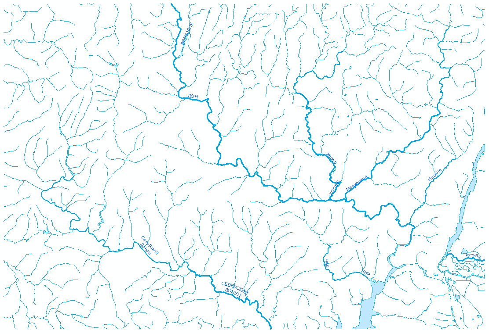
    ```

1. Сделайте растровый слой прозрачным на *50%*.

1. Используя **инструмент расстановки контрольных точек**, укажите *3-6* соответствующих точек по границе страны на характерных выступах контура:
    
    ```{r mrg-ctr, fig.cap = 'Инструмент расстановки контрольных точек'}
    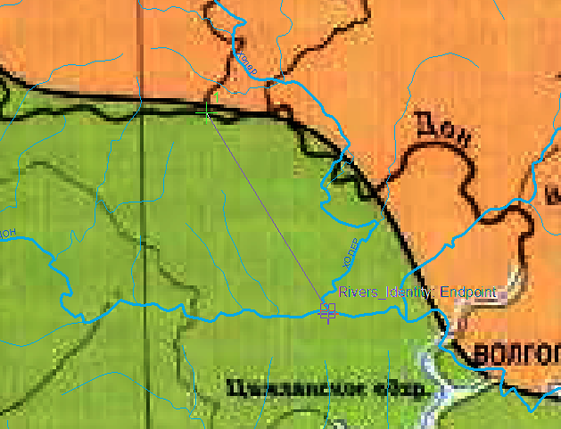
    ```
    
1. Выберите команду меню **Georeferencing > Update Georeferencing**, чтобы завершить привязку растра. При этом по умолчанию будет применено аффинное преобразование с минимизацией среднеквадратической ошибки отклонения исходных и целевых координат:
    
    ```{r mrg-upd, fig.cap = 'Привязанная карта физико-географических регионов'}
    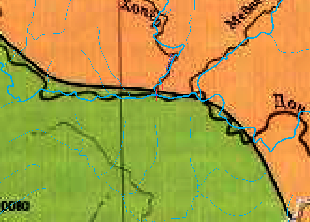
    ```

<kbd>**Снимок экрана №1**. Привязанная карта физико-географических регионов</kbd>

### Карта туристического маршрута {#map-ref-general-referencing-tourist}

1. Добавьте на карту слой *WineSafariRoute.jpg*.

1. Выберите его в списке на панели **Georeferencing**:

    ```{r mrg-lyr, fig.cap = 'Выбор слоя для привязки'}
    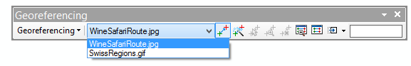
    ```

1. Отключите слой *SwissRegions.gif* в таблице содержания.

1. Привяжите растр *WineSafariRoute* аналогично предыдущему растру, используя контрольные точки:

    ```{r mrg-rou, fig.cap = 'Привязка карты маршрута по контрольным точкам'}
    knitr::include_graphics('images/Ex05/image13.png')
    ```

1. Выберите команду **Georeferencing > Update georeferencing**, чтобы завершить привязку второго растра.

<kbd>**Снимок экрана №2**. Привязанная карта маршрута</kbd>

## Создание базы данных и классов пространственных объектов {#map-ref-general-geodatabase}
[В начало упражнения ⇡](#map-ref-general)

1. Прочитайте параграф **База геоданных** в разделе **Описание функций**.

1. Создайте в папке *Ex05* базу геоданных под названием *RouteMap.gdb*.

1. Создайте в базе данных *классы пространственных объектов* со следующими параметрами:

Название  Модель пространственных объектов  Атрибутивные поля Проекция
--------  --------------------------------- ----------------- --------  
*Regions* Полигональная (polygon features)  NAME (text)       `WGS_1984_UTM_Zone_32N` (импортируйте у слоя карты)
*Routes*  Линейная (line features)          -                 `WGS_1984_UTM_Zone_32N` (импортируйте у слоя карты)
*Places*  Точечная (point features)         NAME (text)       `WGS_1984_UTM_Zone_32N` (импортируйте у слоя карты)

По завершению создания слоёв они автоматически будут добавлены в таблицу содержания карты:

```{r mrg-lyrs, fig.cap = 'Созданные слои в таблице содержания карты'}
knitr::include_graphics('images/Ex05/image14.png')
```

## Векторизация регионов {#map-ref-general-digitizing}
[В начало упражнения ⇡](#map-ref-general)

1. Прочитайте параграф **Редактирование** в разделе **Описание функций**.

1. Оставьте включенными только слои *Regions*, *SwissRegions* и *Countries*.

1. Уберите *прозрачность* у слоя *SwissRegions*.

1. Откройте сеанс редактирования для слоя *Regions*. Появится панель редактирования **Editor**, а также окно шаблонов объектов **Create Features**:

    ```{r mrg-cre, fig.cap = 'Панель Editor и окно Create Features'}
    
    ```

1. Щелкните на шаблоне объекта *Regions* в окне **Create Features** и выберите режим создания объектов **Polygon**:

    ```{r mrg-pol, fig.cap = 'Выбор режима создания объектов'}
    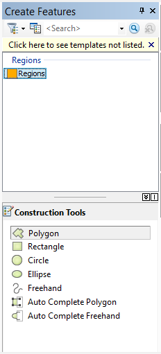
    ```

1. Последовательно щелкая мышкой на точках вдоль границы, оцифруйте регион *Prealpine Zones* (Предальпийские зоны) в центре карты. По завершению дважды щелкните мышкой:

    ```{r mrg-alp, fig.cap = 'Ручная векторизация границы Предальпийской зоны'}
    knitr::include_graphics('images/Ex05/image17.png')
    ```

1. Чтобы появилась возможность пристыковать остальные регионы к границам стран, **выделите** в слое *Countries* все страны, кроме Швейцарии, **скопируйте** их в буфер обмена и **вставьте** в слой *Regions*:
    
    ```{r mrg-bnd, fig.cap = 'Вставка границ стран в слой с границами физико-географических зон'}
    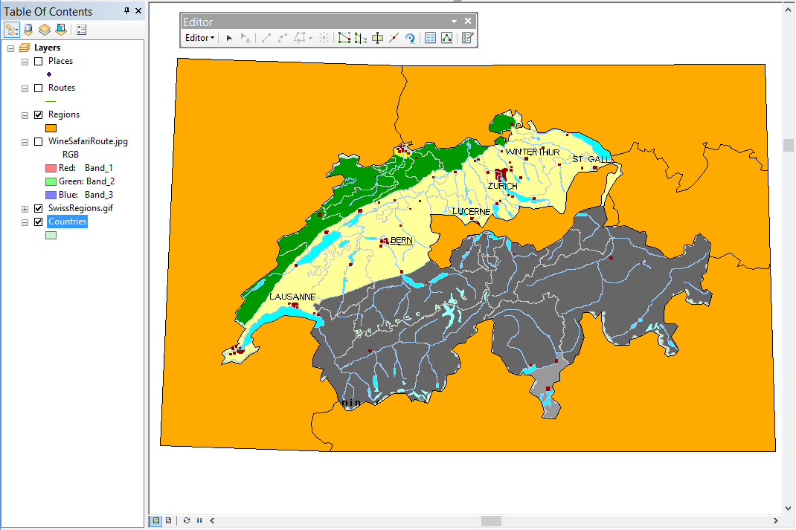
    ```

1. Выделите опять шаблон *Regions* в окне **Create Features**.

1. Используя режим **Auto-Complete Polygon**, оцифруйте границы оставшихся регионов в следующем порядке:

    - Сначала небольшие регионы, примыкающие к границам:

    ```{r mrg-breg, fig.cap = 'Регионы, примыкающие к границе'}
    knitr::include_graphics('images/Ex05/image19.png')
    ```

    - Затем область второго порядка дальности от границы (горы *Юра*):

    ```{r mrg-jura, fig.cap = 'Векторизация региона гор Юра'}
    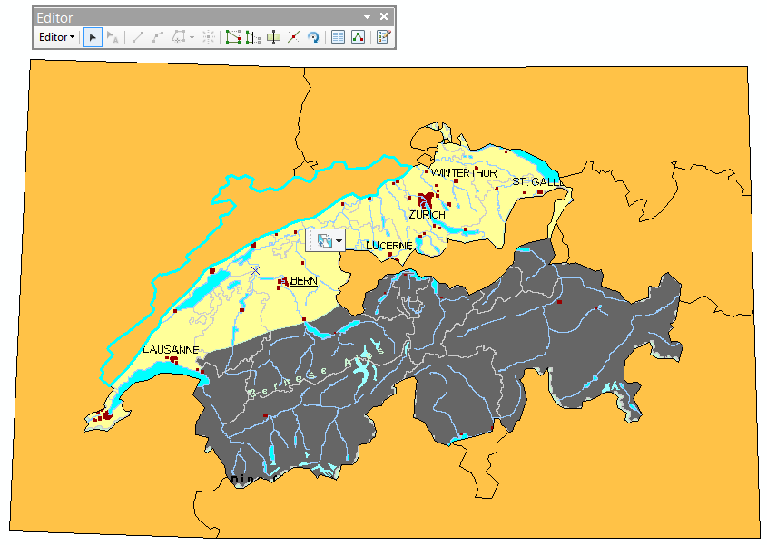
    ```

    - Наконец, границу между центральными регионами:

    ```{r mrg-cnt, fig.cap = 'Граница между центральными регионами'}
    knitr::include_graphics('images/Ex05/image21.png')
    ```

1. Выделите в слое *Regions* границы стран и удалите их.

1. Выберите команду **Editor > Save Edits**, чтобы сохранить результаты редактирования.

*Результат*:

```{r mrg-cntr, fig.cap = 'Результат векторизации границ физико-географических регионов'}
knitr::include_graphics('images/Ex05/image22.png')
```

<kbd>**Снимок экрана №3**. Векторный слой физико-географических регионов</kbd>

## Атрибутирование регионов {#map-ref-general-attributes}
[В начало упражнения ⇡](#map-ref-general)

1. Уберите заливку регионов, линии сделайте толщиной 1.5-2 пиксела:

    ```{r mrg-out, fig.cap = 'Оформление границ регионов'}
    knitr::include_graphics('images/Ex05/image23.png')
    ```

1. Откройте атрибутивную таблицу слоя *Regions*.

1. Поочередно выделяя каждый объект в таблице или на карте, заполните его атрибуты в соответствии с легендой:

    ```{r mrg-att, fig.cap = 'Заполнение атрибутов объектов'}
    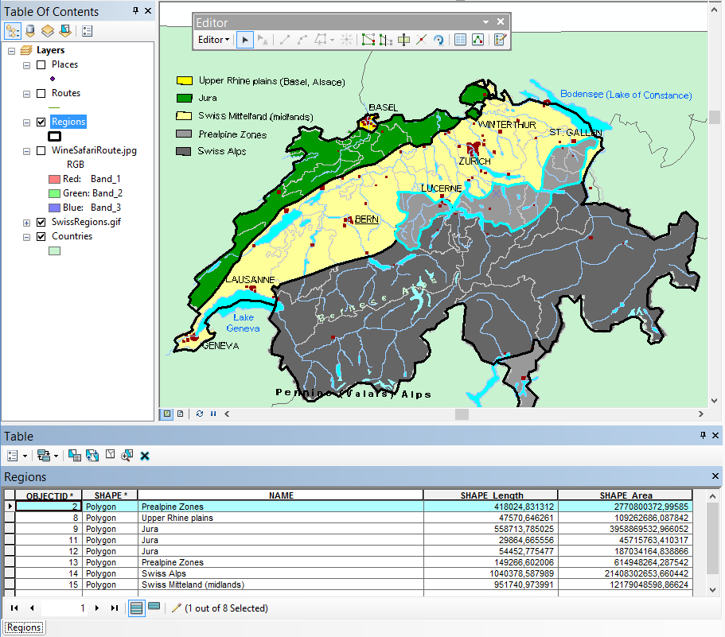
    ```

1. Сохраните изменения и завершите сеанс редактирования.

<kbd>**Снимок экрана №4**. Атрибутированные регионы</kbd>

## Цифрование маршрутов и точек интереса {#map-ref-general-routes-poi}
[В начало упражнения ⇡](#map-ref-general)

1. Выключите слои *Regions* и *SwissRegions.gif*.

1. Включите слои *WinSafariRoute*, *Routes* и *Places*.

1. Оцифруйте объекты слоев *Places* и *Routes*, используя инструменты панели **Сreate Features**:

    - Начните с расстановки точек населённых пунктов:

    ```{r mrg-pop, fig.cap = 'Расстановка точек населенных пунктов'}
    knitr::include_graphics('images/Ex05/image25.png')
    ```

    - Увеличьте масштаб, чтобы были хорошо видны изгибы линий:

    ```{r mrg-bds, fig.cap = 'Линии маршрутов при увеличенном масштабе'}
    knitr::include_graphics('images/Ex05/image26.png')
    ```

    - Проведите линии через получившиеся точки, повторяя контур исходной линии на растровой подложке. Каждую линию начинайте в точке и завершайте двойным щелчком в перекрестке:

    ```{r mrg-rts, fig.cap = 'Векторизация линий маршрутов'}
    knitr::include_graphics('images/Ex05/image27.png')
    ```

    *Результат*:
    
    ```{r mrg-vrts, fig.cap = 'Векторизованные линии маршрутов'}
    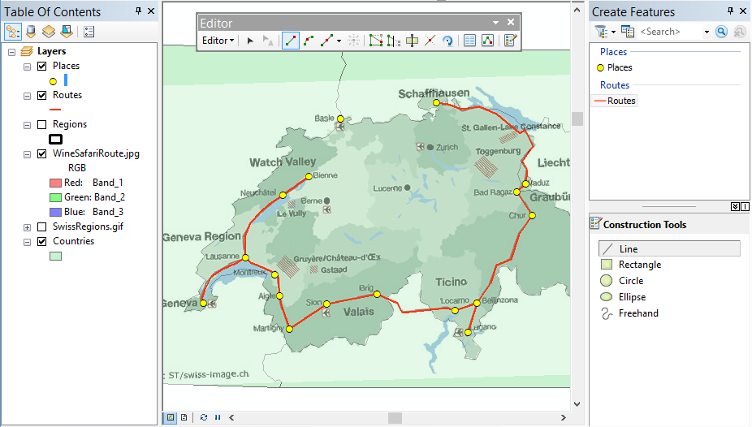
    ```

1. Заполните названия городов в слое *Places*.

    ```{r mrg-popn, fig.cap = 'Заполнение названий городов в атрибутах точек'}
    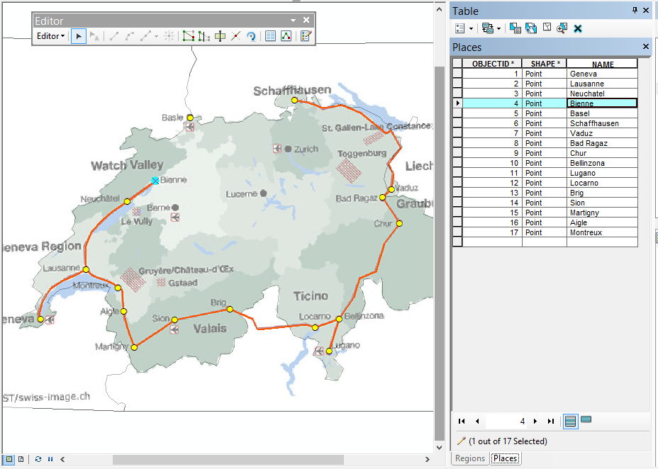
    ```

1. Сохраните изменения и завершите сеанс редактирования.

<kbd>**Снимок экрана №5**. Слои маршрута и пунктов назначения</kbd>

## Оформление карты {#map-ref-general-design}
[В начало упражнения ⇡](#map-ref-general)

1. Оставьте включенными слои *Regions*, *Routes*, *Places* и *Countries*. Остальные слои выключите.

1. Уберите заливку у слоя *Countries*.

1. Оформите слой *Regions* методом категорий по полю *NAME*:

    ```{r mrg-symreg, fig.cap = 'Настройка визуализации слоя Regions'}
    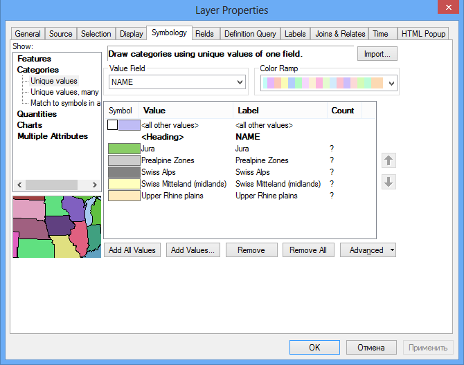
    ```
    
1. Оформите слои *Routes* и *Places* по аналогии с нижеприведенным фрагментом:

    ```{r mrg-sympop, fig.cap = 'Образец оформления слоёв Routes и Places'}
    knitr::include_graphics('images/Ex05/image31.png')
    ```

1. Откройте панель **Labeling** и включите **Maplex** для размещения подписей.

1. Включите подписи для слоя *Places* со следующими настройками:

    Параметр                Значение
    ----------------------- ---------
    *Поле для подписей*     NAME
    *Шрифт*                 Tahoma
    *Кегль (размер)*        12
    *Цвет*                  Черный
    *Начертание*            Обычное

    *Результат*:
    
    ```{r mrg-labpop, fig.cap = 'Подписи населенных пунктов'}
    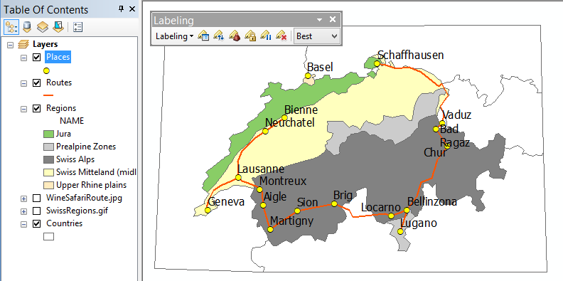
    ```  

Некоторые подписи могут быть размещены не очень удачно. Чтобы они не перекрывали линии маршрута и значки выполните следующие действия:

1. Откройте *настройки весов подписей* **Label Weight Ranking** на панели **Labeling**

1. Установите вес равным *1000* слоям *Places* и *Routes:*

    ```{r mrg-labwgt, fig.cap = 'Редактирование весов для слоёв карты'}
    knitr::include_graphics('images/Ex05/image33.png')
    ```

    *Результат*:
    ```{r mrg-labres, fig.cap = 'Отображение подписей после настройки весов слоёв'}
    knitr::include_graphics('images/Ex05/image34.png')
    ```

1. Добавьте на карту слой аналитической отмывки рельефа *Hillshade* из базы данных упражнения 3, разместите его над слоем Regions и установите прозрачность _80%_.

    *Результат*:
    ```{r mrg-hill, fig.cap = 'Карта со слоем аналитической отмывки'}
    knitr::include_graphics('images/Ex05/image35.png')
    ```

1. Добавьте на карту слой *Lakes* и присвойте ему символ полигона с голубой заливкой без обводки.

    *Результат*:
    ```{r mrg-lakes, fig.cap = 'Карта со слоем озёр'}
    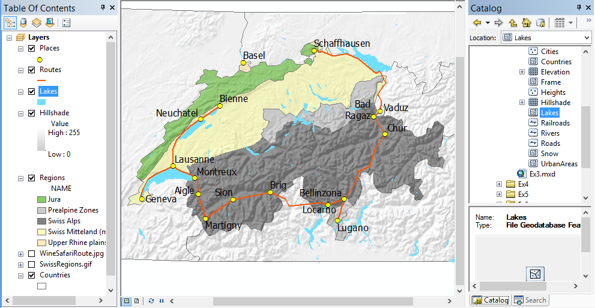
    ```

<kbd>**Снимок экрана №6**. Оформление карты</kbd>

## Компоновка карты {#map-ref-general-layout}
[В начало упражнения ⇡](#map-ref-general)

1. Переключитесь в **режим компоновки**.

1. Установите альбомную ориентировку листа.

1. Оформите компоновку в соответствии с нижеприведенным образцом:

    ```{r mrg-lay, fig.cap = 'Образец компоновки карты'}
    knitr::include_graphics('images/Ex05/image37.png')
    ```

<kbd>**Снимок экрана №7**. Компоновка карты</kbd>

1. Экспортируйте карту в формат <kbd>PNG</kbd> с разрешением *300 dpi*.

1. Сохраните документ карты.

## Контрольные вопросы {#map-ref-general-questions}
[В начало упражнения ⇡](#map-ref-general)

1. В какой последовательности расставляются контрольные точки при привязке данных? Каково их оптимальное расположение?

1. Какой метод трансформирования изображения вы использовали в работе?

1. Как пристыковать один полигон к другому, не оцифровывая их общую границу? Опишите последовательность действий.
