# Гидрографические сети {#network-hydro}

[Скачать данные и файл отчета](https://carto.geogr.msu.ru/gis/data/Ex13.zip)

## Введение {#network-hydro-intro}

**Цель задания** --- научиться моделировать речную сеть с помощью геометрических методов.

Параметр                    Значение
--------------------------  --------
*Теоретическая подготовка*  Сетевая модель данных, сетевой анализ, определение кратчайшего маршрута.
*Практическая подготовка*   Знание основных компонент интерфейса ArcGIS Desktop (каталог, таблица содержания, карта). Работы с базой пространственных данных. Настройка символики и подписей объектов.
*Исходные данные*           База данных ГИС “Сатино”.
*Результат*                 Набор данных геометрической сети в базе пространственных данных. Результаты сетевого анализа
*Ключевые слова*            Геометрические сети, сетевой анализ

### Контрольный лист {#network-hydro-control}

* Добавить на карту слои линейной и площадной гидрографии
* Оцифровать недостающие сегменты линейного слоя гидрографии
* Разрезать линейный слой гидрографии в узлах сочленения водотоков
* Построить геометрическую сеть на основе полученного линейного слоя
* Выполнить упражнения по анализу построенной геометрической сети

### Аннотация {#network-hydro-annotation}

Речные системы, транспортные и инженерные коммуникации — это примеры пространственных сетей. Сети играют огромную роль в географическом пространстве, их можно найти практически на любой карте, они учитываются в виде факторов во многих географических задачах. Основная функция сетей — перенос вещества и данных. Отличительной особенностью сетей является направленность линейных отрезков и их топологическая связность в местах сочленения, таких как слияния рек, перекрестки дорог, разветвления трубопроводов.

В этом задании вы приобретете навыки по созданию и редактированию линейных и точечных объектов, построите геометрическую сеть речной системы на их основе и научитесь делать простой сетевой анализ — построение маршрутов, трассировка водотоков вверх по течению. Полученные навыки пригодятся при изучении сетей других типов: инженерных и транспортных.

## Создание набора данных речной сети {#network-hydro-dataset}
[В начало упражнения ⇡](#network-hydro)

1. Откройте **ArcMap**.

3. Сохраните карту через команду меню **File > Save** в вашей директории *Ex13* под именем *Ex13\_Реки.mxd*. Это необходимо для того, чтобы у вас появилась домашняя директория в окне каталога.

4. Откройте окно  **Каталога**. Найдите вверху домашнюю директорию *Home* — это каталог *Ex13*, куда вы сохранили документ карты.

5. Добавьте на карту слои  *WaterPolygon* и  *WaterLine* из базы  *Satino.gdb*.

> Перед вами два представления речной сети: линейное и площадное. Подумайте, в каких задачах необходимо одно представление, а в каких — другое?

Чтобы обеспечить связность гидрографической сети, следует преобразовать площадное представление крупных водотоков в линейное. Для этого необходимо вручную оцифровать осевую линию реки, притянуть устья притоков к этой осевой линии, а затем разрезать осевую линию в узлах пересечения (в дальнейшем это позволит при трассировке «сворачивать» с одного водотока на другой).

1. Щелкните правой кнопкой мыши по домашнему каталогу (Home) и выберите **New > File Geodatabase** для того, чтобы создать новую базу геоданных.

2. Назовите ее *Ex13.*

3. Щелкните по *Ex13.gdb* правой кнопкой мыши и выберите пункт **Make Default Geodatabase**. Эта команда указывает системе, что все результаты обработки данных следует помещать в выбранную базу геоданных.

4. Добавьте в базу геоданных *Ex13.gdb* новый набор данных *Hydro*. Для этого щелкните правой кнопкой мыши на названии базы геоданных и в контекстном меню выберите **New > Feature Dataset** (**Рис. 1**).

    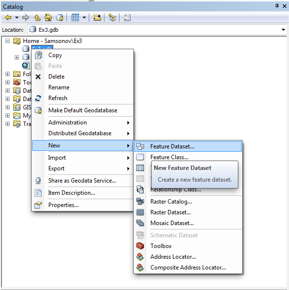

1. В появившемся окне введите название набора данных *Hydro*.

2. В следующем окне вам просят задать проекцию. Щелкните на кнопке  **Add Coordinate System** и в ниспадающем меню выберите команду Import. Найдите слой Border базе геоданных Satino.gdb и дважды кликните на нем. Параметры проекции автоматически подставятся из созданного ранее слоя. Убедитесь, что проекция называется *WGS\_1984\_UTM\_Zone\_37N*.

3. Нажмите Далее и во всех оставшихся диалогах оставьте параметры по умолчанию.

4. Создайте новый класс пространственных объектов *Streams* внутри набора данных *Hydro*. Для этого щелкните правой кнопкой мыши по набору данных Hydro и в контекстном меню выберите пункт **New—Feature Class**.

5. В первом диалоге введите название класса *Streams*, его псевдоним (alias) *Водотоки* и из ниспадающего списка выберите тип класса *Line Features* (**Рис. 2**). Нажмите Далее два раза, чтобы пропустить второй диалог.

    

    В появившемся (третьем) диалоге (**Рис. 3**) вас просят определить состав атрибутивных полей для слоя. Здесь можно сделать это вручную, однако мы воспользуемся импортом.

    

1. Нажмите кнопку **Import** и найдите класс *WaterLine* в базе геоданных\  *Satino.gdb*, дважды щелкните на нем. Названия и типы полей автоматически подставятся в список (**Рис. 3**).

1. Нажмите **Finish**. Проверьте, чтобы в вашей таблице содержания было 3 слоя: *Водотоки*, *Гидрография (линии)* и *Гидрография (полигоны)*.

## Копирование и цифрование линий водотоков {#network-hydro-digitizing}
[В начало упражнения ⇡](#network-hydro)

Для того чтобы собрать речную сеть, можно скопировать уже существующие линейные водотоки в созданный вами слой, а затем *оцифровать* недостающие водотоки (Протва и Исьма).

> **Цифрование** — это процесс получения векторных объектов на основе изображения. При ручной оцифровке пользователь ГИС самостоятельно рисует линии, обводит полигоны, расставляет точки поверх растрового изображения, в котором эти объекты нарисованы. Существуют также методы цифрования, которые решают эту задачу в полуавтоматическом режиме, когда система пытается самостоятельно распознать и векторизовать объекты, а пользователь затем исправляет ошибки и недочеты в результатах цифрования. Типичный пример — перевод отсканированной бумажной топографической карты в набор векторных слоев базы пространственных данных.

1. Щелкните правой кнопкой мыши на слое *Водотоки* и выберите пункт меню **Edit Features > Start Editing**, чтобы начать редактирование.

2. Выделите все водотоки из слоя *Гидрография (линии)*. Для этого щелкните правой кнопкой мыши по слою *Гидрография (линии)* и в контекстном меню выберите пункт **Selection > Select All**. Скопируйте выделенные водотоки в буфер обмена через команду главного меню **Edit > Copy**.

3. Вставьте скопированные объекты в слой *Водотоки*. Для этого воспользуйтесь стандартной командой главного меню **Edit > Paste** и в появившемся диалоге выберите в качестве целевого слой *Водотоки*.

4. Снимите выделение с водотоков, нажав кнопку  **Clear Selected Features** на панели инструментов **Tools**.

5. Удалите слой *Гидрография (линии)* из таблицы содержания. В этом задании он больше вам не понадобится.

6. Переключитесь в окно **Create Features** c помощью кнопки  на панели **Tools** (**Рис. 4**) и выберите *Водотоки* в списке цифруемых объектов:

    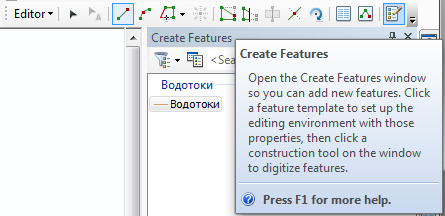

1. Приблизьтесь к верховьям *Протвы* в западной части карты. Для навигации используйте колесико мыши (масштабирование) и кнопку <kbd>C</kbd> на клавиатуре (перемещение). Рекомендуемый диапазон масштабов для цифрования — *1:1 500–1:2000*. Вы можете его отслеживать вверху окна.

1. Щелкните посередине полигона в месте начала реки и начните цифровать линию примерно по осевой линии полигона с определенным интервалом. Щелкните мышью в месте, где вы хотите поставить точку, затем переместите курсор к месту следующей точки, щелкните еще раз, и так далее. Не увлекайтесь и не расставляйте точки слишком часто. Оцифруйте осевую линию Протвы целиком с запада на восток — это займет у вас некоторое время.

2. Когда линия будет полностью оцифрована, щелкните дважды мышью в последней точке, или нажмите <kbd>F2</kbd>.

    

    Советы по цифрованию:

    > Если вам **мешает плавающее окно дополнительных функций**, нажмите\ клавишу TAB.\
    > Если ваш **курсор подошел к границе окна**, зажмите клавишу <kbd>C</kbd> на клавиатуре и переместите карту. Отпустите клавишу C и продолжайте цифрование.\
    > Если вы **поставили точку не в том месте**, где хотели, нажмите <kbd>Ctrl</kbd> + <kbd>Z</kbd>, чтобы отменить действие.\
    > Если вы **случайно завершили цифрование** раньше, чем требуется, начните с последней точки. Ничего страшного, если у вас получится *2-3*, а не одна линия — их всегда можно объединить.\
    > Если вы **хотите сдвинуть вершину**, выберите стрелку на панели редактирования и дважды щелкните на линии — появятся вершины. После того, как сдвинете нужные точки, щелкните курсором на пустом месте карты.\
    > Если **курсор в узком месте назойливо притягивается к границе реки**, попробуйте увеличить масштаб изображения.

1. Повторите операцию цифрования для реки *Исьмы* от ее верховья до устья. Последнюю точку поставьте на осевой линии *Протвы*.

2. Сохраните изменения, выбрав на панели **Editor** команду **Editor > Save Edits**.

3. Снимите выделение с водотоков, нажав кнопку  **Clear Selected Features** на панели инструментов **Tools**.

4. Нажмите глобус  **Full extent**, чтобы все объекты поместились на экране.

## Притягивание (снэппинг) притоков и разрезание осевой линии основных рек
[В начало упражнения ⇡](#network-hydro)

Вы помните, что ранее оцифрованные притоки *Протвы* и *Исьмы* были пристыкованы к полигональной границе реки. Возникает вопрос: сохранился ли этот характер соседства после того, как вы заменили полигональное представление рек на линейное?

1. Найдите устье реки *Межиловки* при впадении в *Протву* (западная часть полигона) и увеличьтесь так, чтобы было хорошо видно место впадения.

    > Какая топологическая ошибка может быть замечена в месте впадения ручья в Протву?

1. Возьмите стрелку  на панели **Editor** и дважды щелкните на линии ручья. Должны появиться вершины. Потяните за последнюю вершину и пристыкуйте ее к линии реки (**Рис. 6**). Щелкните на пустом месте, чтобы завершить редактирование.

    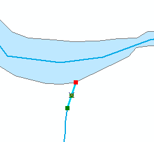
    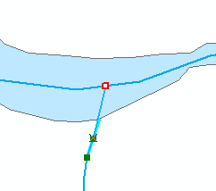

1. Повторите операцию для всех остальных ручьев. Перемещайтесь по карте, используя клавишу <kbd>C</kbd>. Не забудьте также про *Исьму*. Сохраните изменения, выбрав команду **Editor > Save Edits**

    Помимо сохранения связности для геометрической сети очень важно, чтобы линии были разрезаны на сегменты между пересечениями. Это необходимо для того чтобы отличать реальные узлы от перекрытий (сравните обычный перекресток и эстакаду!).

1. Выделите на карте *Протву* и приблизьтесь к месту впадения в нее реки *Межиловки*.

2. Найдите на панели **Editor** инструмент разрезания линии  и щелкните мышью в месте впадения ручья в *Протву*. Линия *Протвы* разобьется этой точкой на 2 части.

3. Повторите процедуру с выделением *Протвы* и разрезанием для всех остальных притоков.

4. Разрежьте аналогичным образом остальные водотоки.

5. Сохраните изменения, выбрав команду **Editor > Save Edits**. Завершите редактирование, выбрав команду **Editor > Stop Editing**.

6. Сохраните документ карты.

## Установка точки стока {#network-hydro-sink}
[В начало упражнения ⇡](#network-hydro)

Подготовленных вами данных уже достаточно для того, чтобы построить геометрическую сеть. Однако в общем случае сеть является двунаправленной (например, транспортная), а наша сеть имеет вполне определенное направление — вниз по течению. Чтобы задать это направление, необходимо создать новый точечный слой и поставить в нем одну точку, расположенную ниже всего по течению.

1. Перейдите в окно Каталога, щелкните правой кнопкой мыши по набору данных *Hydro* и выберите пункт **New > Feature Class**.

2. Задайте классу имя *Sink* и точечный тип *Point Features*. Остальные параметры оставьте по умолчанию.

3. Смените символ слоя *Sink* на кружок голубого цвета диаметром *10* пикселов.

4. Включите режим редактирования с помощью команды **Edit Features > Start Editing**, в окне **Create Features** выберите *Sink* и поставьте точку на восточной оконечности реки Протвы (правый край карты).

5. Сохраните изменения и завершите режим редактирования.

6. Добавьте на карту слой горизонталей *ContoursBasic* из базы данных  *Satino.gdb* и смените цвет линий на бледно-серый. Переместите его вниз в качестве основы.

1. Отключите слой *Гидрография (полигоны)* и нажмите кнопку  **Full extent**, чтобы вся территория полигона поместилась на экране.

<kbd>**Снимок экрана №1.** Линейный слой водотоков, горизонтали и точка стока</kbd>

## Построение и настройка геометрической сети {#network-hydro-gnetwork}
[В начало упражнения ⇡](#network-hydro)

Ваши данные полностью готовы к тому, чтобы построить на их основе геометрическую сеть.

1. Перейдите в окно **Каталога**, щелкните правой кнопкой мыши по набору данных *Hydro* и выберите пункт **New > Geometric Network**.

2. Оставьте *Hydro\_Net* в качестве имени по умолчанию и установите расстояние принудительного снэппинга линий равным 1 м (**Рис. 8**). Эта опция будет полезна, если вы где-то не дотянули устье притока до реки. Оно дотянется автоматически. Нажмите **Далее**.

    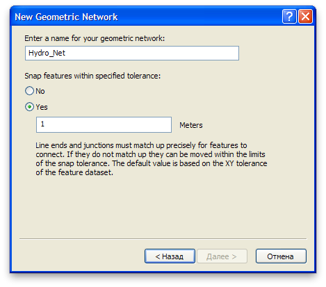

1. В следующем окне нажмите **Select All**, чтобы выбрать слои, участвующие в построении сети (**Рис. 9**). Нажмите **Далее**.

    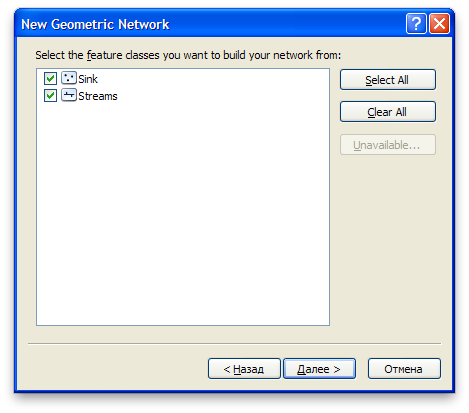

1. Перед вами окажется диалог настройки ролей. *Junction* — это узел, *Edge* — это ребро. Для слоя Sink установите значение параметра **Sources & Sinks** равным *Yes*. Система будет знать, что этот слой содержит точки, являющиеся истоками либо стоками (**Рис. 10**). Нажмите **Далее**.

    

1. Во всех остальных диалогах оставьте параметры по умолчанию. Нажмите **Finish** в последнем диалоге, чтобы завершить создание сети.

2. После того как будет построена геометрическая сеть, в таблицу содержания добавятся 3 новых слоя: *Водотоки (ребра сети)*, *Hydro\_Net\_Junctions* (сочленения в сети) и *Sink* (точка стока). Удалите новые слои *Водотоки* и *Sink*, поскольку они дублируют старые

3. Включите режим редактирования и откройте таблицу атрибутов слоя *Sink*.

4. Установите для единственной точки в этом слое поле *AncillaryRole* равным 2 (*Sink)*. Если список не отображается, просто введите в ячейку 2. Обратите внимание на то, что есть и противоположный вариант — *Source* (исток).

    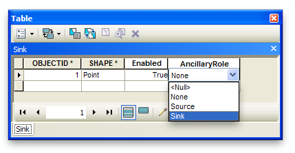

1. Сохраните изменения, выбрав пункт меню **Editor > Save Edits**.

2. Щелкните правой кнопкой мыши на пустом поле вверху окна и откройте панель инструментов **Utility Network Analyst**, предназначенную для работы с геометрической сетью (**Рис. 12**).

    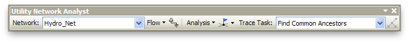

1. Выберите в меню пункт **Flow > Display Arrows** для того чтобы система автоматически показала направление течения. Вдоль отрезков будут показаны кружки, означающие, что направление еще не задано (**Рис. 13**).

    

1. Нажмите кнопку 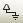 **Set Flow Direction**. Кружки должны смениться стрелочками, указывающими направление течения. Просмотрите разные части карты и убедитесь в том, что направление течения задано одинаково верно для всех водотоков (**Рис. 14**).

    

    <kbd>**Снимок экрана №2.** Геометрическая сеть с определенным направлением течения</kbd>

1. Завершите сеанс редактирования, выбрав на панели **Editor** пункт меню **Editing > Stop Editing**. В появившемся диалоге нажмите Да.

Вы закончили подготовку и настройку геометрической сети. Теперь она доступна для анализа и редактирования.

## Анализ и редактирование геометрической сети {#network-hydro-analysis}
[В начало упражнения ⇡](#network-hydro)

Самое интересное в сетевых моделях — это возможность их анализа. Например, если зафиксирована точка прорыва на трубопроводе, можно определить все расположенные далее сегменты и ответвления сети, которые пострадают в результате аварии. Для замыкающего створа на реке можно определить все притоки, расположенные выше по течению или быстро трассировать путь воды вниз по течению вплоть до устья основной реки бассейна. При анализе транспортных сетей часто решается задача прокладки кратчайшего маршрута, расчета зон доступности и управления парком транспортных средств.

> При анализе геометрических сетей в **ArcGIS** используются флаги и барьеры. **Флаг** — это точка, относительно которой осуществляется трассировка сети. **Барьер** — это точка, запрещающая проход по ребру графа или его вершине.

1. Откройте меню флагов и барьеров на панели инструментов **Utility Network Analyst** и выберите флаг для вершины (первая иконка на **Рис. 15**).

    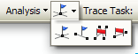

1. Поставьте флажок в месте впадения реки *Межиловки* в *Протву*.

3. В списке **Trace Task** выберите задачу **Trace Upstream** (трассировать вверх по течению) и нажмите кнопку  **Solve**.

    Инструмент анализа выделит водотоки, расположенные выше по течению относительно заданной точки. Весь их сток в конечном счете попадает в данную точку (**Рис. 16**).

    

    <kbd>**Снимок экрана №3.** Водотоки выше по течению относительно заданной точки</kbd>

4. Смените задачу на **Trace Downstream** и опять нажмите кнопку  **Solve**.

    Инструмент анализа построит маршрут вниз по течению

4. Поставьте еще один флажок в верховьях ручья Язвицы и запустите анализ в режиме **Find Path**. Будет построен маршрут между двумя точками (**Рис. 17**).

    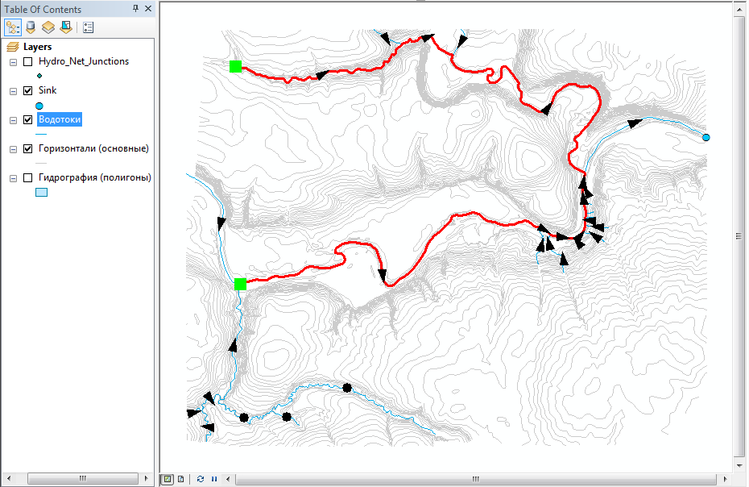

    <kbd>**Снимок экрана №4.** Маршрут между двумя точками</kbd>

4. Поставьте точечный барьер (вторая справа иконка на **Рис. 15**) в месте впадения *Исьмы* в *Протву* и попробуйте еще раз рассчитать маршрут.

    > Что произошло с расчетом маршрута после того, как вы поставили барьер?

4. Очистите флаги и барьеры, выбрав **Analysis > Clear Flags** и **Analysis > Clear Barriers**.

5. Попробуйте поэкспериментировать с разными режимами расчетов в меню **Trace Task** и расстановкой флагов и барьеров.

    Геометрическая сеть отличается также тем, что это топологический формат хранения данных — она хранит связность ребер и вершин, что бывает удобно при редактировании и совершенно необходимо при анализе.

4. Включите режим редактирования снова и приблизьтесь к месту впадения любого ручья в *Протву*.

5. Выделите узел сочленения и переместите его в сторону.

    > Что происходит при перемещении узла сети? Остаются ли ребра на своих местах?**

Сохраните документ карты еще раз.

## Контрольные вопросы {#network-hydro-questions}
[В начало упражнения ⇡](#network-hydro)

1. Каким требованиям должны отвечать гидрографические данные, чтобы их можно было представить в виде геометрической сети?

1. Какие функции выполняют флаги и барьеры при решении задач сетевого анализа?

1. Какие задачи можно решать с помощью анализа геометрических сетей?

1. Какие преимущества при редактировании данных дает топологическая структура данных?
