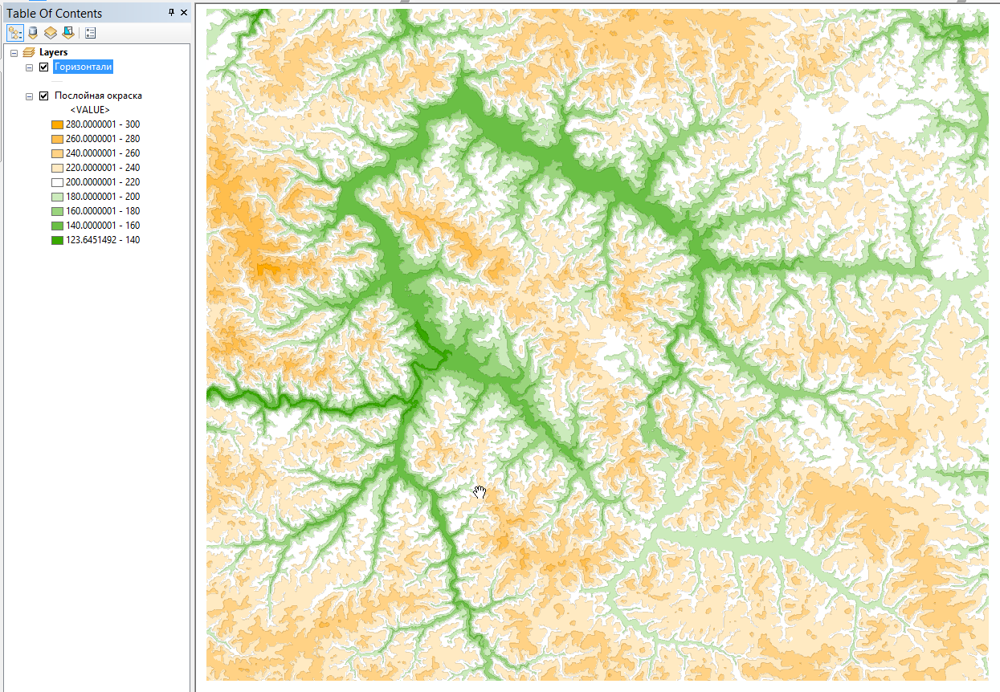
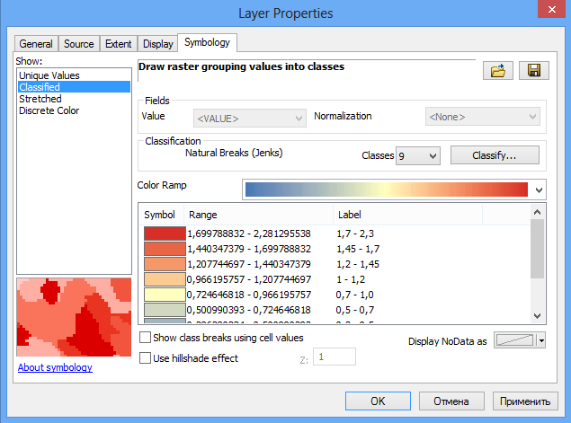
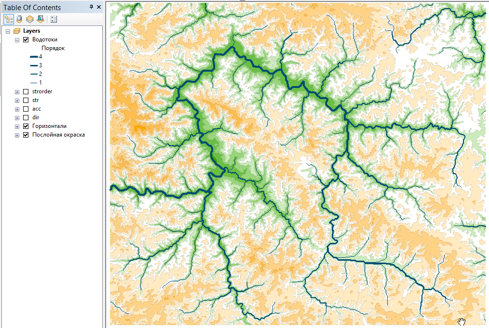
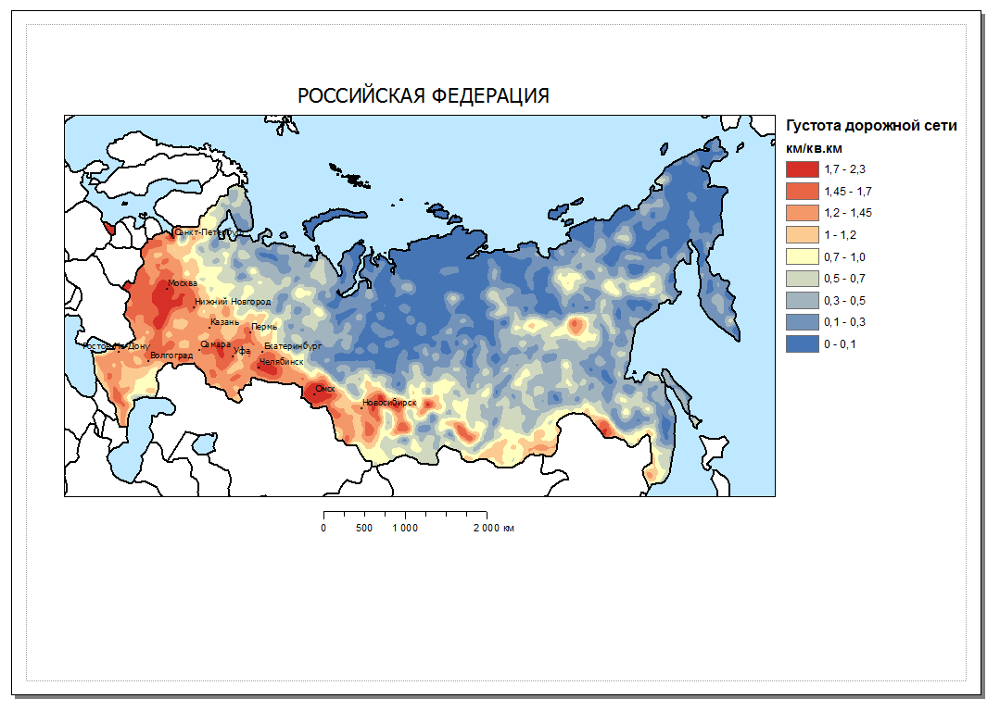
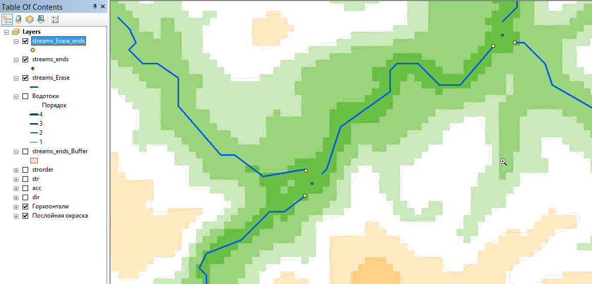
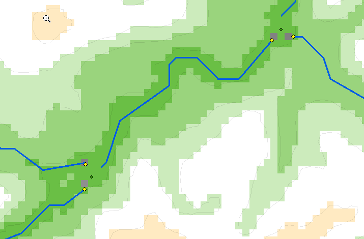

# Анализ цифровой модели рельефа {#dem}

[Скачать данные и файл отчета](http://autolab.geogr.msu.ru/gis/data/Ex15.zip)

## Введение {#dem-intro}

 **Цель** — научиться на основе цифровой модели рельефа выделять водотоки и их водосборные бассейны в автоматическом режиме. Осуществлять расчет статистики по высотам в рамках выделенных бассейнов

Параметр                    Значение
--------------------------  --------
*Теоретическая подготовка*  Растровая модель пространственных данных. Цифровые модели рельефа (ЦМР) и их типы, построение ЦМР, построение производных поверхностей (углы наклона, направление тока, площадь водосбора). Гидрологический анализ ЦМР и его принципы.
*Практическая подготовка*   Знание основных компонент интерфейса ArcGIS Desktop (каталог, таблица содержания, карта). Настройка символики и подписей объектов. Создание базы геоданных и классов пространственных объектов. Инструменты геообработки ArcToolbox. Создание компоновки карты: название легенда, масштаб, градусная сетка.
*Исходные данные*           Цифровая модель рельефа по данным топографической карты масштаба 1:200 000.
*Результат*                 Карта водотоков и их водосборных бассейнов, построенная по ЦМР, с указанием средней высотой каждого бассейна.
*Ключевые слова*            Цифровая модель рельефа, гидрологический анализ ЦМР.      

### Контрольный список {#dem-control}

* Добавить на карту цифровую модель рельефа и визуализировать ее методом послойной окраски
* Построить растр направлений тока
* Построить растр площади водосбора
* Выделить тальвеги путем запроса
* Присвоить тальвегам порядок по методу Стралера
* Векторизовать тальвеги
* Получить устья тальвегов
* Разделить устья впадающих водотоков
* Привязать полученные точки к растру аккумуляции тока
* Построить водосборные бассейны
* Конвертировать полученные бассейны в векторный вид
* Рассчитать статистику по высотам в пределах бассейнов
* Привязать рассчитанную статистику к площадям бассейнов
* Подписать бассейны по значению средней высоты
* Завершить оформление карты в режиме компоновки

### Аннотация {#dem-annotation}

Цифровые модели рельефа играют важную роль в гидрологическом и геоморфологическом анализе. Одно из основных приложений ЦМР, позволивших значительно упростить анализ речных систем, — это автоматизированное построение водосборов и расчет их морфометрических характеристик.

В задании вам предстоит автоматически выделить тальвеги и водосборы по цифровой модели рельефа. Тальвеги будут классифицированы вами согласно их порядкам, а для каждого бассейна определена средняя высота. Задание завершается оформлением карты в режиме компоновки.

## Оформление данных {#dem-design}
[В начало упражнения ⇡](#dem)

1. Скопируйте каталог *Ex15* в свою папку.

2. Подключитесь в окне каталога к вашей папке *Ex15*. Убедитесь, что в ней находится база геоданных *Ex15.gdb*.

3. Используя контекстное меню базы данных, назначьте ее базой данных по умолчанию.

4. Добавьте на карту слой *dem*. Это цифровая модель рельефа в растровом формате.

5. Измените оформление слоя следующим образом:

    Параметр              Значение  
    --------------------- --------
    *Способ отображения*  Classified
    *Интервал*            С равным шагом (Defined Interval), сечение 20 м.
    *Цветовая шкала*      Scale\_termo2: 

    Диалог примет следующий вид:

    

1. Измените красный цвет шкалы на оранжевый. Для этого в контекстном меню цветовой шкалы выберите команду **Properties...**. В появившемся диалоге дважды щелкните на бело-красном градиенте и замените красный цвет на оранжевый *Electron Gold*:

      

1. Завершите настройку шкалы, нажав **ОК** и еще раз **ОК**.

2. Измените сортировку значений на вкладке **Symbology** таким образом, чтобы вверху оказались самые большие высоты. Нажмите **ОК**, чтобы закрыть диалог настройки слоя.

3. Измените название слоя *dem* на «Послойная окраска».

4. Дополнительно к послойной окраске постройте горизонтали, чтобы усилить пластику рельефа. Для этого запустите инструмент геообработки **Spatial Analyst Tools > Surface > Contour** и заполните его параметры следующим образом:

    Параметр                    Значение  
    --------------------------- --------
    *Input Raster*              Послойная окраска  
    *Output Polyline Features*  `…\Ex15\Ex15.gdb\contours`
    *Contour interval*          20  

    Величина сечения рельефа указывается в параметре **Contour Interval**. Остальные параметры оставьте по умолчанию и нажмите **ОК**. Полученный слой будет добавлен на карту.

1. Переименуйте слой в *«Горизонтали»* и измените его оформление следующим образом:

    Параметр        Значение  
    --------------- --------
    *Цвет линии*    Черный
    *Толщина линии* 0,2
    *Прозрачность*  90%

    Изображение примет следующий вид:

    

<kbd>**Снимок экрана №1.**  Изображение рельефа методом горизонталей с послойной окраской</kbd>

Сохраните документ карты в свою папку *Ex15* под именем *Ex15\_DemAnalysis.mxd*.

## Направление тока {#dem-flowdir}
[В начало упражнения ⇡](#dem)

Растр направления тока показывает в каждой ячейке направление максимального уклона. Он необходим для построения водосборных бассейнов и прочих задач гидрологического и морфометрического анализа.

Для построения растра направлений тока запустите инструмент **Spatial Analyst Tools > Hydrology > Flow Direction** и заполните его параметры следующим образом:

Параметр                        Значение  
------------------------------- --------
*Input Raster*                  Послойная окраска  
*Output flow direction raster*  `…\Ex15\Ex15.gdb\dir`

Нажмите **ОК**. Полученный слой будет добавлен на карту:

<kbd>**Снимок экрана №2.** Растр направления тока</kbd>

## Водосборная площадь (аккумуляция тока) {#dem-flowacc}
[В начало упражнения ⇡](#dem)

Растр аккумуляции тока в каждой ячейке хранит количество ячеек, дренируемых выше по склону. Фактически, это число показывает водосборную площадь для каждой ячейки. Площадь водосбора необходима для автоматического выделения водотоков (тальвегов) по цифровой модели рельефа.

1. Для построения растра аккмуляции тока запустите инструмент **Spatial Analyst Tools > Hydrology > Flow Accumulation** и заполните его параметры следующим образом:

    Параметр                          Значение  
    --------------------------------- --------
    *Input Raster*                    dir  
    *Output flow accumulation raster* `…\Ex15\Ex15.gdb\acc`  

    Нажмите **ОК**. Полученный слой будет добавлен на карту.

1. Чтобы сделать отображение растра аккумуляции тока более наглядным, откройте его свойства и на вкладке **Symbology** измените растяжку гистограммы на метод **Histogram Equalize** (Выравнивание гистограммы):

    

    Картографическое изображение примет следующий вид:

    

<kbd>**Снимок экрана №3.**  Растр аккумуляции тока</kbd>

## Выделение и классификация водотоков {#dem-classify}
[В начало упражнения ⇡](#dem)

Выделение тальвегов осуществляется на основе растра аккумуляции тока. Вы просто задаете запрос следующего вида: «*Водотокам принадлежат те пикселы, в которых значение аккумуляции тока больше заданной величины. Остальные пикселы сделать пустыми*».

1. Для реализации этого запроса используйте инструмент **Spatial Analyst > Conditional > Set Null** со следующими параметрами:

    Параметр                                Значение
    --------------------------------------- --------
    *Input Conditional Raster*              acc  
    *Expression Value*                      VALUE < 2000  
    *Input false raster or constant value*  1
    *Output raster*                         `…\Ex15\Ex15.gdb\str`

    По результатам выполнения данного инструмента будут выделены все водотоки, в которых значение аккумуляции тока более *2000*.

1. Измените цвет полученных пикселов на белый, чтобы они были хорошо видны. Изображение примет следующий вид:

    

    <kbd>**Снимок экрана №4.**  Водотоки, полученные по растру аккумуляции тока</kbd>

    Полученные водотоки можно ранжировать по порядкам.

    > При упорядочении водотоков методом *Стралера* номер порядка увеличивается только в том случае, когда встречаются водотоки одного порядка. Водотоки, которые не имеют притоков, имеют порядок равный 1.

1. Запустите инструмент **Spatial Analyst Tools > Hydrology > Stream Order** и заполните его параметры следующим образом:

    Параметр                      Значение  
    ----------------------------- --------
    *Input Stream Raster*         str  
    *Input Flow Direction Raster* dir  
    *Output raster*               `…\Ex15\Ex15.gdb\strorder`  
    *Method of Stream Ordering*   STRAHLER

    Нажмите **ОК**, чтобы запустить инструмент. Растр классифицированных водотоков будет добавлен на экран. Если все выполнено верно, расцветка водотоков должна соответствовать их порядкам от 1 до 4.

    

    <kbd>**Снимок экрана №5.**  Водотоки, классифицированные методом Стралера</kbd>

## Векторизация водотоков {#dem-vectorize}
[В начало упражнения ⇡](#dem)

1. Для получения векторных линий водотоков воспользуйтесь инструментом **Spatial Analyst Tools > Hydrology > Stream to Feature** и заполните его параметры согласно следующей таблице:

    Параметр                      Значение
    ----------------------------- --------
    *Input Stream Raster*         strorder
    *Input Flow Direction Raster* dir
    *Output Polyline Features*    `…\Ex15\Ex15.gdb\streams`
    *Simplify Polylines*          Да

    После запуска инструмента в таблицу содержания будут добавлены векторные линии водотоков.

1. Переименуйте полученный слой в *Водотоки*.

2. Визуализируйте водотоки в соответствии с их порядками от 1 до 4. Для этого настройте отображение слоя следующим образом:

    Параметр                          Значение  
    --------------------------------- --------
    *Способ отображения*              Категории (Categories—Unique Values)
    *Поле отображения (Value Field)*  grid\_code (*в нем хранится порядок водотока после векторизации)*
    *Цвет линий*                      Steel Blue 
    *Толщина линий*                   1, 1.5, 2 и 3 пункта

    Диалог настройки отображения слоя должен выглядеть примерно следующим образом:

    

1. Нажмите **ОК**, чтобы применить настройки символики.

2. Измените название поля классификации в легенде с *grid\_code* на «*Порядок*».

3. Отключите все слои, кроме слоев *Водотоки*, *Горизонтали* и *Послойная окраска*.

У вас должно получиться следующее картографическое изображение:

<kbd>**Снимок экрана №6.**  Классифицированные векторные линии водотоков</kbd>

Сохраните документ карты.

## Выделение и разделение устьевых точек {#dem-mouth}
[В начало упражнения ⇡](#dem)

Водосборный бассейн в рабочем процессе гидрологического анализа ЦМР строится для одной точки. Если в качестве точки выбрать устье реки, то полученный бассейн будет соответствовать бассейну всей реки. Однако если устье является точкой слияния двух водотоков, будет построен бассейн, *общий для обоих водотоков*. Проблему можно решить, немного сдвинув конечные точки водотоков выше по течению. Для этого можно использовать следующую последовательность действий:

* Получить конечные точки водотоков (устья)

* Построить вокруг точек небольшие буферные зоны радиусом в 2*R*, где *R* — размер ячейки растра ЦМР (*разрешение* ЦМР)

* Полученными зонами обрезать исходные линии водотоков, таким образом их несколько укоротив

* Получить обновленные конечные точки водотоков, которые не совпадают для каждой пары сливающихся притоков.

Приведенная последовательность действий является классическим примером интерпретации задачи в терминах инструментов ГИС-анализа.

1. Запустите инструмент **Data Management Tools > Features > Feature Vertices to Points** со следующими параметрами:

    Параметр                Значение  
    ----------------------- --------
    *Input Features*        Водотоки  
    *Output Feature Class*  `…\Ex15\Ex15.gdb\streams_ends`  
    *Point Type*            END (конечные точки)

1. Приблизьтесь к одной из точек слияния водотоков, пока не станут видны отдельные пикселы, чтобы внимательно наблюдать за тем, что будет происходить дальше.

    

1. Запустите инструмент **Analysis Tools > Proximity > Buffer**, который отвечает за построение буферных зон. Заполните его параметры следующим образом:

    Параметр                  Значение  
    ------------------------- --------
    *Input Features*          streams\_ends  
    *Output Feature Class*    `…\Ex15\Ex15.gdb\streams_ends_Buffer`  
    *Distance (Linear Unit)*  200  

    В таблицу содержания будут добавлены буферные зона вокруг устьев водотоков:

    

1. Обрежьте водотоки с помощью инструмента **Analysis Tools > Overlay > Erase**. Разберитесь самостоятельно, какие слои следует подставить в параметры **Input Features** и **Erase Features**. Назовите выходной слой *streams\_Erase*.

    Отключите временно слои *Водотоки* и *streams\_ends\_Buffer*, результат будет выглядеть следующим образом:

    

1. Воспользовавшись снова инструментом **Data Management Tools > Features > Feature Vertices to Points**, постройте *конечные* точки для обрезанных водотоков. Будьте внимательны при выборе типа точек (параметр **Point type**). Назовите выходной класс *streams\_Erase\_ends*.

    Результат должен выглядеть примерно следующим образом:

    

    <kbd>**Снимок экрана №7.**  Точки слияния, смещенные выше по течению</kbd>

2. Сохраните документ карты.

## Построение водосборных бассейнов {#dem-watersheds}
[В начало упражнения ⇡](#dem)

Построение водосборных бассейнов состоит из трех операций:
* привязка точек устья к растру аккумуляции тока,
* проведение границ водосборов в растровом режиме,
* векторизация бассейнов.

1. Запустите инструмент **Spatial Analyst Tools > Hydrology > Snap Pour Point** и заполните его параметры следующим образом:

    Параметр                    Значение  
    --------------------------- --------
    *Input raster*              streams\_Erase\_ends  
    *Input accumulation raster* acc
    *Output raster*             `…\Ex15\Ex15.gdb\pour`
    *Snap Distance*             100

    Остальные параметры оставьте по умолчанию. Параметр **Snap distance** указывает радиус поиска, в пределах которого вокруг каждой заданной точки устья будет искаться ячейка с максимальной аккумуляцией тока. В данном случае он равен *100* метрам — разрешению ЦМР.

    После выполнения инструмента в окрестности каждой точки появится привязанный пиксел:

    

1. Для построения границ водосборных бассейнов запустите инструмент **Spatial Analyst Tools > Hydrology > Watershed** и заполните его параметры следующим образом:

    Параметр                                  Значение  
    ----------------------------------------- --------
    *Input flow direction raster*             dir  
    *Input raster or feature pour point data* pour
    *Pour point field*                        Value
    *Output raster*                           `…\Ex15\Ex15.gdb\wsh`

    Полученный растр будет добавлен на экран, вы можете его расцветить в уникальных цветах, чтобы границы бассейнов хорошо читались:

    

    <kbd>**Снимок экрана №8.**  Растровый слой водосборных бассейнов</kbd>

1. Конвертируйте полученные бассейны в векторные полигоны. Для этого запустите инструмент **Conversion Tools > From Raster > Raster to Polygon** со следующими параметрами:

    Параметр                  Значение
    ------------------------- --------
    *Input raster*            wsh
    *Field*                   Value
    *Output polygon features* `…\Ex15\Ex15.gdb\watersheds`
    *Simplify polygons*       Да

1. Переименуйте полученный слой в «Водосборные бассейны» и измените его символ на тонкую красную линию *без заливки*.

2. Оставьте включенными следующие слои:

      * Водотоки
      * Водосборные бассейны
      * Горизонтали
      * Послойная окраска

3. Установите масштаб равным *1:400 000*. Картографическое изображение примет следующий вид:

    

    <kbd>**Снимок экрана №9.**  Векторный слой водосборных бассейнов</kbd>

## Расчет, привязка и визуализация статистики по водосборным бассейнам {#dem-statistics}
[В начало упражнения ⇡](#dem)

В пределах границ водосборных бассейнов возможно рассчитать различную статистику по данным ЦМР. Вам предлагается рассчитать статистику по высотам. Далее эту статистику необходимо присоединить к исходному слою бассейнов.

1. Запустите инструмент **Spatial Analyst Tools > Zonal > Zonal Statistics as Table** со следующими параметрами:

    Параметр                            Значение  
    ----------------------------------- --------
    *Input raster or feature zone data* Водосборные бассейны
    *Zone Field*                        Id
    *Input Value Raster*                Послойная окраска
    *Output Table*                      `…\Ex15\Ex15.gdb\stats`
    *Statistics Type*                   ALL

1. Откройте полученную таблицу, чтобы ознакомиться с ее содержимым:

<kbd>**Снимок экрана №10.** Таблица статистики высот по водосборным бассейнам</kbd>

1. Присоедините статистические данные к исходному слою с помощью инструмента **Data Management Tools > Joins > Join Field** со следующими параметрами:

    Параметр            Значение
    ------------------- --------
    *Input table*       Водосборные бассейны  
    *Input join field*  Id
    *Join table*        stats
    *Output join field* ID
    *Join fields*       Выделите все поля (кнопка **Select All**)  

    Диалог инструмента примет следующий вид:

    

    Нажмите **ОК**, чтобы запустить соединение таблиц. После выполнения инструмента, откройте атрибутивную таблицу слоя Водосборные бассейны, чтобы убедиться, что расчетные столбцы были добавлены:

    

1. Включите подписи слоя *Водосборные бассейны* по полю *MEAN* (средняя высота в пределах бассейна)

2. Чтобы избавиться от лишних значащих цифр, откройте таблицу слоя Водосборные бассейны и выберите в контекстном меню заголовка столбца *MEAN* команду **Properties** (свойства поля):

    

1. В открывшемся диалоге нажмите кнопку **Numeric…** и установите в окне **Number Format** округление до 1 знака после запятой:

    

    Если все выполнено верно, на карте должны быть подписаны средние высоты по каждому бассейну:

    

    <kbd>**Снимок экрана №11.** Средние высоты водосборных бассейнов</kbd>

2. Сохраните документ карты.

## Оформление итоговой карты {#dem-result}
[В начало упражнения ⇡](#dem)

1. Установите масштаб карты равным 1:500 000

2. Переключитесь в режим компоновки

3. Измените ориентировку листа на альбомную

4. Добавьте на карту численный масштаб и заголовок «*Водотоки разных порядоков и их водосборные бассейны*».

5. Добавьте легенду со следующими слоями: *Водотоки*, *Водосборные бассейны* и *Послойная окраска*.

6. Добавьте пометку «*Для каждого бассейна указана средняя высота в метрах над уровнем моря*»

7. Приведите внешний вид карты в соответствии с рисунком:

    

1. Полученную карту вставьте в отчет.

2. Сохраните документ карты.

## Контрольные вопросы {#dem-questions}
[В начало упражнения ⇡](#dem)

1. Что представляет растр направления тока?

2. Что представляет собой растр аккумуляции тока?

3. Как можно выделить водотоки по растру аккумуляции тока?

4. Как получаются порядки рек методом Стралера?

5. После того как выделены водотоки, какую последовательность действий нужно выполнить, чтобы построить для них границы бассейнов?

6. Как можно рассчитать статистику по бассейнам? Опишите последовательность действий.
