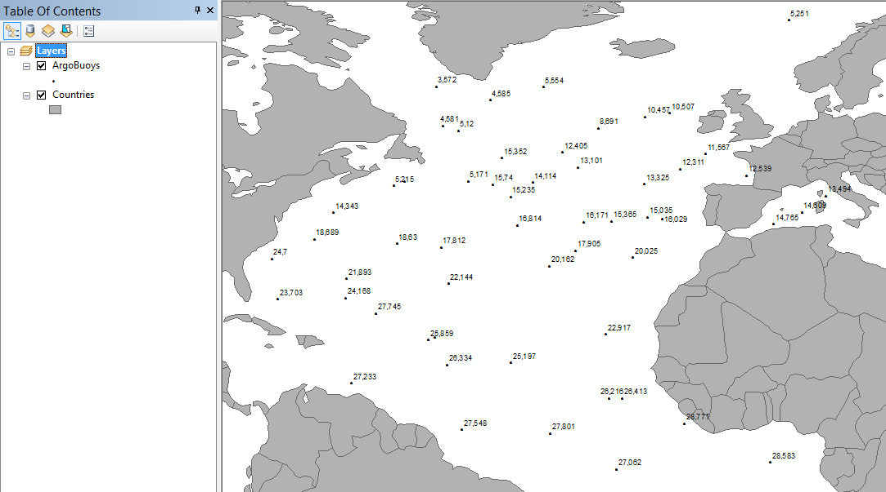
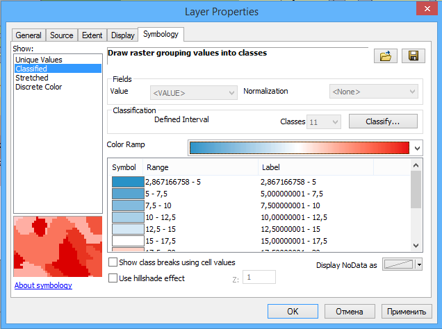
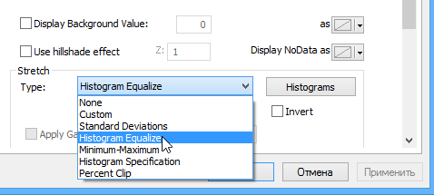
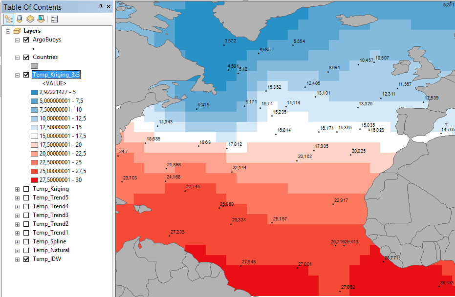
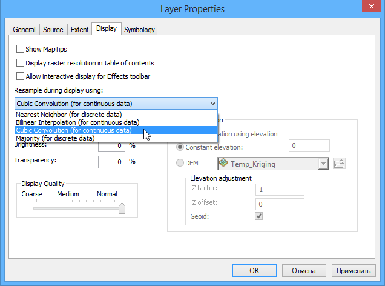
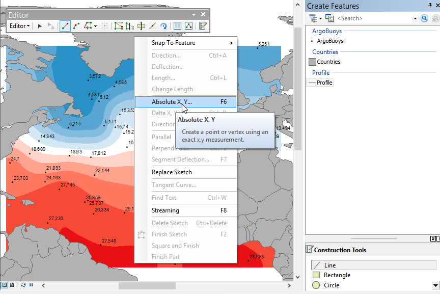
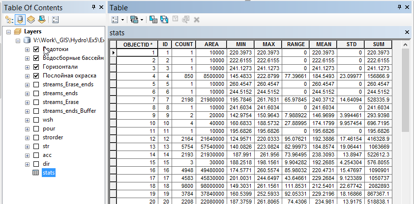
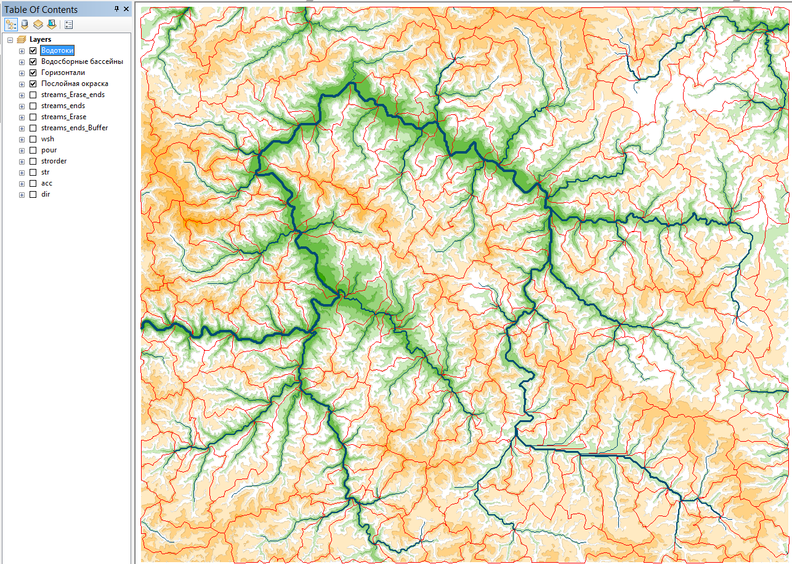

# Пространственная интерполяция {#interpolation}

[Скачать данные и файл отчета](http://autolab.geogr.msu.ru/gis/data/Ex17.zip)

## Введение {#interpolation-intro}

**Цель** --- научиться на основе точечных данных восстанавливать поля распределения непрерывных показателей различными способами. Осуществлять визуализацию методом изолиний с послойной окраской, строить профили по полученным поверхностям.

Параметр                    Значение
--------------------------  --------
*Теоретическая подготовка*  Построение растровых поверхностей. Интерполяция по данным в нерегулярно расположенных точках. Методы интерполяции: обратно взвешенных расстояний, естественного соседа, тренда, сплайнов, кригинга.
*Практическая подготовка*   Знание основных компонент интерфейса ArcGIS Desktop (каталог, таблица содержания, карта). Настройка символики и подписей объектов. Пространственные и атрибутивные запросы, оверлей. Создание базы геоданных и классов пространственных объектов. Редактирование классов пространственных объектов. Инструменты геообработки ArcToolbox. Создание компоновки карты: название легенда, масштаб, градусная сетка.
*Исходные данные*           Данные [дрейфующих буев ARGO](http://www.argo.ucsd.edu) на акваторию Северной Атлантики, границы стран мелкомасштабной картографической основы.
*Результат*                 Поверхности температуры за 30.01.2011, построенные различными методами; поверхность кригинга, полученная после обработки фильтром 3х3; изолинии по данной поверхности с шагом 2,5 градуса; профиль температуры по меридиану 38° з.д.; карта с названием, легендой, масштабом и профилем
*Ключевые слова*            Интерполяция, аппроксимация, гидрометеорологические поля, картографирование, профили.       

### Контрольный лист {#interpolation-control}

* Добавить на карту границы стран и точки наблюдений, оформить в соответствии с указаниями
* Оценить максимально возможное разрешение растра
* Построить поверхность методом обратно взвешенных расстояний
* Построить поверхность методом естественного соседа
* Построить поверхность методом сплайнов с натяжением
* Построить поверхности методом полиномиального тренда со степенями 1,2,3,4,5
* Построить поверхность методом кригинга
* Сгладить данную поверхность фильтром с плавающим окном размера 3х3
* Построить изолинии по данной поверхности
* Построить профиль по меридиану 38° з.д.
* Оформить карту с легендой и масштабом

### Аннотация {#interpolation-annotation}

Моделирование физических полей --- основа гидрометеорологического картографирования. Типичный рабочий процесс при создании карт температуры, давления, скорости ветра и прочих непрерывных в пространстве явлений заключается в восстановлении поверхности на основе точечных измерений (или модельных значений). Полученные поверхности можно визуализировать, выполнять их анализ, строить профили и разрезы.

В задании предлагается восстановить поле температуры в Северной Атлантике по данным [дрейфующих буев ARGO](http://www.argo.ucsd.edu); проанализировать отличия поверхностей, полученных разными методами. В заключении работы необходимо построить профиль и оформить карту в режиме компоновки.

## Оформление базовых слоев {#interpolation-base}
[В начало упражнения ⇡](#interpolation)

1. Скопируйте каталог *Ex17* в свой рабочий каталог.

2. Подключитесь в окне каталога к вашей папке *Ex17*. Убедитесь, что в ней находится база геоданных *Argo.gdb*.

3. Используя контекстное меню базы данных, назначьте ее базой данных по умолчанию.

4. Добавьте на карту слои *ArgoBuoys* и *Countries* и оформите их следующим образом:

   * *ArgoBuoys*  --- черные кружки диаметром 3 пункта
   * *Countries*  --- заливка серым цветом 30%, обводка серым цветом 60%

1. Включите подписи слоя *ArgoBuoys* по полю *Temp*, установите размер шрифта равным 7 пунктам.

    Картографическое изображение примет следующий вид:

    

    <kbd>**Снимок экрана №1.**  Исходные данные</kbd>

1. Сохраните документ карты в свою папку под названием *Ex17_Interpolation.mxd*

## Оценка необходимого разрешения растра {#interpolation-resolution}
[В начало упражнения ⇡](#interpolation)

Для оценки минимально необходимого разрешения растра следует вычислить для массива исходных точек среднее расстояние до ближайшего соседа (*Nearest Neighbor Distance, NND*), которое дает оценку пространственной частоты. Согласно [теореме Котельникова](https://ru.wikipedia.org/wiki/Теорема_Котельникова), потерь данных можно избежать, если частота дискретизации будет вдвое больше максимальной пространственной частоты. Данная частота дискретизации именуется *частотой Найквиста*. Интерпретируя это утверждение в терминах растрового анализа, можно сказать, что *разрешение растра R должно быть по крайней мере в 2 раза мельче, чем среднее расстояние до ближайшего соседа*.

1. Запустите инструмент геообработки **Analysis Tools > Proximity > Near** и задайте его параметры следующим образом:

    Параметр          Значение
    ----------------- --------
    *Input Features*  ArgoBuoys  
    *Near Features*   ArgoBuoys  

    Нажмите **ОК**:

    

1. После завершения работы инструмента откройте атрибутивную таблицу слоя *ArgoBuoys* и в контекстном меню заголовка поля *Near\_DIST* выберите команду **Statistics**, чтобы открыть диалог со статистикой поля.

2. Найдите в диалоговом окне строку *Mean* (среднее значение), разделите его пополам и округлите полученное значение в меньшую сторону до ближайшего числа, кратного 0,5. Если все сделано правильно, то в результате должно получиться разрешение *2,5 градуса*.

> Более подробно с решением проблемы выбора оптимального разрешения растра вы можете ознакомиться в статье [Hengl T. Finding the right pixel size // Comput. Geosci. 2006. Vol. 32, № 9. P. 1283–1298](https://www.researchgate.net/publication/222014409_Finding_the_right_pixel_size).

## Интерполяция поверхностей {#interpolation-surfaces}
[В начало упражнения ⇡](#interpolation)

Используя инструменты геообработки, находящиеся в **ArcToolbox** в группе **Spatial Analyst Tools > Interpolation**, постройте растровые поверхности нижеуказанными методами:

Метод | Инструмент геообработки | Выходной растр
------|-------------------------|---------------
[Обратно взвешенных расстояний](http://desktop.arcgis.com/ru/arcmap/latest/tools/3d-analyst-toolbox/how-idw-works.htm) | **IDW** | `.Ex17/Argo.gdb/Temp_IDW`
[Естественного соседа](http://desktop.arcgis.com/ru/arcmap/latest/tools/3d-analyst-toolbox/how-natural-neighbor-works.htm) | **Natural Neighbor** | `…/Ex17/Argo.gdb/Natural`
[Сплайнов](http://desktop.arcgis.com/ru/arcmap/latest/tools/3d-analyst-toolbox/how-spline-works.htm) | **Spline** | `…/Ex17/Argo.gdb/Spline`
[Кригинга](http://desktop.arcgis.com/ru/arcmap/latest/tools/3d-analyst-toolbox/how-kriging-works.htm) | **Kriging** | `…/Ex17/Argo.gdb/Temp_Kriging`
[Тренда](http://desktop.arcgis.com/ru/arcmap/latest/tools/3d-analyst-toolbox/how-trend-works.htm) 1,2,3,4,5 степени | **Trend** (для указания степени полинома используйте параметр Polynomial Order) |  `…/Ex17/Argo.gdb/Trend1`,`…/Ex17/Argo.gdb/Trend2`,`…/Ex17/Argo.gdb/Trend3`,`…/Ex17/Argo.gdb/Trend4`,`…/Ex17/Argo.gdb/Trend5`

> Используя гиперссылки в таблице, вы можете перейти на страницу справки и изучить принципы работы каждого из методов интерполяции.

Для всех инструментов будут общими следующие параметры:

Параметр                Значение
----------------------- --------
*Input Point Features*  ArgoBuoys
*Z value field*         Temp
*Output Cell Size*      2,5

Если все выполнено верно, то в вашей базе геоданных и таблице содержания должно появиться *9 новых растров*, отражающих поверхность распределения температуры:

<kbd>**Снимок экрана №2.**  Построенные поверхности</kbd>

## Настройка отображения поверхностей {#interpolation-visualization}
[В начало упражнения ⇡](#interpolation)

Для того чтобы поверхности можно было сравнивать, необходимо визуализировать их в единой цветовой шкале и с одинаковым шагом температуры. Рассмотрим последовательность действий на примере растра, полученного методом кригинга:

1. Убедитесь, что в свойствах слоя *Temp_Kriging* на вкладке **Symbology** включен режим отображения *Classified*. Нажмите на этой же вкладке кнопку **Classify…**

2. В появившемся диалоге выберите метод классификации *Defined* (заданный интервал), установите интервал равным 2,5 метра и нажмите **ОК**:

    

1. Выберите сине-бело-красную шкалу для отображения температуры. Диалог свойств слоя примет следующий вид:

    

1. Нажмите **ОК**. Картографическое изображение примет следующий вид:

    

    <kbd>**Снимок экрана №3.** Поле температуры методом кригинга</kbd>

1. Повторите эту операцию для оставшихся растров.

2. Поочередно *включая только нужный растр* (так чтобы на карте был виден именно он) сделайте снимки экрана:

  <kbd>**Снимок экрана №4.**  Поле температуры методом обратно взвешенных расстояний</kbd>

  <kbd>**Снимок экрана №5.**  Поле температуры методом естественного соседа</kbd>

  <kbd>**Снимок экрана №6.**  Поле температуры методом сплайнов</kbd>

  <kbd>**Снимок экрана №7.**  Поле температуры методом тренда 1 степени</kbd>

  <kbd>**Снимок экрана №8.**  Поле температуры методом тренда 2 степени</kbd>

  <kbd>**Снимок экрана №9.**  Поле температуры методом тренда 3 степени</kbd>

  <kbd>**Снимок экрана №10.**  Поле температуры методом тренда 4 степени</kbd>

  <kbd>**Снимок экрана №11.**  Поле температуры методом тренда 5 степени</kbd>

## Сглаживание поверхности, полученной методом кригинга {#interpolation-smoothing}
[В начало упражнения ⇡](#interpolation)

Мелкие неровности поверхности, обусловленные методом интерполяции, можно устранить с помощью сглаживания. Для этого часто используется фильтрация с помощью плавающего окна.

1. Отключите все растры кроме построенного методом кригинга.

2. Запустите инструмент **Spatial Analyst Tools > Neighborhood > Focal Statistics** и настройте его параметры следующим образом:

    Параметр        Значение
    --------------- --------
    *Input Raster*  Temp\_Kriging  
    *Output Raster* `Ex17\Argo.gdb\Temp_Kriging_3x3`  

    Остальные параметры (включая размер окна 3×3) оставьте по умолчанию. Нажмите **ОК**. После выполнения сглаженный растр будет добавлен в таблицу содержания:

    

    Обратите внимание на размер ячейки.

1. Визуализируйте сглаженный растр аналогично созданным ранее растрам. Для этого вам потребуется сменить способ его отображения на **Classified**.

2. Нажмите **ОК**. Изображение примет цветной, но по прежнему пикселизованный вид:

    

1. Дважды щелкните на слое *Temp\_Kriging\_3x3*, перейдите на вкладку **Display** и установите режим [передискретизации](https://ru.wikipedia.org/wiki/Передискретизация) слоя **Сubic Convolution** (кубическая свертка):

    

1. Нажмите **ОК**. Изображение примет более привычный гладкий вид непрерывной поверхности:

    

    <kbd>**Снимок экрана №12.**  Сглаженная поверхность поля температуры</kbd>

## Построение линии профиля {#interpolation-profile}
[В начало упражнения ⇡](#interpolation)

Распространенная задача при анализе полей температуры, солености, давление — построение профилей или разрезов. Вам предлагается построить профиль температуры по меридиану 38° з.д.

1. Создайте в базе геоданных *Argo* линейный класс пространственных объектов c названием *Profile* и системой координат *WGS84* из группы **Geographic Coordinate Systems > World**.

2. Добавьте этот слой на карту и смените его символ на линию черного цвета.

3. Включите режим редактирования.

4. Выберите в окне **Create Features** слой **Profiles** и щелкните правой кнопкой мыши на карте. В появившемся диалоге выберите команду **Absolute X,Y** чтобы задать координаты первой точки профиля:

    

1. В появившемся мини-диалоге введите значения для долготы и широты соответственно -38 и 0 и нажмите на клавиатуре <kbd>Enter</kbd>.

    

1. Повторите эту операцию для ввода конечной точки профиля (координаты -38 и 63 соответственно)

2. Нажмите на клавиатуре <kbd>F2</kbd>, чтобы завершить создание линии:

    

1. Завершите сеанс редактирования, выбрав на панели **Editor** команду **Editor > Stop Editing**.

## Определение температур по линии профиля {#interpolation-temperature}
[В начало упражнения ⇡](#interpolation)

Для построения профиля вдоль созданной линии необходимо перенести величины температур с поверхности на узлы линии профиля. Для этого можно воспользоваться функцией интерполяции объектов.

> Интерполяция объектов позволяет перенести информацию с поверхности на перекрывающиеся с ней объекты. В частности, при интерполяции линии каждый ее узел получит значение, интерполированное в той же точке с поверхности растра.

1. Запустите инструмент **3D Analyst Tools > Functional Surface > Interpolate Shape** и заполните его параметры следующим образом:

    Параметр                Значение
    ----------------------- --------
    *Input Surface*         Temp_Kriging_3x3  
    *Input Feature Class*   Profile
    *Output Feature Class*  `.Ex17\Argo.gdb\Profile_Temp`  

    Остальные параметры оставьте по умолчанию и нажмите **ОК**.

1. Для корректного отображения широты конвертируйте линию в точки. Для  этого запустите инструмент **Data Management Tools > Features > Feature  Vertices to Points**. Назовите выходной класс *Profile\_Temp\_Pts.*

2. Добавьте в точки значения широты, долготы и температуры. Для этого воспользуйтесь инструментом **Data Management Tools > Features > Add XY Coordinates**.

3. Откройте атрибутивную таблицу получившегося слоя. Она должна иметь  следующий вид:

    

1. Выберите команду меню **View > Graphs > Create Graph**:

    

1. Настройте параметры графика следующим образом:

    Параметр        Значение  
    --------------- --------
    *Graph Type*    Vertical Line  
    *Layer/Table*   Profile\_Temp\_Pts  
    *Y Field*       POINT\_Z  
    *X Field*       POINT\_Y
    *Add to Legend* Отключено  

    Диалог примет следующий вид:

    

1. Нажмите **Next** и настройте отображение графика следующим образом:

    Параметр                    Значение  
    --------------------------- --------
    *Title*                     Профиль температуры по меридиану 38° з.д.  
    *Axis Properties > Left*    Температура, °С  
    *Axis Properties > Bottom*  Широта, °

    Диалог примет следующий вид:

    

1. Нажмите **Finish**. Построенный профиль будет добавлен в окно
  приложения:

    

    <kbd>**Снимок экрана №13**.  Профиль температуры</kbd>

## Оформление карты {#interpolation-map-design}
[В начало упражнения ⇡](#interpolation)

1. Переключитесь в режим компоновки.

2. Установите масштаб равным 1:70 000 000.

3. Щелкните на профиле правой кнопкой мыши и выберите команду **Add To Layout**, чтобы добавить его на страницу компоновки.

4. Оформите карту в соответствии с нижеприведенным изображением. Добавьте на нее название, легенду и численный масштаб:

    

    Для установки нулевого расстояния между плашками цветовой шкалы дважды щелкните на легенде, перейдите на вкладку **Layout** и установите параметр **Vertical Patch Gap** равным *0 pt*:

    

1. Экспортируйте изображение в файл формата *PNG* и вставьте его в отчет.

2. Сохраните документ карты.

## Контрольные вопросы {#interpolation-questions}
[В начало упражнения ⇡](#interpolation)

1. Каким образом выбирается разрешение растра?

2. Как работает метод обратно взвешенных расстояний?

3. Как работает метод естественного соседа?

4. Как работает метод тренда?

5. Как работает метод кригинга?

6. Опишите отличия в созданных растрах

7. Что позволяет сделать фильтрация растра?

8. Что такое передискретизация растра и для чего она нужна?

9. Обратите внимание, что поверхность кригинга не всегда соответствует исходным значениям в точках. Чем это может быть обусловлено?
