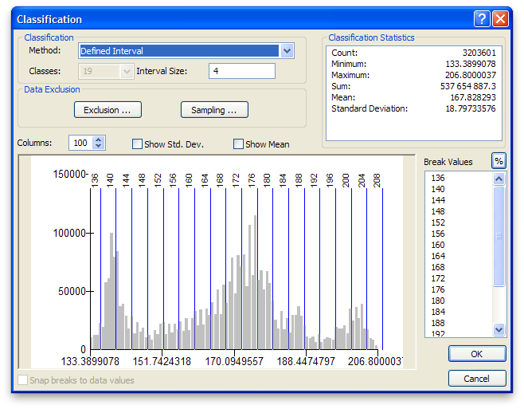
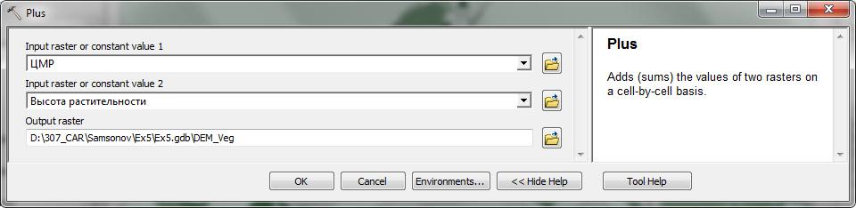
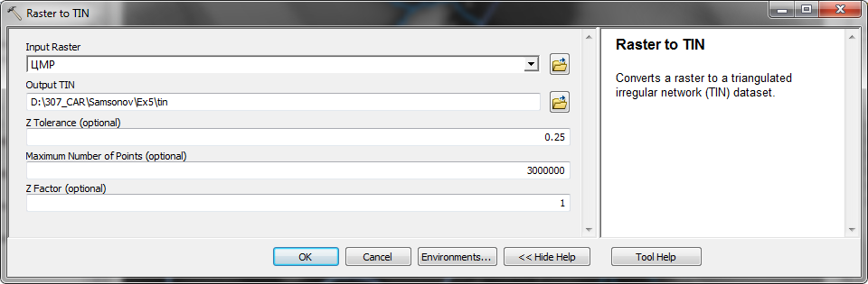
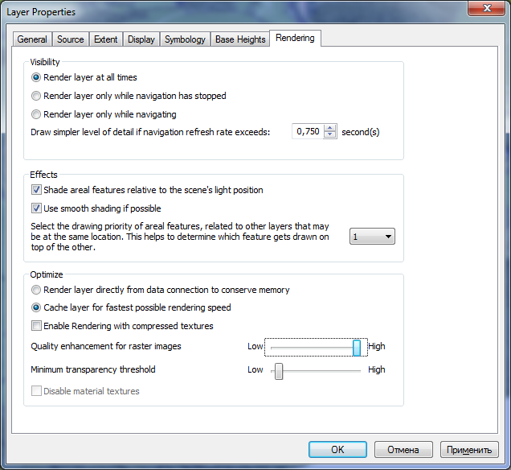
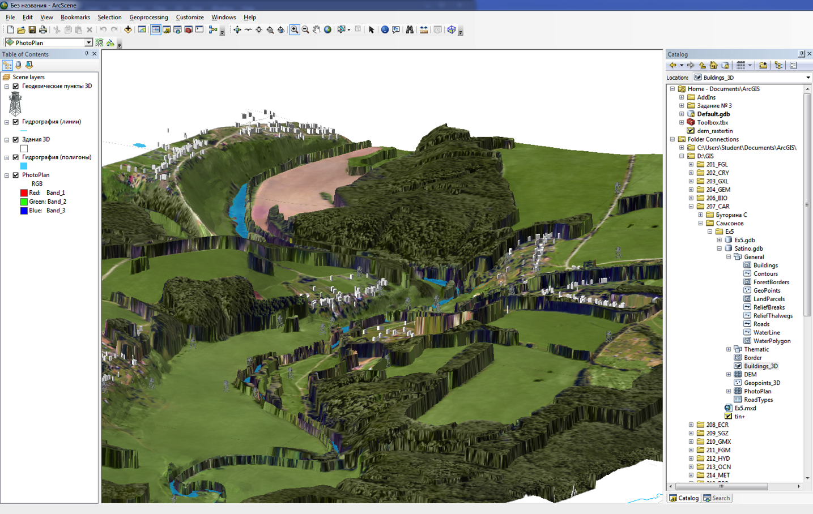
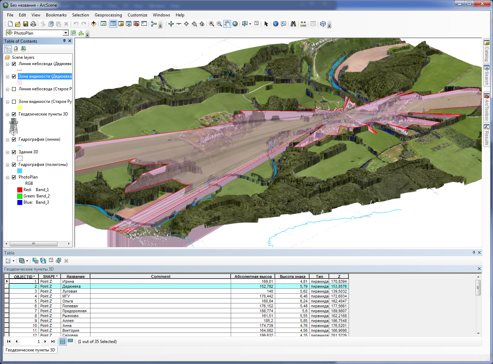

# Трехмерное моделирование {#threed-modelling}

[Скачать данные и файл отчета](http://autolab.geogr.msu.ru/gis/data/Ex18.zip)

## Введение {#threed-modelling-intro}

**Цель задания** --- знакомство с трехмерными моделями данных, трехмерной визуализацией и анализом в ГИС

Параметр                    Значение
--------------------------  --------
*Теоретическая подготовка*  Трехмерные модели данных, виртуальное моделирование, анализ цифровых моделей рельефа, построение зон видимости.
*Практическая подготовка*   Знание основных компонент интерфейса ArcGIS Desktop (каталог, таблица содержания, карта). Настройка символики и подписей объектов. Создание базы геоданных и классов пространственных объектов. Инструменты геообработки ArcToolbox. Создание компоновки карты: название легенда, масштаб, градусная сетка.
*Исходные данные*           База данных ГИС “Сатино”, аэрофотоснимок сверхвысокого разрешения.
*Результат*                 Трехмерная модель Сатинского учебного полигона, зоны видимости и линии небосвода для двух обзорных точек
*Ключевые слова*            Трехмерный анализ и моделирование, цифровые модели рельефа (ЦМР), драпировка снимка

### Контрольный лист {#threed-modelling-control}

* Добавить на карту ЦМР и отобразить ее методом горизонталей с послойной окраской.
* Подготовить вспомогательные объекты для учета препятствий.
* Преобразовать растровые данные в триангуляционные.
* Визуализировать данные в трехмерной среде (приложение ArcScene).
* Выполнить анализ зоны видимости наблюдательного пункта при разных положениях его высоты.

### Аннотация {#threed-modelling-annotation}

Трехмерные модели играют важную роль в географических исследованиях. Изучение рельефа и его морфометрических характеристик; моделирование полей распределения физических и химических показателей в океане, атмосфере и почвах; моделирование городской среды и транспортных коммуникаций; моделирование поверхностей небесных тел; имитация чрезвычайных ситуаций и военных действий — это лишь краткий список тех задач, которые решаются с помощью анализа и визуализации 3D-моделей.

Задание посвящено знакомству с трехмерным ГИС-моделированием. Географическая задача, которую вам предстоит решить — это определение зоны видимости в точке с учетом рельефа и физических препятствий, таких как дома и лесные массивы. Анализ зон видимости позволяет определить охват территории доступный для визуального наблюдения.

Зона видимости ограничивается трехмерной линией небосвода (skyline). Чем круче угол направления между точкой наблюдателя и линией небосвода, тем меньше будет открытость небосвода по данному направлению. Общая открытость небосвода характеризует долю видимой части небесной полусферы. Это важный топоклиматический параметр, накладывающий ограничение на объем поступающей прямой солнечной радиации. Как следствие, открытость небосвода учитывается при расчетах таяния снега, моделировании городского климата, оценке пригодности земель для сельского хозяйства.

В процессе занятия вы научитесь работать с растровыми и триангуляционными моделями рельефа, управлять отображением слоев в виртуальной 3D-среде и использовать снимки в качестве текстуры трехмерных моделей, определять зону видимости и визуализировать ее.

## Организация рабочего пространства {#threed-modelling-workspace}
[В начало упражнения ⇡](#threed-modelling)

1. Скопируйте данные упражнения в свой рабочий каталог *Ex18* с помощью **Проводника**.

2. Откройте **ArcMap** и в нем — окно **Catalog (Каталог)**.

3. Сохраните документ карты в свой каталог *Ex18* под именем *Ex18\_ЦМР.mxd*.

4. Создайте в домашнем каталоге новую базу геоданных *Ex18*.

5. Щелкните по *Ex18.gdb* правой кнопкой мыши и выберите пункт **Make Default Geodatabase** чтобы назначить ее базой геоданных по умолчанию.

## Визуализация цифровой модели рельефа {#threed-modelling-demviz}
[В начало упражнения ⇡](#threed-modelling)

Для того чтобы полноценно моделировать видимость в трехмерном пространстве, необходимо иметь в наличии цифровую модель рельефа, а также и объекты, расположенные на поверхности.

1. Раскройте в домашнем каталоге базу геоданных *Satino.gdb* и перенесите на карту следующие слои из группы *General*:

    - *WaterPolygon* (площадная гидрография);
    - *WaterLine* (линейная гидрография);
    - *Contours* (горизонтали);
    - *DEM* (цифровая модель рельефа);

2. Разместите слои именно в том порядке, в котором они указаны выше.

3. Дважды щелкните на слое *Горизонтали*. Перейдите на вкладку **Display** и установите значение прозрачности равным *80%* (Рис. 1).

    

1. Перейдите на вкладку **Symbology** и поменяйте цвет горизонталей на черный. Нажмите **ОК**.

2. Смените символ слоя *Гидрография (линии)* на ярко-голубую линию толщиной *1.5* пиксела.

3. Смените цвет объектов слоя *Гидрография (полигоны)* на ярко-голубой.

4. Переименуйте слой *DEM* в таблице содержания в *ЦМР*.

5. Дважды щелкните на слое *ЦМР*, перейдите на вкладку **Symbology** и нажмите **Classify…**, чтобы сменить метод классификации.

6. В появившемся диалоге выберите режим *Defined Interval* (заданный вручную интервал) и установите величину интервала равной 4 метрам. Окно классификации примет вид, аналогичный Рис. 2.

    

1. Нажмите **ОК** чтобы закрыть диалог классификации высот.

2. Выберите цветовую шкалу, близкую по гамме к гипсометрической. Окно карты примет вид, аналогичный представленному на Рис. 3.

    

    <kbd>**Снимок экрана №1.** Цифровая модель рельефа долины реки Протвы</kbd>

## Подготовка вспомогательных цифровых моделей для учета препятствий {#threed-modelling-additional}
[В начало упражнения ⇡](#threed-modelling)

При расчете зоны видимости важно учитывать, что на поверхности расположены разные объекты, в том числе здания и растительность. Чтобы учесть объект в качестве препятствия, есть два пути: представить его в виде трехмерного тела, либо внедрить в качестве неровности в цифровую модель рельефа. Для растительности вам предлагается воспользоваться вторым вариантом. Алгоритм состоит из двух шагов:

- ­преобразовать слой растительности в растр, каждый пиксел которого хранит значение высоты растительности;

- прибавить полученный растр к растру ЦМР; там, где леса нет, высота ЦМР сохранится; на залесенных участках к ней прибавится высота растительного покрова.

1. Найдите слой *VegTypes* в базе данных *Satino.gdb* и добавьте его на карту.

2. Дважды щелкните на слое *Растительность* и перейдите на вкладку **Symbology**.

3. Выберите тип отображение **Quantities > Graduated Colors**. В качестве поля отображения укажите поле *Высота*. Выберите шкалу от светло-зеленого к темно-зеленому. Диалог примет вид, аналогичный представленному на Рис. 4:

    

1. Нажмите **ОК**. Окно карты примет следующий вид (Рис. 5):

    

2. Откройте **ArcToolbox** и запустите инструмент **Conversion Tools > To Raster > Polygon to Raster**.

3. Выберите в качестве входных данных **Input Features** слой *Растительность*.

4. В списке **Field** выберите поле *Height* — значение, хранящееся в нем, будет присвоено каждой ячейке растра.

1. Установите параметр **Cell size** равным *2,5* метра. Остальные параметры оставьте по умолчанию. Диалог инструмента примет вид, аналогичный представленному на Рис. 6:

    

1. Нажмите **ОК**, чтобы запустить выполнение инструмента.

2. Полученный слой переименуйте в *Высота растительности*.

3. Запустите инструмент **Spatial Analyst Tools > Math > Plus**, осуществляющий сложение растров.

4. Выберите в качестве первого растра *ЦМР*, в качестве второго — *Высота растительности*.

5. Назовите выходной класс *DEM\_Veg*. Диалог примет следующий вид (Рис. 7).

    

1. Нажмите *ОК*.

2. После того, как полученный слой добавится на карту, назовите его *ЦМР+*.

3. Перенесите слой *ЦМР+* под гидрографию. Обратите внимание на резкие перепады яркости изображения, обусловленные внедрением объектов растительности.

    

## Преобразование растровых моделей в триангуляционные {#threed-modelling-rastertotin}
[В начало упражнения ⇡](#threed-modelling)

До этого момента вы использовали растровые модели, которые удобны для вычислений. Их также можно использовать и в трехмерной среде. Однако, чтобы обеспечить максимальную производительность и качество визуализации, растровые модели желательно преобразовать в триангуляционные, поскольку именно на них основаны методы трехмерной визуализации.

1. Запустите инструмент геообработки **3D Analyst Tools > Conversion > From Raster > Raster to TIN**.

2. В качестве **Input Raster** выберите *ЦМР*.

3. В поле **Output TIN** назовите выходной слой *tin*.

4. Параметр допуска по высоте **Z Tolerance** установите равным *0,25* метров.

    > Параметр **Z Tolerance** управляет чувствительностью триангуляционной модели к неровностям поверхности. Если величина неровности больше, чем указанный порог, она будет выражена в виде набора треугольников. В нашем случае сечение исходных горизонталей было 2 метра, а вспомогательных горизонталей — 1 м. Точность положения горизонталей — ¼ сечения. Следовательно, значение порога, равное 0,25 метра позволит сохранить все нюансы поверхности.

1. Максимальное количество точек **Maximum Number Of Points** увеличьте до *3 000 000* (три миллиона). Это значение подобрано для вас эмпирически.

2. Множитель по высоте **Z factor** оставьте равным *1*. Окно инструмента примет вид, аналогичный представленному на Рис. 9.

    

1. Нажмите **ОК**, чтобы запустить преобразование.

2. Повторите процедуру преобразования для слоя *ЦМР+*. В диалоге инструмента назовите выходной слой *tin+*.

3. Полученный слой *tin+* поместите в таблице содержания так, чтобы он был под слоями гидрографии. Все слои, кроме *tin+* и гидрографии отключите.

4. Дважды щелкните на слое *tin+* и перейдите на вкладку **Symbology**.

5. Выберите в списке слева метод отображения *Edge Types* — он отвечает за показ ребер триангуляции.

6. Щелкните внизу на кнопку **Add All Values**, чтобы добавить к отображению все типы ребер.

7. Исправьте цвет стандартного ребра *Regular Edge* на черный и нажмите **ОК**.

8. Приблизьтесь к лесному массиву в центральной части карты к северу от *Протвы*. Окно карты примет вид, аналогичный представленному на (Рис. 10).

    

> Проанализируйте свойства триангуляционной модели. Является ли плотность треугольников и их размеры постоянными? Обратите внимание, как сгущается сетка на участках с большой кривизной поверхности.

Сохраните документ карты и сверните окно.

<kbd>**Снимок экрана №2.** Триангуляционная модель рельефа долины реки Протвы с лесным массивом</kbd>

## Визуализация данных в трехмерной среде и знакомство с приложением ArcScene {#threed-modelling-arcscene}
[В начало упражнения ⇡](#threed-modelling)

Несмотря на то, что анализ зон видимости можно проводить и в традиционной двумерной среде, более наглядно результат выглядит в трехмерной сцене, особенно когда есть несколько местоположений наблюдателя с разными высотами.

Для работы в трехмерной среде в **ArcGIS** используется приложение **ArcScene**. Это инструмент визуализации, анализа и редактирования трехмерных данных.

1. Откройте приложение **Пуск—Программы > ArcGIS > ArcScene**.

2. Сохраните сразу же документ сцены в свой каталог *Ex18* под названием *Ex18\_3D.sxd*.

3. Раскройте домашнюю директорию в окне **Каталога**, щелкните правой кнопкой мыши на базе геоданных *Ex18.gdb* и выберите пункт **Make Default Geodatabase**, чтобы назначить ее базой геоданных по умолчанию, если это еще не сделано.

4. Откройте панель инструментов **Tools** и обратите внимание на то, что она несколько отличается от привычной вам панели инструментов в **Аркмапе**. Самый первый инструмент используется для вращения сцены.

    

1. Добавьте на карту слой *PhotoPlan* из базы геоданных *Satino*.

    > Обратите внимание на то, что снимок отображается плоским. Системе известна лишь информация о цвете каждого пиксела, но не о его высоте.

1. Откройте свойства слоя и перейдите на вкладку **Base Heights** (базовые высоты).

2. Установите параметр **Elevation from surfaces** в положение *Floating on a custom surface*.

3. Нажмите кнопку обзора каталогов  и укажите модель *tin+* в качестве источника высот.

4. На вкладке **Symbology** в группе **Stretch** установите параметр **Type** равным *None*. Этот параметр отвечает за растяжку гистограммы, которая в случае фотоснимка не нужна.

5. Перейдите на вкладку **Display** и установите параметр **Resample during display using** равным *Cubic Convolution* (кубическая свертка). В этом режиме изображение будет всегда сглаживаться независимо от масштаба сцены.

6. Перейдите на вкладку **Rendering** поставьте галочку **Shade areal features relative to the scene’s light position**. В этом режиме снимок на снимок будет накладываться тень в соответствии с параметрами освещения сцены.

7. На той же вкладке в группе настроек **Optimize** переместите ползунок **Quality enhancement for raster images** в крайнее правое положение для того чтобы снимок отображался в максимальном качестве. Диалог настройки слоя примет вид, аналогичный представленному на Рис. 12.

    

8. Нажмите **ОК** в настройках слоя. Вам придется подождать некоторое время, пока снимок драпируется на поверхность модели.

9. Добавьте на карту слои *WaterLine* и *WaterPolygon* из базы геоданных *Satino* и переместите их наверх таблицы содержания.

10. Откройте свойства слоя *Гидрография (полигоны)* двойным щелчком.

11. Перейдите на вкладку **Symbology** и смените цвет заливки на ярко-голубой, и уберите обводку (поставьте *No Color*).

12. Перейдите на вкладку **Display** и установите прозрачность слоя (**Transparency**) равной *30%*.

13. Перейдите на вкладку **Base Heights** и установите параметр **Elevation from surfaces** в положение *Floating on a custom surface.* Нажмите кнопку обзора каталогов и укажите в качестве источника модель *tin*.

14. Нажмите **ОК** в свойствах слоя.

15. Настройте аналогичным образом слой *Гидрография (линии)*, сменив цвет линии на голубой и включив опцию **Floating on a custom surface**.

    Полученная сцена имеет один недостаток: необходимо увеличить масштаб по высоте, чтобы изображение стало более наглядным.

1. Дважды щелкните в таблице содержания на заголовке **Scene Layers** и установите параметр **Vertical Exxageration** равным *3*. Нажмите **ОК**.

2. Окно приложения примет вид, аналогичный представленному на Рис. 13.

    

    > Что изменилось в сцене после установки параметра Vertical Exxageration? Как он влияет на отображение слоев?

## Визуализация трехмерных объектов: геодезические пункты и здания  {#threed-modelling-geodesy}
[В начало упражнения ⇡](#threed-modelling)

В сцену необходимо добавить здания, которые играют роль дополнительных препятствий и геодезические пункты, с которых производятся наблюдения. До этого момента вы пользовались функцией драпировки объектов на поверхность. Здания и геодезические пункты, напротив, хранятся в базе данных как трехмерные объекты.

1. Добавьте на карту слой *Geopoints\_3D* из базы данных *Satino*.

2. Дважды щелкните на слое *Геодезические пункты 3D* в таблице содержания и на вкладке **Symbology** щелкните на кнопку с изображением символа.

3. В открывшемся диалоге нажмите кнопку **Style References**, чтобы подгрузить дополнительные символы.

4. Отметьте в списке набор символов *3D Industrial* (Рис. 14) и нажмите **ОК**.

    

5. Найдите в таблице символ *WatchTower 1*, выберите его и установите размер *40 пикселов*. Диалог настройки символа примет вид, аналогичный представленному на Рис. 15.

    

6. Нажмите **ОК**, чтобы завершить настройку символа для геодезического пункта.

7. Добавьте на карту слой *Buildings\_3D* из базы данных *Satino*. Это трехмерные объекты типа **Multipatch**, у которых была заранее определена высота.

8. Приблизьтесь к участку поймы между деревнями *Дедюевка* и *Рыжково*. Окно приложения примет вид, аналогичный представленному на Рис. 16.

    

    <kbd>**Снимок экрана №3**. Визуализация исходных данных для анализа зон видимости: рельеф, снимок, геодезические пункты и трехмерные здания</kbd>

## Анализ зоны видимости наблюдательного пункта {#threed-modelling-viewshed}
[В начало упражнения ⇡](#threed-modelling)

Зона видимости строится для определенной точки в трехмерном пространстве. В качестве наблюдательных точек удобно использовать геодезические пункты. Сначала вы определите зону видимости с точки, расположенной на земле, а затем приподнимете ее на несколько метров, чтобы понять, как изменится зона видимости.

1. Откройте атрибутивную таблицу слоя Геодезические пункты 3D и выделите строку с геодезическим пунктом *Старое русло*. Строка должна выделиться ярко-голубым цветом.

2. Запустите инструмент геообработки **3D Analyst Tools > Visibility > Skyline**, который строит линию небосвода.

3. В качестве слоя точек наблюдений **Input Observer Point Features** выберите *Геодезические пункты 3D*. Поскольку вы выделили объект в таблице этого слоя, линия небосвода будет рассчитана только для него, а не для всех объектов.

4. В поле **Input Surface** выберите поверхность *tin+* с помощью обзора каталогов.

5. Из списка препятствий **Input Features** выберите слой *Здания 3D*. Диалог инструмента и окно приложения примут вид, аналогичный представленному на Рис. 17.

6. Нажмите **ОК**, чтобы запустить расчеты.

    

1. После того, как результат будет добавлен в таблицу содержания, смените его название на *Линия небосвода (Старое русло)* и смените символ на ярко-желтую линию.

2. Запустите инструмент **3D Analyst Tools > Visibility > Skyline Barrier**, который строит трехмерную зону видимости на основе линии небосвода.

3. Выберите в качестве **Input Observer Point Features** слой *Геодезические пункты 3D*.

4. В качестве **Input Features** выберите слой *Линия небосвода (Старое русло)*.

5. Установите галочку *Closed*, чтобы сформировать боковые стенки зоны видимости.

6. Остальные параметры оставьте по умолчанию.

7. Нажмите **ОК**, чтобы запустить расчеты.

8. После того, как результат добавится в таблицу содержания, переименуйте его в Зона видимости (Старое русло).

9. Смените цвет слоя зоны видимости на ярко-желтый и установите прозрачность слоя равной *50%*. Окно приложения примет вид, аналогичный представленному на Рис. 18:

    

    <kbd>**Снимок экрана №4.** Результат расчета зоны видимости пункта Старое русло</kbd>

> Проанализируйте результат. Приблизьтесь поближе, чтобы рассмотреть полученные границы. Как ведет себя линия небосвода при встрече с препятствиями?

## Изменение высоты наблюдения {#threed-modelling-height}
[В начало упражнения ⇡](#threed-modelling)

Рассмотрим теперь, как изменится зона видимости, если переместиться в пункт, расположенный более высоко.

1. Выберите в таблице атрибутов слоя *Геодезические пункты 3D* строку *Дедюевка*. Строка должна выделиться ярко-голубым цветом.

2. Запустите инструмент **Skyline** еще раз для построения линии небосвода.

3. В параметр **Input Observer Point Features** подставьте слой *Геодезические пункты 3D*.

4. В поле **Input Surface** выберите поверхность *tin+* с помощью обзора каталогов.

5. Из списка препятствий **Input Features** выберите слой *Здания 3D*. Остальные параметры оставьте по умолчанию и запустите инструмент.

6. Получившийся слой переименуйте в *Линия небосвода (Дедюевка)* и смените его символ на ярко-красную линию.

7. Запустите снова инструмент **Skyline Barrier** для построения зоны видимости.

8. Выберите в качестве **Input Observer Point Features** слой *Геодезические пункты 3D*.

9. В качестве **Input Features** выберите слой *Линия небосвода (Дедюевка)*.

10. Установите галочку **Closed**, чтобы сформировать боковые стенки зоны видимости.

11. Остальные параметры оставьте по умолчанию и запустите инструмент, нажав **ОК**.

12. Переименуйте получившийся слой в *Зона видимости (Дедюевка)*, смените его цвет на розовый и установите прозрачность равной *50%*.

13. Отключите слои *Линия небосвода (Старое русло)* и *Зона видимости (Старое русло)*.

14. Нажмите **глобус**, чтобы вся сцена поместилась на в окне просмотра (Рис. 19).

    

    <kbd>**Снимок экрана №5**. Результат расчета зоны видимости пункта Дедюевка</kbd>

    > Проанализируйте, как изменилась зона видимости после выбора более высокой точки.

Сохраните документ сцены еще раз. Положите ваш отчетный файл в сетевую папку преподавателя.

## Контрольные вопросы {#threed-modelling-questions}
[В начало упражнения ⇡](#threed-modelling)

1. Опишите сути и отличия растровой и триангуляционной моделей рельефа

1. На что влияет параметр допуска по высоте (z tolerance) при преобразовании растровой модели в триангуляционную?

1. Каким эффектом обладает параметр преувеличения по высоте (vertical exxageration) применительно к цифровой модели рельефа? Меняет ли этот параметр сами цифровые данные о высотах?

1. Какие действия необходимо выполнить для того чтобы положить снимок на трехмерную цифровую модель рельефа?

1. Что такое линия зона видимости и линия небосвода? Как они соотносятся?

1. Как влияет высота точки наблюдения на конфигурацию зоны видимости?
