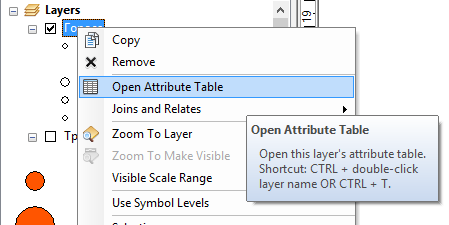
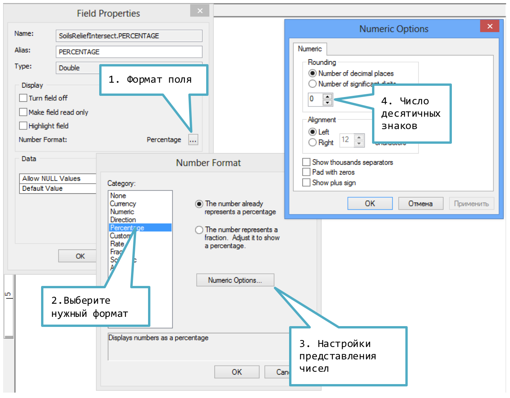

# Атрибутивная таблица {#manual-attributes}

## Открытие атрибутивной таблицы

В контекстном меню слоя выберите команду **Open Attribute Table**:

Во всплывающей подсказке содержится информация о том, как можно сделать это быстрее.

## Псевдонимы полей

Дважды щелкните на названии слоя, перейдите на вкладку **Fields**, выделите поле слева и введите текст псевдонима справа:

## Формат отображения поля

1. В контекстном меню заголовка поля выберите команду **Properties...**

2. В появившемся диалоге выполните следующие действия:

    

## Выделение строки в атрибутивной таблице

Найдите нужную строку и щелкните по ее заголовку слева:

## Сортировка таблицы

Дважды щелкните по заголовку столбца, чтобы отсортировать его. Щелкните дважды еще раз, чтобы отсортировать в обратном порядке.

## Соединение таблиц

1. Дважды щелкните на слое, к которому нужно присоединить таблицу, и перейдите на вкладку **Joins & Relates**.

2. Нажмите кнопку **Add...**.

3. Во всплывающем окне выберите ключевое поле слоя для соединения, внешнюю таблицу и ключевое поле внешней таблицы, по которому они будут соединяться:

    
