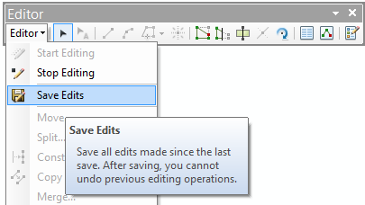
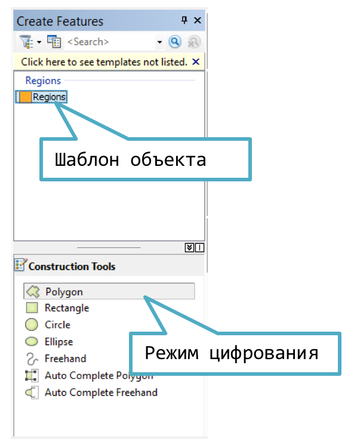
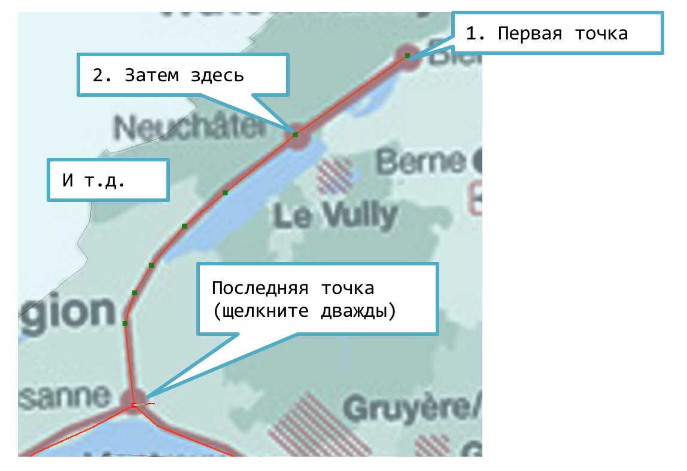
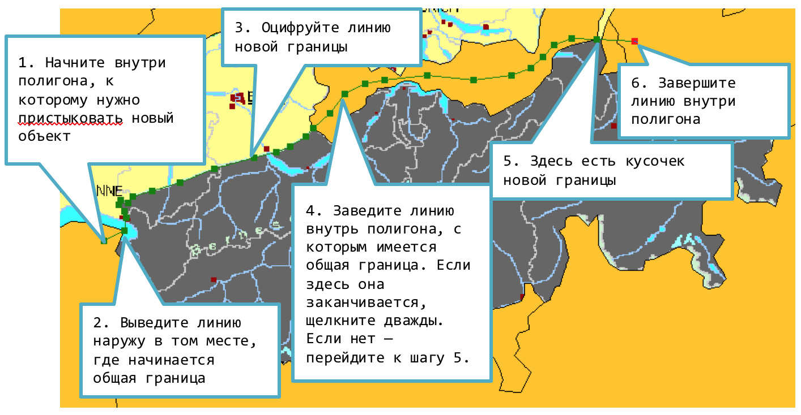
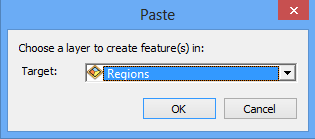

# Редактирование {#manual-edit}

## Включение сеанса редактирования {#manual-edit-begin}

В контекстном меню слоя выберите команду **Editing > Start Editing**:

*Альтернативный вариант:* на панели **Editor** выберите пункт меню **Editor > Start Editing**:

## Сохранение изменений {#manual-edit-save}

На панели **Editor** выберите пункт меню **Editor > Save Edits**:

## Завершение сеанса редактирования {#manual-edit-end}

На панели **Editor** выберите пункт меню **Editor > Stop Editing**:

## Создание (цифрование) объектов {#manual-edit-create}

1. Щелкните на шаблоне объекта в окне **Create Features** и выберите режим цифрования в нижней части окна:

    

2. Для создания точки достаточно щелкнуть в нужно месте на карте.

3. При цифровании линии последовательно нажимайте в узлах линии в порядке их очередности. В последней точке сделайте двойной щелчок или нажмите <kbd>F2</kbd>:

    

## Цифрование полигонов в режиме автозавершения (auto-complete)  {#manual-edit-complete}

1. Выберите в окне **Create Features** режим **Auto-Complete polygon**

2. Оцифруйте границу, используя следующие правила:

    

## Копирование объектов {#manual-edit-copy}

Используйте команду главного меню **Edit > Copy**.

## Вставка объектов {#manual-edit-insert}

1. Используйте команду главного меню **Edit > Paste**.

2. В появившемся диалоге выберите слой, в который необходимо вставить объекты:

    
