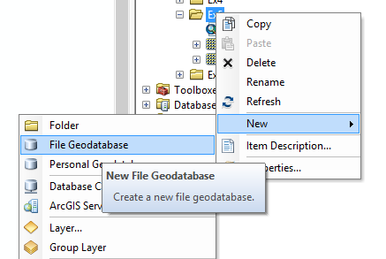

# База геоданных {#manual-gdb}

## Создание базы геоданных

В контекстном меню папки в окне каталога выберите команду **New > File Geodatabase**:

## Создание классов пространственных объектов

1. В контекстном меню базы геоданных выберите команду **New > Feature Class**:

    

2. В появившемся диалоге введите название класса и выберите тип модели пространственных объектов и нажмите **Далее**:

    

3. Выберите систему координат или импортируйте ее у существующего слоя карты или базы данных:

    

4. В следующих двух диалогах **XY Tolerance** и **Configuration Keyword** ничего не меняйте и нажмите **Далее**.

5. В завершающем диалоге вы можете создать новые поля в атрибутивной таблице слоя:

    

6. Нажмите **Finish**, чтобы завершить создание класса пространственных объектов.

## Установка базы геоданных по умолчанию

В контекстном меню базы геоданных выберите пункт меню **New > File Geodatabase**:

