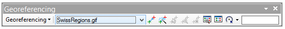
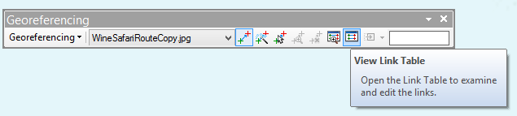
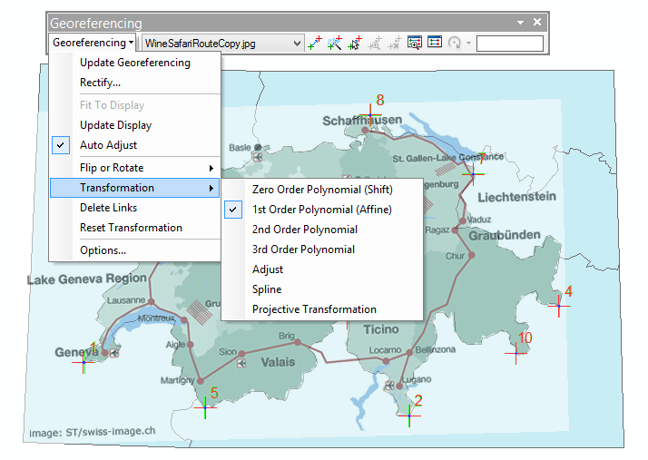

# Привязка растровых данных {#manual-georef}

## Панель Georeferencing

Привязка растровых данных путем трансформирования осуществляется с помощью панели **Georeferencing**:

## Перемещение растра в область, отображаемую на экране

Выберите команду **Fit to Display** в меню **Georeferencing**:

## Расстановка контрольных точек

1. Найдите соответствующие точки на растре и на картооснове.

2. На панели **Georeferencing** щелкните кнопку **Add Control Points**:

3. Щелкните сначала на точке растра, затем на точке референцного слоя:

    

## Просмотр и редактирование контрольных точек

1. На панели **Georeferencing** щелкните кнопку **View Link Table**:

    

2. Отредактируйте контрольные точки на появившейся панели:

    

## Выбор метода трансформирования

На панели **Georeferencing** откройте пункт меню **Georeferencing---Transformation**:

## Трансформирование

Чтобы создать файл пространственной привязки, используйте команду меню **Georeferencing > Update Georeferencing**
