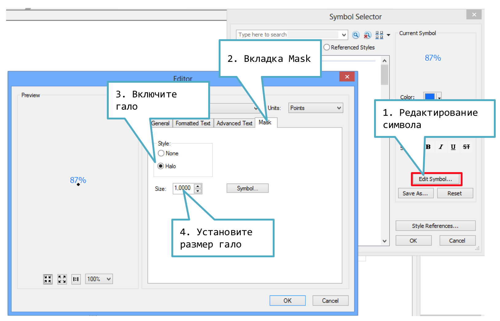
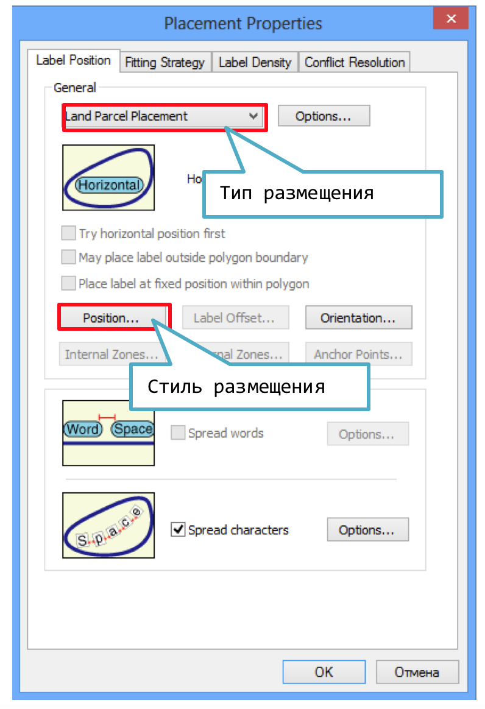
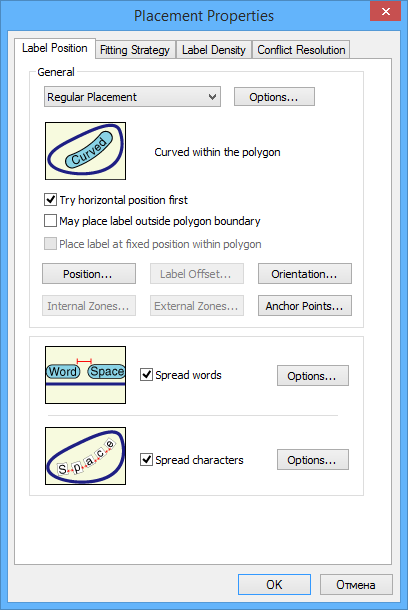
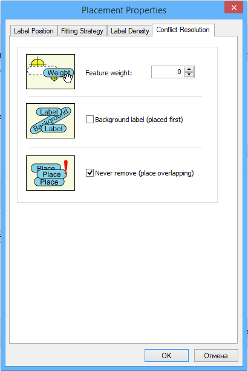

# Подписи объектов {#manual-labels}

## Включение механизма Maplex

**Maplex** --- это дополнительный модуль для *ArcGIS*, предоставляющий расширенные настройки размещения подписей.

Чтобы включить **Maplex**, откройте панель инструментов **Labeling** и выберите опцию в меню **Labeling**. Там же устанавливается режим работы:

## Включение и настройка подписей

Чтобы создать простые подписи для слоя, перейдите на вкладку **Label** в его свойствах и включите режим **Label Features in this layer**. Далее настройте поле, по которому будут подписываться объекты, а также настройте внешний вид подписи:

## Классифицированные подписи

Чтобы внешний вид подписи (размер, цвет и т.д.) соответствовал типу объекта, необходимо использовать классифицированные подписи. Для этого:

1. Установите на вкладке **Labels** метод отображения *Define classes of features and label each class separately*.

2. Импортируйте классы символов, нажав кнопку **Get Symbol Classes**.

3. Настройте внешний вид каждого класс подписи, выбирая их из списка **Class**

    

## Гало подписей

Чтобы подписи хорошо читались на пестром фоне, им добавляют обводку --- гало.

1. В диалоге настройке подписи щелкните на кнопке **Symbol**.

2. В появившемся диалоге выполните следующие действия:

    

## Настройки размещения подписей

Диалог настройки размещения подписей вызывается нажатием кнопки **Placement properties** на вкладке **Labels** в свойствах слоя:

В данном диалоговом окне находятся 4 вкладки:

- **Label Position** (Позиция подписи),

- **Fitting strategy** (Вписывание подписи),

- **Label Density** (Плотность размещения),

- **Conflict Resolution** (Разрешение конфликтов).

## Тип и стиль размещения

Чтобы настроить конкретный стиль размещения, нажмите кнопку **Position...** и выберите нужный стиль:

## Разрядка букв

Разрядка букв по длине объекта включается нажатием галочки **Spread Characters** на вкладке **Label Position**:

## Разрядка слов

Разрядка букв по длине объекта включается нажатием галочки **Spread Words** на вкладке **Label Position**:

## Подписывать наибольшую часть

Если объект состоит из нескольких частей (например, страна включает в себя острова), **Maplex** по умолчанию подписывает каждую из них. Для того чтобы подписывалась только самая крупная часть, перейдите на вкладку **Label Density** и отметьте флажком опцию **Label Largest Feature Part**:

## Разрешение конфликтов

За опции разрешения конфликтов при расстановке подписей отвечает вкладка **Conflict Resolution** в диалоговом окне **Placement Properties**. В частности, можно запретить удалять подпись, даже если она перекрывается другой подписью. Для этого установите флажок **Never remove (place overlapping)**:

## Приоритеты подписей

На панели **Labeling** нажмите кнопку **Label Weight Ranking**:

