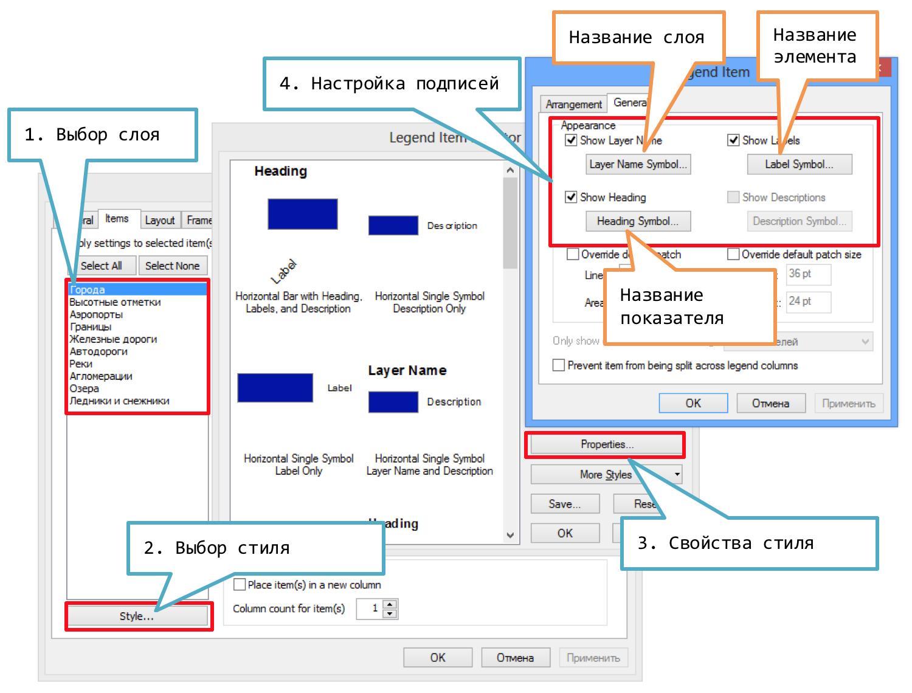
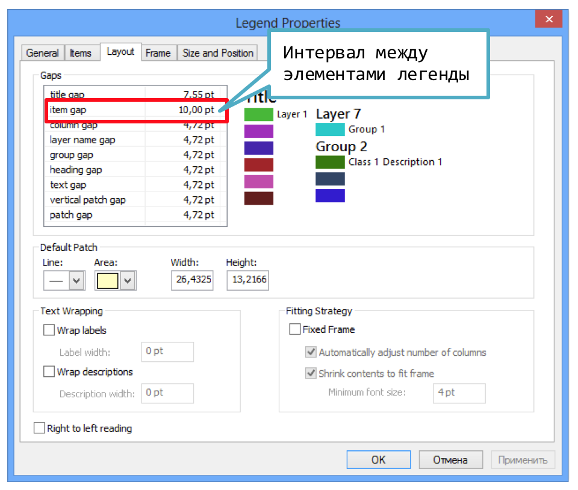
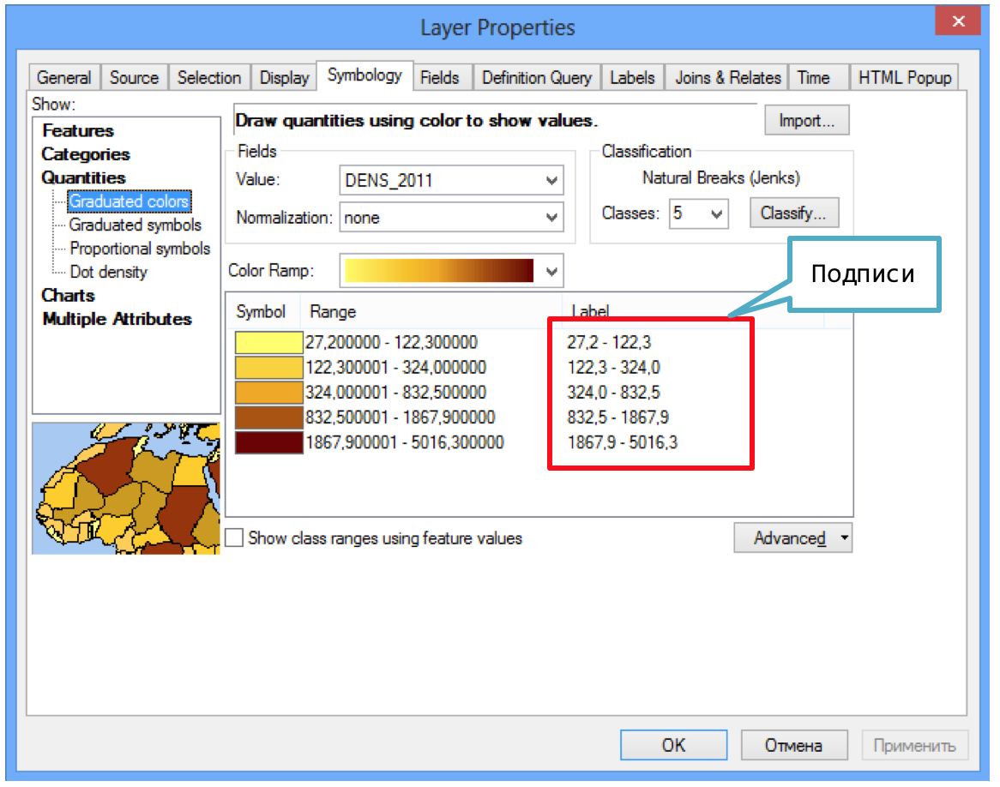

# Легенда карты {#manual-legend}

## Вставка легенды

Используйте команду Insert---Legend. В появившемся диалоге оставьте в правой части только те слои, для которых вы хотите условные обозначения. Ненужные слои можно выделить и исключить из легенды. Параметры в остальных диалогах можно оставить по умолчанию --- их можно настроить позже.

## Название слоя в легенде

Чтобы поменять название слоя в легенде, переименуйте его в таблице содержания

## Название показателя в легенде

Чтобы переименовать название показателя, перейдите в настройки слоя и замените его на вкладке Symbology в столбце Label:

## Стиль отображения подписей в легенде

Вы можете отрегулировать стиль отображения, а также включить/отключить подписи для:

- Названия слоя

- Названия показателя

- Названия элемента легенды

- Описания элемента легенды (если есть)

Для этого:

1. Дважды щелкните на легенде

2. Перейдите на вкладку Items, выберите один или несколько слоев и нажмите кнопку Style

3. В появившемся диалоге нажмите кнопку Properties...

4. В следующем диалоге перейдите на вкладку General, в которой вы можете выполнить необходимые настройки.

Если вы выделили несколько слоев, то настройки будут применены ко всем. Вышеописанный процесс иллюстрирует следующий рисунок:

## Название легенды

Чтобы изменить название легенды или стиль его отображения, дважды щелкните на легенде и перейдите на вкладку *General:*

## Интервал между элементами легенды

Интервал между элементами легенды регулируется в свойствах легенды на вкладке Layout (компоновка) и обозначен там как *Item Gap*:

## Изменение подписей классов

Щелкните дважды на слое и перейдите на кладку Symbology. Отредактируйте вручную содержимое столбца Label.

Было:

Стало:

