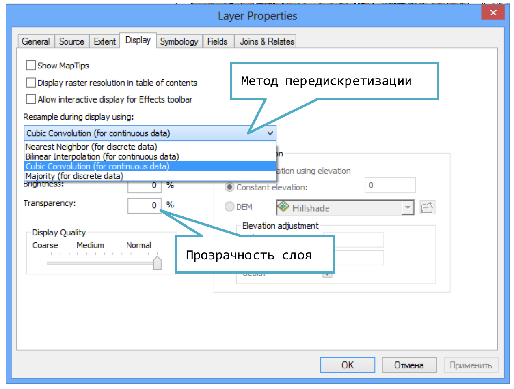

# Оформление растрового слоя {#manual-raster}

## Градиентная окраска

Для отображения растрового слоя в режиме градиентной окраски, перейдите в свойствах слоя на вкладку Symbology и выберите режим Stretched. Здесь вы можете выбрать шкалу и настроить режим растяжки гистограммы.

Растяжка гистограммы используется для сопоставления разброса значений растра и цветовой шкалы. В режиме Minimum-Maximum начало цветовой шкалы соответствует минимальному значению растра, конец шкалы --- максимальному значению.

## Классификация (послойная окраска)

Классифицированное отображение растра позволяет объединять пикселы по диапазонам значений и присвоить им общий цвет. Например, этот способ часто используется при отображении рельефа методом послойной окраски.

## Передискретизация и прозрачность слоя

Поскольку пиксел экрана не совпадает по размерам с ячейкой растра (вы можете увеличивать и уменьшать изображение) необходим алгоритм расчета значения пикселов изображения на основе ячеек растра. Для этого используется передискретизация. В ArcGIS имеются следующие ее режимы:

- Nearest Neighbor (ближайшего соседа) --- для классифицированных растров

- Bilinear (Билинейный) --- кусочно-гладкий метод, не годится для классифицированных растров

- **Cubic Convolution (Кубическая свертка)** --- наиболее гладкий метод, не годится для классифицированных данных

- Majority (большинство) --- для классифицированных растров

Для выбора метода передискретизации передите на вкладку Display и выберите нужный режим в списке Resample during display using.

На этой же вкладке регулируется прозрачность слоя.

