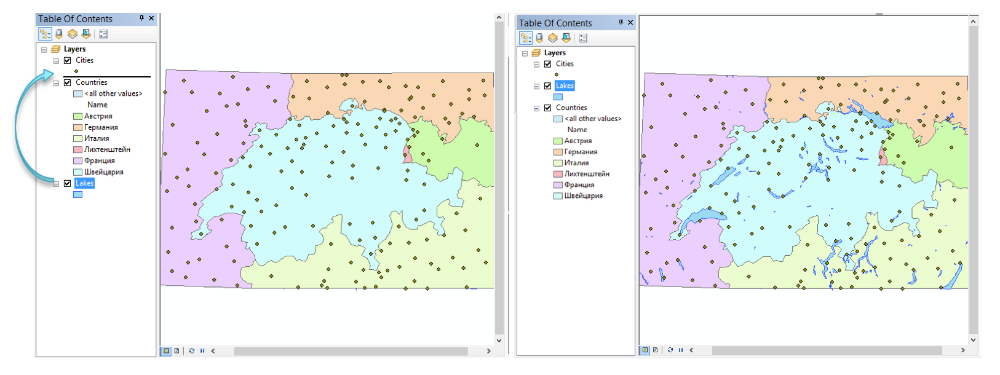
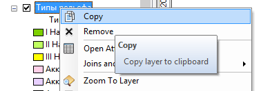
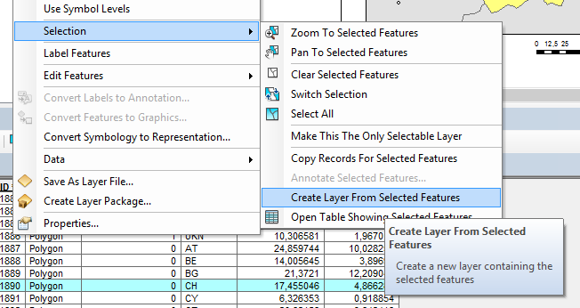
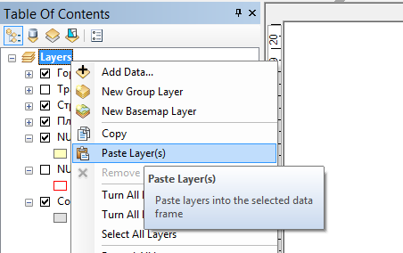

# Работа с таблицей слоев {#manual-toc}

## Добавление слоя

Чтобы добавить слой на карту, вы можете его просто перетащить из базы данных в таблицу содержания. Альтернативный путь --- через кнопку Add Data на панели инструментов:

## Удаление слоя

Чтобы удалить слой, выберите в его контекстном меню команду Remove:

## Переименование слоя

Выделите слой и нажмите F2 на клавиатуре:

## Переименование показателя

Щелкните на названии показателя в таблице содержания, затем щелкните еще раз:

## Смена порядка слоев

Щелкните на слое левой кнопкой мыши и, не отпуская ее, переместите слой вверх или вниз по таблице содержания. Отпустите левую кнопку мыши в нужном месте:

## Свойства слоя

Чтобы открыть свойства слоя, дважды щелкните на нем, либо выберите в контекстном меню пункт Properties (Свойства).

## Копирование слоя

В контекстном меню слоя выберите команду *Copy*:

## Вставка слоя

В контекстном меню Фрейма данных Layers выберите команду *Paste layer(s)*:

## Создание нового слоя на основе выбранных объектов

В контекстном меню слоя выберите команду Selection --- Create Layer From Selected Features:

## Отключение слоя

Снимите флажок слоя, он перестанет отображаться.

## Копирование и вставка слоя

1. В контекстном меню слоя нажмите Copу

2. В контекстном меню фрейма данных Layers нажмите Paste:

