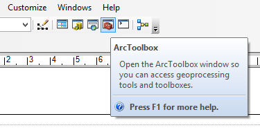
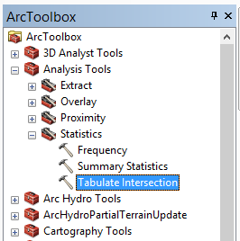

# Геообработка {#manual-toolbox}

## Открытие ArcToolbox

На стандартной панели инструментов нажмите кнопку с красным сундучком:

## Запуск инструмента

Найдите нужный инструмент в иерархическом дереве и дважды щелкните на нем:

