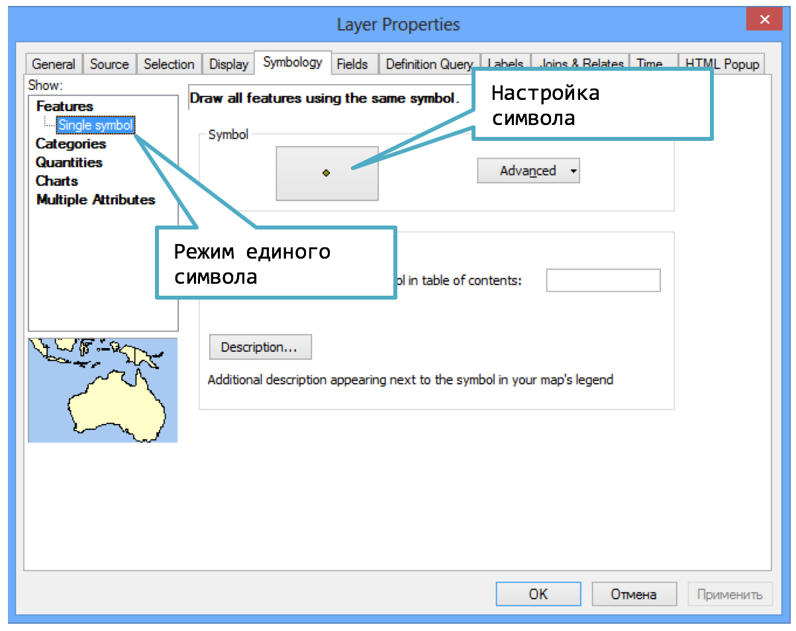
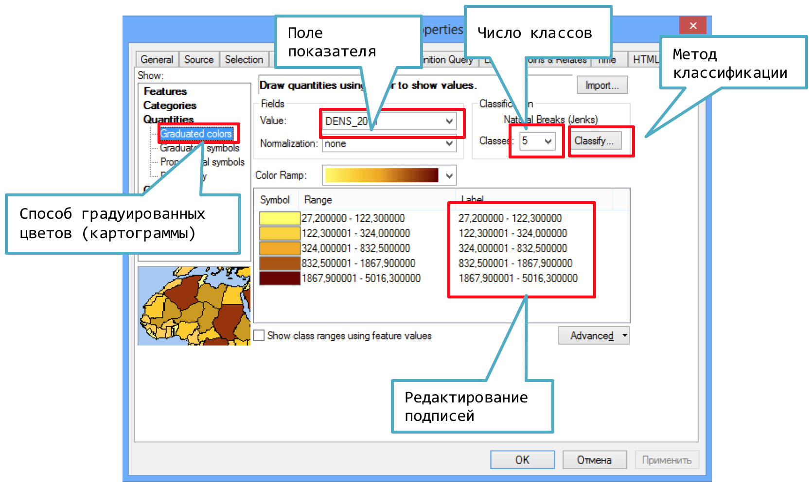
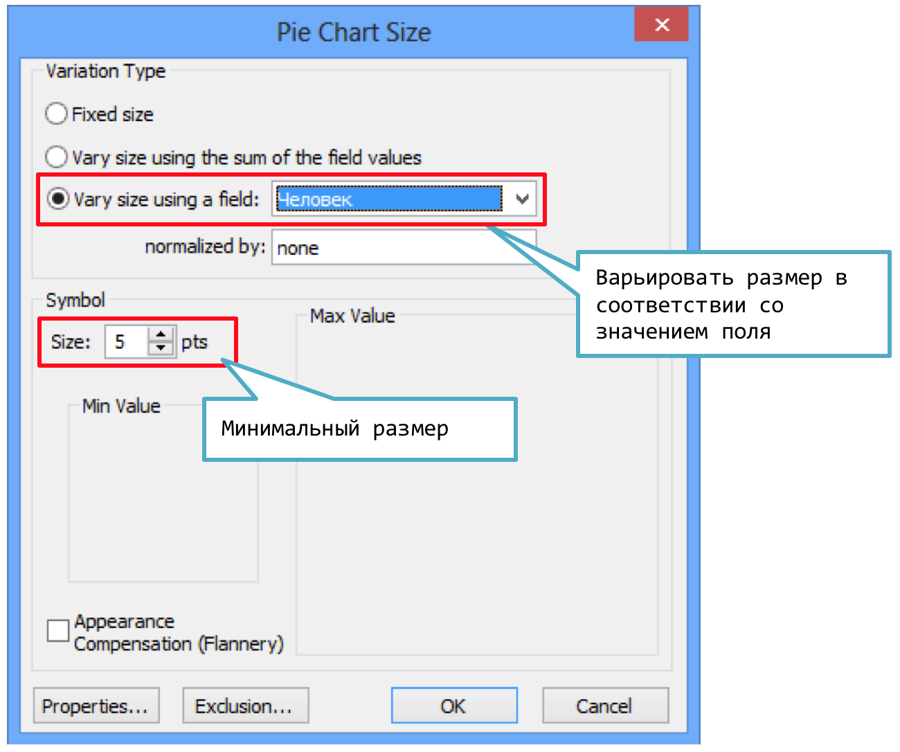
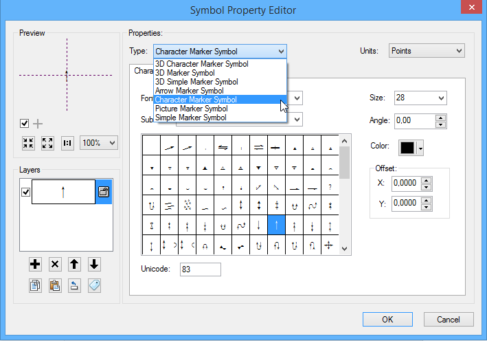
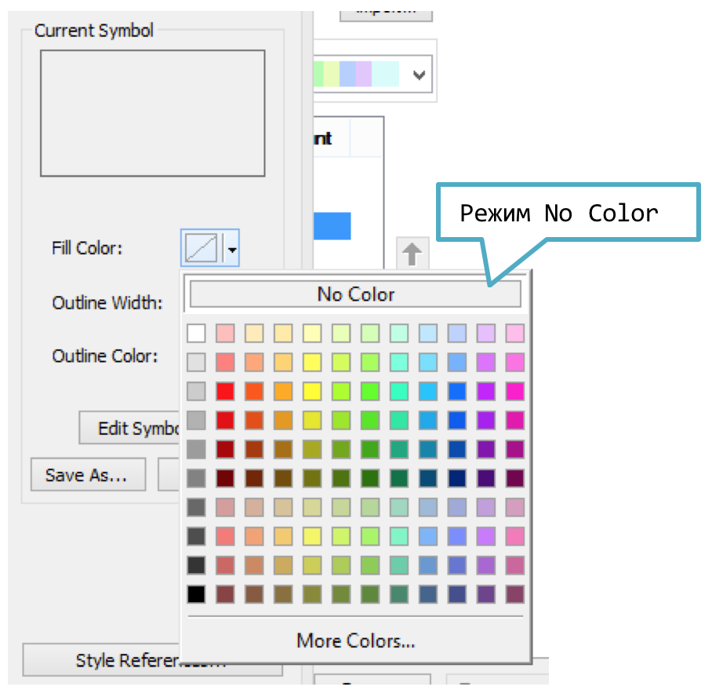
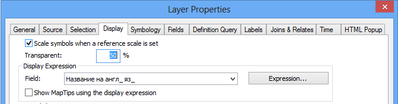
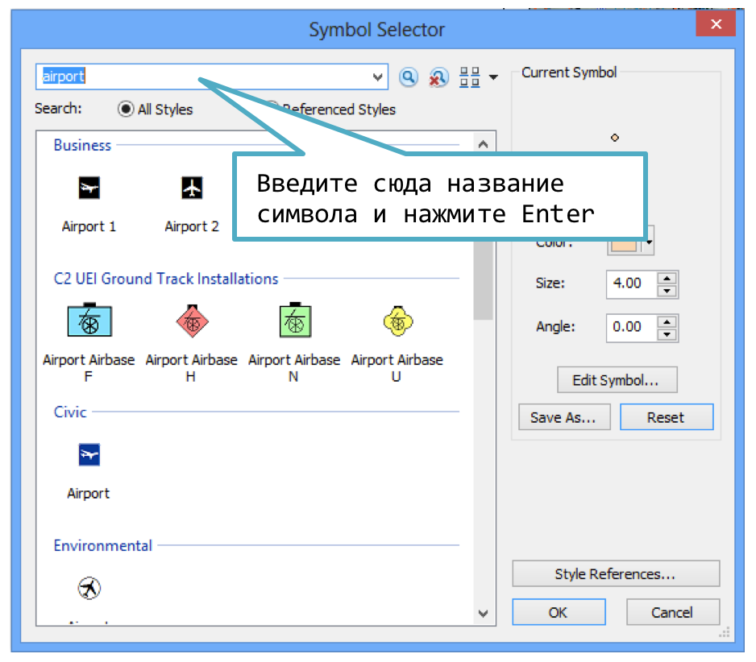
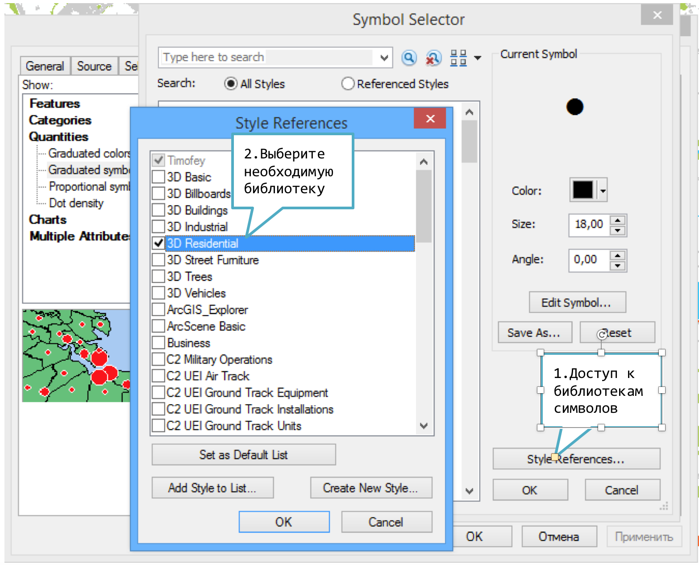

# Оформление векторного слоя {#manual-vector}

## Единый символ для всего слоя {#manual-vector-one}

В свойствах слоя перейдите на вкладку Symbology и выберите режим Features---Single Symbol. Далее щелкните на кнопку Настройки символа:

В появившемся диалоге вы можете выбрать готовый символ, настроить его, либо перейти к созданию нового символа.

## Категории (Categories) {#manual-vector-categories}

В свойствах слоя перейдите на вкладку Symbology и выберите режим Features---Single Symbol. После этого выберите поле категорий в списке Value Field и нажмите Add All Values, чтобы подставить имеющиеся в поле категории в список. Чтобы отредактировать символ конкретной категории, дважды щелкните на нем.

### Сортировка классов {#manual-vector-sorting}

Для сортировки категорий по значению категории или подписи щелкните по заголовку и выберите команду Reverse Sorting:

### Сортировка цветовой шкалы {#manual-vector-colorscale}

Для сортировки категорий по значению категории или подписи щелкните по заголовку и выберите команду Flip Symbols:

### Подстановка стиля (Match Symbols In a Style) {#manual-vector-match}

На вкладке Symbology свойств слоя выберите режим Categories --- Match Symbols In a Style:

## Градуированные символы (картодиаграммы) {#manual-vector-diagrams}

В свойствах слоя на вкладке *Symbology* выберите режим Graduated Symbols:

## Градуированные цвета (картограммы) {#manual-vector-graduated}

В свойствах слоя на вкладке *Symbology* выберите режим Graduated Colors:

## Секторная картодиаграмма (pie chart) {#manual-vector-pie}

В свойствах слоя на вкладке *Symbology* выберите режим *Charts---Pie Charts*:

Чтобы размер диаграммы варьировался, нажмите кнопку Size. Появится диалог,в котором вы можете выбрать, как он будет меняться:

## Выбор метода классификации {#manual-vector-classes}

Метод классификации выбирается после нажатия на кнопку Classify...

## Настройка символа для точечного объекта {#manual-vector-point}

При редактировании точечного объекта вы можете настраивать его размер и основной цвет. Нажав кнопку редактирования символа, вы можете сделать более тонкую настройку:

### Символьный маркер {#manual-vector-symbol}

Чтобы использовать шрифтовые символы для визуализации точечных слоев, в диалоге Symbol Selector (см. выше) нажмите Edit Symbol. В появившемся диалоге выберите тип символа Character Marker Symbol:

### Вращение символа {#manual-vector-rotation}

Вращение символа обычно используется для показа векторных величин в точках. Направление задается значением в заданном атрибутивном поле таблицы слоя. Чтобы включить функцию поворота, войдите в свойства слоя и на вкладке Symbology нажмите кнопку *Advanced --- Rotation...*:

Далее, в появившемся диалоге выберите поле, в соответствии с которым будет осуществляться поворот символа, а также направление поворота:

### Размер символа {#manual-vector-size}

Вы можете менять размера символа в соответствии со значением в атрибутивном поле. Для включения этого режима войдите в свойства слоя и на вкладке Symbology нажмите кнопку Advanced --- Size...:

В появившемся диалоге выберите, в соответствии с каким полем следует менять размер символа:

## Настройка символа для линейного объекта {#manual-vector-line}

При настройке символа для линейных объектов вы можете выбрать подходящий образец в списке слева, а затем настроить его цвет и толщину. Кнопка Edit Symbol позволяет осуществить более тонкую настройку символа, например, сделать линию с обводкой:

## Настройка символа для полигонального объекта {#manual-vector-polygon}

При редактировании символа полигонального объекта вы можете задавать цвет заливки и обводки, а также толщину обводки. Кнопка Edit Symbol позволяет сделать более тонкую настройку, например, добавить штриховку полигона:

## Создание площадного объекта без заливки {#manual-vector-nullfill}

Выберите в свойствах символа цвет заливки No Color:

## Регулировка прозрачности векторного слоя {#manual-vector-transparency}

Перейдите на вкладку Display в свойствах слоя и введите значение прозрачности в поле Transparent:

## Поиск символа по названию {#manual-vector-search}

Для поиска символа по названию, используйте соответствующее поле в диалоге настройки символа:

## Подключение библиотек символов {#manual-vector-libraries}

Вы можете подключить дополнительные библиотеки символов. Для этого в настройках символов нажмите кнопку *Style References*:

