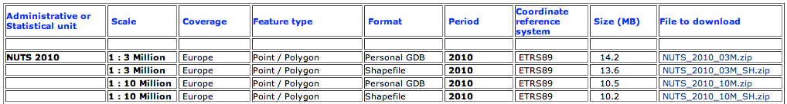
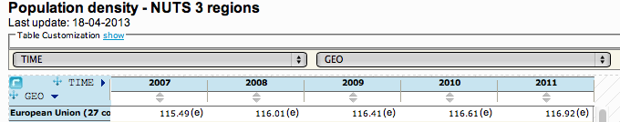
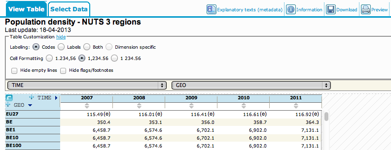
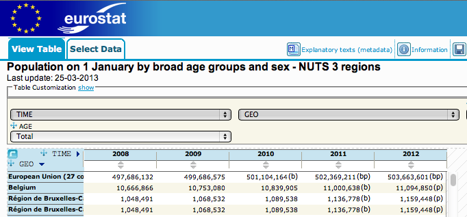
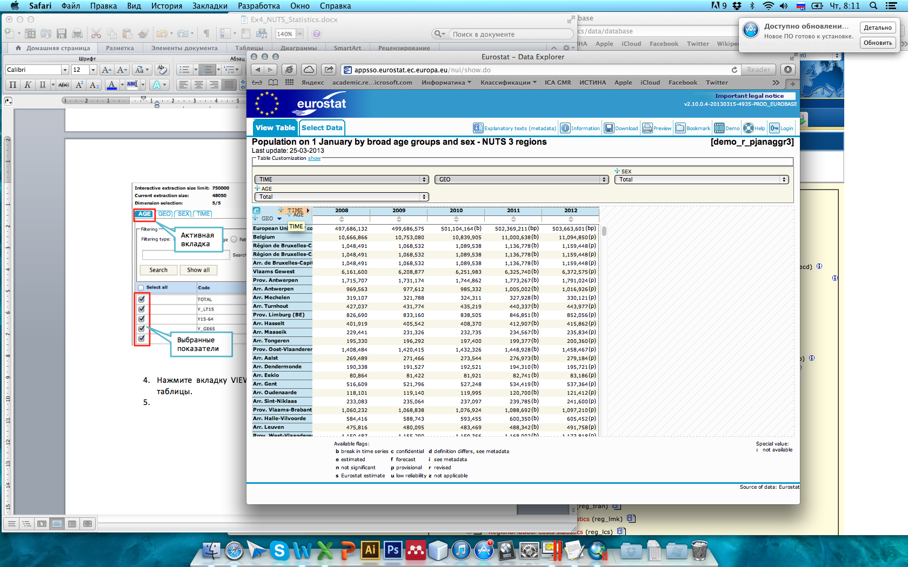
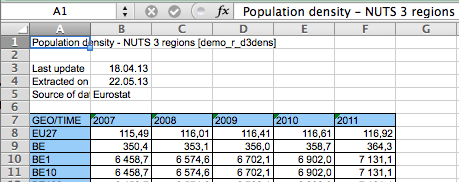
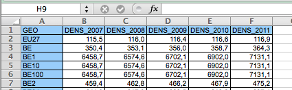
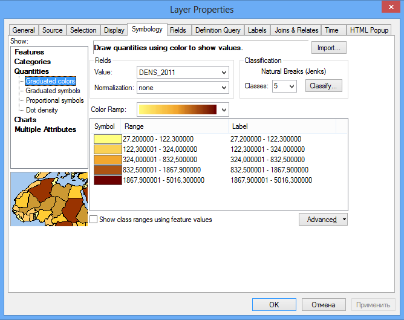
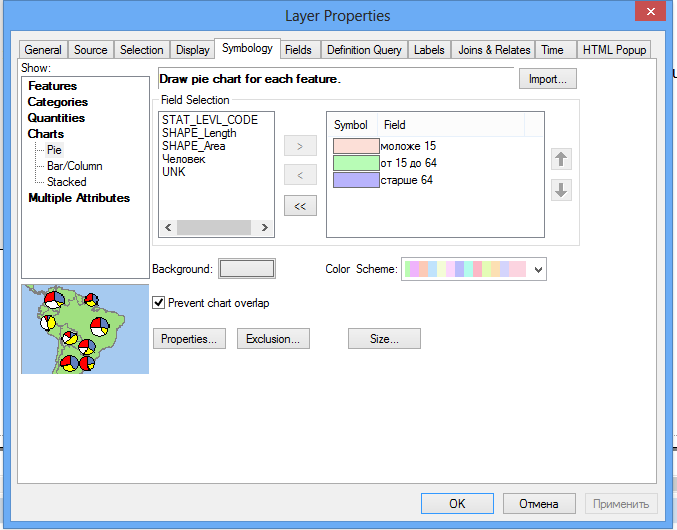

# Картографирование по статистическим данным

## Введение

**Цель задания** --- научиться использовать статистические данные для построения социально-экономических карт методом картограмм и картодиаграмм.

Параметр                    Значение
--------------------------  ----
*Поток*                     <kbd>Экономический</kbd>
*Теоретическая подготовка*  Соединение таблиц в реляционных базах данных, внешний и внутренний ключ соединения, картограммы, картодиаграммы
*Практическая подготовка*   Знание основных компонент интерфейса ArcGIS Desktop (каталог, таблица содержания, карта). Работы с базой пространственных данных. Настройка символики и подписей объектов.
*Исходные данные*           Слои статистических единиц Евросоюза NUTS и таблицы показателей с портала NUTS
*Результат*                 Карта количества транспортных средств в Швейцарии по единицам 3-го уровня, карта плотности и структуры населения Швейцарии по единицам 3-го уровня
*Ключевые слова*            Статистические данные, картограммы, картодиаграммы, соединение таблиц, визуализация статистических данных.

### Контрольный лист

* [x] Скачать слои административно-территориального деления с сайта NUTS.
* [x] Скачать статистические таблицы NUTS на уровень 3.
* [x] Присоединить таблицы статистики к слою административных единиц.
* [x] Создать карту количества автомобилей способом картодиаграмм.
* [x] Создать карту населения способом картограмм и секторных картодиаграмм.

### Аннотация

В основе многих социально-экономических карт лежат статистические данные, которые обычно предоставляются в табличном виде. Задание посвящено знакомству с созданием карт в среде ГИС на основе табличных данных. В качестве примера используется официальная статистика Евросоюза, размещенная на сайте NUTS. Попутно при выполнении задании вы познакомитесь с операцией соединения таблиц.

## Скачивание географических данных с сайта NUTS
[К содержанию ⇡](#картографирование-по-статистическим-данным)

1. Перейдите на [главную страницу **NUTS**](http://epp.eurostat.ec.europa.eu/portal/page/portal/nuts_nomenclature/introduction) и прочитайте краткую информацию на ней.

1. Выберите в правой части окна пункт меню **NUTS Geodatafiles at GISCO**.

2. Скачайте файлы *NUTS 2010* для масштаба *1:3 Million* в формате *Personal GDB* и сохраните их себе в каталог *Ex08*.

## Скачивание таблиц с сайта NUTS
[К содержанию ⇡](#картографирование-по-статистическим-данным)

1. На главной странице **NUTS** выберите в правой части окна пункт меню **Statistics on regions and cities**.

2. На сайте статистики **NUTS** выберите пункт **Database**, чтобы перейти к просмотру таблиц базы данных:

    

1. Найдите таблицу плотности населения по регионам *Population density - NUTS 3 regions (demo\_r\_d3dens)* и нажмите иконку слева от нее:

    

1. Нажмите **Table Customization > Show**, чтобы настроить содержание таблицы:

    

1. Установите режим **Codes**, чтобы в первом столбце отображались уникальные идентификаторы вместо названий единиц.

2. Нажмите кнопку **Download**, чтобы скачать таблицу:

    

1. В появившемся окне нажмите кнопку **Download in Excel format**, не меняя никаких настроек.

Скачайте аналогичным образом таблицу *Stock of vehicles by category and NUTS 2 regions (tran\_r\_vehst),* содержащую статистику по количеству зарегистрированных транспортных средств в регионах.

## Скачивание структурных таблиц с сайта NUTS
[К содержанию ⇡](#картографирование-по-статистическим-данным)

1. Найдите таблицу *Population on 1 January by broad age groups and sex - NUTS 3 regions* и откройте ее.

2. Нажмите кнопку **Select Data** в заголовке сайта:

    

1. В левой части окна выберите вкладку *AGE*, отметьте галочками все пункты и нажмите *UPDATE*, чтобы обновить таблицу:

    

1. Нажмите вкладку **VIEW Table** в верхней части окна, чтобы перейти к просмотру таблицы.

2. Схватите мышкой показатель *Age* и переместите его в таблицу на место показателя *TIME*:

    

    В результате таблица должна приобрести искомую структуру, в которой показана структура населения по 3 категориям: до 15 лет (дети), 15-64 года (трудоспособные) и старше 64 лет (пенсионеры). Помимо этого есть поле Unknown для населения неустановленной возрастной категории:

    

1. Включите режим показа кодов вместо названий единиц.

2. Скачайте таблицу в формате *Microsoft Excel*.

## Форматирование таблиц для загрузки в ГИС
[К содержанию ⇡](#картографирование-по-статистическим-данным)

Чтобы скачанные таблицы можно было использовать в ГИС, их нужно отформатировать следующим образом:

1. Удалите все строки выше заголовка.

2. Переименуйте поле *GEO/TIME* в *GEO*.

3. Переименуйте поля таким образом, чтобы:

    - Они не содержали пробелов, символов “ / “, “ - ” и тому подобных. Символ подчеркивания “\_” допускается.
    - Название поля начиналось с буквы.

4. Установите столбцам показателей числовой формат с необходимым числом десятичных знаков.

5. Сохраните таблицы под названиями:

    - *Density.xls* (плотность населения),
    - *Population.xls* (структура населения),
    - *Vehicles.xls* (число зарегистрированных транспортных средств).

Пример преобразования таблиц представлен на рисунках ниже.

*Было*:

*Стало*:

## Подготовка проекта
[К содержанию ⇡](#картографирование-по-статистическим-данным)

1. Откройте **ArcMap** и создайте новый документ карты в каталоге *Ex08*.

2. Добавьте на карту слой *Countries* из базы данных предудыщего упражнения.

3. Добавьте на карту слой *NUTS\_RG\_03M\_2010* из базы данных, которую вы скачали с сайта. Она находится в каталоге PGDB/data:

    

1. Присвойте добавленному слою символ полигона без заливки с обводкой красного цвета и переименуйте его в *NUTS*.

2. *Выделите в таблице* слоя *NUTS* строку, в которой `NUTS\_ID = “CH”`, которая соответствует региону Швейцарии. Обратите внимание на то, что таблица может быть отсортирована не по алфавиту, а по статусу единицы:

    

1. Выделите все регионы, находящиеся внутри выделенной единицы, используя *пространственный запрос* со следующими параметрами:

    Параметр                   Значение
    -------------------------  ------------------------------
    *Слой искомых объектов*    NUTS
    *Слой-источник*            NUTS
    *Пространственный запрос*  Are within the layer feature

    *Результат*:
    

1. **Создайте новый слой на основе выбранных объектов** он получит название «*NUTS selection*».

2. **Отключите** исходный слой *NUTS*.

## Отображение картодиаграмм по единицам 2-го уровня
[К содержанию ⇡](#картографирование-по-статистическим-данным)

1. **Скопируйте** слой *NUTS selection*, **вставьте** и назовите его *Транспортные средства (NUTS 2)*.

2. С помощью **определяющего запроса** в окне конструктора запроса включите единицы 2-го уровня, введя строку:

    `\[STAT\_LEVL\_CODE\] = 2`

    При вводе строки используйте двойной щелчок на названии вместо ввода текста вручную.

    *Результат*:
    

1. Добавьте на карту лист *Data* таблицы *Vehicles* и переименуйте его в *Vehicles*:

    

1. **Раскройте таблицу** слоя *Транспортные средства*, чтобы просмотреть состав атрибутивных полей. Таблица содержит поле *NUTS\_ID*, содержащее уникальные идентификаторы единиц NUTS.

    

1. **Присоедините таблицу**  *VEHICLES* к слою *Транспортные средства*, используя следующие параметры:

    Параметр                  Значение
    ------------------------- ----------
    *Ключевое поле слоя*      NUTS\_ID
    *Присоединяемая таблица*  VEHICLES
    *Ключевое поле таблицы*   GEO

    Раскройте таблицу слоя *Транспортные средства (NUTS 2)*, чтобы убедиться в результате:
    

1. Включите для слоя **способ градуированных символов** (картодиаграммы), используя следующие параметры:

    Параметр                Значение
    ----------------------- -------------------------------
    *Поле показателя*       2011 год
    *Размер значка*         От 15 до 60
    *Метод классификации*   Равноинтервальный с шагом 200 (Defined Interval)
    *Фоновый символ*        Без заливки

    Цвет диаграммы выберите по своему вкусу. Диалог примет следующий вид:
    

1. Переименуйте **название показателя в таблице слоев** в «тысяч штук».

    *Результат*:
    

## Отображение картограмм по единицам 3-го уровня
[К содержанию ⇡](#картографирование-по-статистическим-данным)

1. Скопируйте слой *NUTS selection* и назовите его «*Плотность населения (NUTS 3)*».

2. Включите единицы 3-го уровня, по аналогии с единицами 2-го уровня.

3. Добавьте на карту лист *Data* таблицы *Density* и переименуйте его в *DENSITY*.

4. Присоедините таблицу *DENSITY* к слою *Плотность населения,* используя те же поля, что и в случае слоя транспорта.

5. Включите для слоя метод отображения **Graduated Colors (картограммы)**, используя следующие параметры:

    Параметр                Значение
    ----------------------- -----------------------------------------
    *Поле статистики*       2011 год
    *Цветовая шкала*        От желтого к коричневому (по умолчанию)
    *Метод классификации*   Дженкса (естественных интервалов)
    *Количество интервалов* 5

    Диалог свойств слоя примет следующий вид:
    

1. Переименуйте название показателя в таблице содержания в «чел/кв. км.».

2. Перенесите слой со статистикой транспорта так, чтобы он располагался поверх слоя плотности населения и увеличьте толщину обводки полигонов до 1.5 пиксела.

Результат позволяет одновременно показывать статистику по двум уровням иерархии:

## Отображение структурных картодиаграмм по единицам 3-го уровня
[К содержанию ⇡](#картографирование-по-статистическим-данным)

1. Скопируйте слой *NUTS selection* и назовите его «*Структура населения (NUTS 3)*».

2. Включите единицы 3-го уровня.

3. Добавьте на карту лист *Data* таблицы *Population* и переименуйте его в *POPULATION*.

4. Присоедините таблицу *POPULATION* к слою *Структура населения*.

5. Определите русскоязычные **псевдонимы** полям на вкладке **Fields**:

    - Y\_LT15 — моложе 15 лет,
    - Y\_15\_64 — от 15 до 64 лет,
    - Y\_GE65 — старше 64 лет,
    - TOTAL — человек.

    *Результат*:

    

1. Включите для слоя метод отображения **Pie Charts (секторные диаграммы)**, используя следующие параметры:

    Параметр              Значение
    --------------------- -----------------------------------------------
    *Поля статистики*     моложе 15 лет, от 15 до 64 лет, старше 64 лет
    *Цвета*               Выберите на свой вкус
    *Минимальный размер*  5
    *Размер*              По полю “Человек” (TOTAL)

    Диалог примет следующий вид:
    

    *Результат*:
    

Структура населения в целом очень похожа по регионам, при этом незначительно варьируется численность населения пенсионного и нетрудоспособного населения.

## Оформление итоговых карт
[К содержанию ⇡](#картографирование-по-статистическим-данным)

1. Добавьте на карту слой городов из базы данных задания 3.

2. С помощью **определяющего запроса** оставьте только те города, у которых значение поля `Pop\_Rank <= 6`. Это города с населением 50 000 человек и более:

    

1. Оформите слой городов аналогично заданию 3, разделив их на классы.

2. Включите **подписи** стран.

3. Перекрасьте страны в нейтрально-серый цвет.

4. Установите масштаб карты равным 1:2 000 000.

5. Переключитесь в режим компоновки и установите альбомную ориентировку.

6. Подгоните размер фрейма таким образом, чтобы он охватывал страну с небольшим запасом.

    *Результат*:
    

    Пока что не обращайте внимания на то, что слои перекрывают друг друга. При экспорте вы будете оставлять включенным только один из них.

1. Добавьте на карту легенду, включив в нее слои *Транспортные средства*, *Структура населения* и *Плотность населения*.

2. Переведите элементы легенды на русский язык и сотрите заголовок легенды.

3. Вставьте заголовок карты «ШВЕЙЦАРИЯ» и масштабную линейку.

## Экспорт карты числа транспортных средств

1. Отключите слои плотности населения и структуры населения. В легенде останется только слой с картодиаграммами.

2. Отредактируйте подписи классов таким образом, чтобы убрать у них незначащие нули.

    *Результат*:
    

1. Экспортируйте карту в графический файл формата <kbd>PNG</kbd> c разрешением 300 dpi.

## Экспорт карты населения
[К содержанию ⇡](#картографирование-по-статистическим-данным)

1. **Включите слои** плотности населения и структуры населения. Отключите слой транспортных средств.

2. Включите отображение названия слоя в легенде для слоя **Структура населения**.

3. Уберите **незначащие нули в подписях классов** слоя плотности населения, оставив один знак после запятой.

    *Результат*:
    

1. Экспортируйте карту в графический файл формата <kbd>PNG</kbd> c разрешением 300 dpi.
