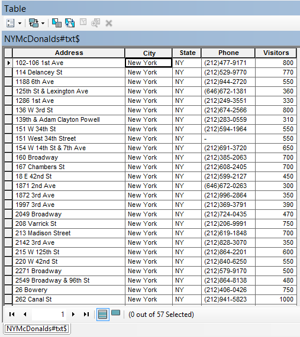
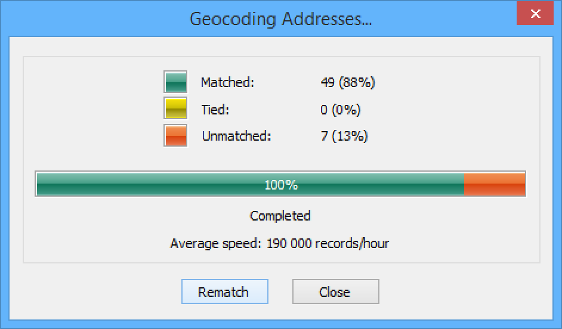

# Анализ распределения типов подстилающей поверхности

## Введение

**Цель задания** --- научиться определять соотношение типов подстилающей поверхности по регулярной сетке для метеорологических моделей и моделей формирования поверхностного стока средствами ГИС-технологий.

Параметр                    Значение
--------------------------  --------
*Поток*                     <kbd>Гидрометпоток</kbd>
*Теоретическая подготовка*  Оверлей пространственных объектов, соединение таблиц в реляционных базах данных, внешний и внутренний ключ соединения.
*Практическая подготовка*   Знание основных компонент интерфейса ArcGIS Desktop (каталог, таблица содержания, карта). Работы с базой пространственных данных. Настройка символики и подписей объектов. Владение базовыми ГИС-технологиями: пространственные и атрибутивные запросы, оверлей.
*Исходные данные*           Cлои картографической основы OpenStreetMap
*Результат*                 Слой регулярной сетки, для каждой ячейки которого определено соотношение типов подстилающей поверхности. Картодиаграммы типов подстилающей поверхности. Проект карты с компоновкой.
*Ключевые слова*            Регулярная сетка, оверлей, соединение таблиц, картодиаграммы

### Контрольный лист

* [x] Построить регулярную сетку с заданными параметрами.
* [x] Определить долю каждого типа подстилающей поверхности в площади ячеек.
* [x] Присоединить получившиеся столбцы к слою регулярной сетки.
* [x] Экспортировать результаты в текстовый файл.
* [x] Визуализировать результат способом картодиаграмм.
* [x] Оформить карту в режиме компоновки.

### Аннотация

В задачах климатического и метеорологического моделирования, а также моделирования поверхностного стока важную роль играет характер подстилающей поверхности, а именно соотношение водопроницаемых и водоупорных поверхностей, соотношение леса, воды, открытых грунтов, городских территорий и т.д. Подготовка этих данных осуществляетсясредствами ГИС на основе картографических данных и данных дистанционного зондирования.

В задании вам предлагается сформировать регулярную сетку и с помощью оверлея определить соотношение типов поверхностей по каждой ячейке. Результаты далее экспортируются в текстовый файл для дальнейшего использования при моделировании, а на основе полученных данных оформляется карта соотношения типов поверхностей методом картодиаграмм.

## Оформление базовых слоев
[К содержанию ⇡](#анализ-распределения-типов-подстилающей-поверхности)

1. Скопируйте каталог *Ex09* в свою папку.

2. Подключитесь в окне каталога к вашей папке *Ex09*. Убедитесь, что в ней находится база геоданных *LandCover.gdb*:

3. Добавьте на карту следующие слои и раскрасьте их в соответствии с цветами:

    Слой          Цвет
    ------------- -------------
    *Hydro*       Голубой
    *Green*       Зеленый
    *Industrial*  Оранжевый
    *Buildings*   Темно-серый

1. Сохраните документ карты в свою папку под названием *LandCover.mxd*.

<kbd>**Снимок экрана №1.** Типы подстилающей поверхности</kbd>

## Построение регулярной сетки
[К содержанию ⇡](#анализ-распределения-типов-подстилающей-поверхности)

1. Создайте новую базу геоданных. Для этого в окне каталога щелкните правой кнопкой мыши по вашей папке &lt;Фамилия&gt;\\Ex09 и выберите **New > File Geodatabase**.

2. Назовите базу геоданных *Ex09*.

3. Щелкните по *Ex09.gdb* правой кнопкой мыши и выберите пункт **Make Default Geodatabase**. Эта команда указывает системе, что все результаты автоматической обработки данных следует помещать в выбранную базу геоданных.

4. Откройте **ArcToolbox** с помощью иконки  на панели инструментов.

5. Запустите инструмент геообработки **Data Management Tools > Feature Class > Create Fishnet** и заполните его параметры следующим образом.

    Параметр                  Значение
    ------------------------- ----------------------------------------
    *Output Feature Class*    <Ваша папка>/Ex09/Ex09.gdb/fishnet\_1000
    *Template Extent*         Same as Layer Buildings
    *Cell Size Width*         1000
    *Cell Size Height*        1000
    *Number of Rows*          0
    *Number of Columns*       0
    *Create Label Points*     Нет
    *Geometry Type*           POLYGON

    Остальные параметры оставьте по умолчанию. *Диалог инструмента примет следующий вид:*

    

1. Нажмите **ОК**. После выполнения расчетная сетка будет добавлена на экран.

2. Разместите слой *Fishnet* поверх других слоев и смените его символ на черную линию толщиной 1 пункт.

3. Сохраните документ карты.

## Подсчет доли водных объектов в площади ячеек
[К содержанию ⇡](#анализ-распределения-типов-подстилающей-поверхности)

1. Запустите инструмент **Analysis Tools > Statistics > Tabulate Intersection**.

2. Заполните его параметры следующим образом:

    Параметр                Значение
    ----------------------- -----------------------
    *Input Zone Features*   fishnet\_1000
    *Zone Fields*           OID
    *Input Class*           Features Hydro
    *Output Table*          \<Ваша папка\>/Ex09/Ex09.gdb/fishnet\_1000\_Hydro

    Остальные параметры оставьте по умолчанию. *Диалог примет следующий вид:*

    

1. Нажмите **ОК**, после выполнения таблица результатов будет добавлена в таблицу содержания.

2. Откройте таблицу и посмотрите значения в поле *PERCENTAGE* — они отражают долю объекта в площади ячейки.

## Подсчет доли прочих типов поверхности в площади ячеек
[К содержанию ⇡](#анализ-распределения-типов-подстилающей-поверхности)

Повторите операцию подсчета доли площади для оставшихся трех слоев, используя следующие параметры:

Входной слой    Выходной слой
--------------- ---------------------------
*Green*         Fishnet\_1000\_Green
*Industrial*    Fishnet\_1000\_Industrial
*Buildings*     Fishnet\_1000\_Buildings

## Добавление и инициализация атрибутивных полей
[К содержанию ⇡](#анализ-распределения-типов-подстилающей-поверхности)

1. Откройте таблицу атрибутов слоя *Fishnet*.

2. Добавьте в нее поле, которое будет хранить значение доли водных объектов. Для этого выберите в главном меню таблицы команду *Add Field…* и заполните параметры появившегося диалога следующим образом:

    Параметр  Значение
    --------  --------
    *Name*    Hydro
    *Type*    Float

    Остальные параметры оставьте по умолчанию.

1. Добавьте аналогичным образом поля *Green*, *Industrial*, *Building*, а также *Other*, которое будет использоваться для хранения доли прочих поверхностей.

2. Используя калькулятор поля, заполните каждое поле значением *0*.

3. Сохраните документ карты.

## Присоединение таблицы с долей водных объектов
[К содержанию ⇡](#анализ-распределения-типов-подстилающей-поверхности)

> **Соединение таблиц** (join) — операция, в результате которой к одной таблице добавляются столбцы из другой таблицы. При этом требуется, чтобы строки добавленных столбцов присоединились к нужным строкам основной таблицы. Порядок строк и их число в обеих таблицах, как правило, не одинаковы. Чтобы установить соответствие между строками исходной и присоединяемой таблицы, необходимо иметь в каждой таблице поле с общими для них значениями. Это поле именуется ключевым.

1. Откройте слой *Fishnet* на редактирование.

2. Присоедините таблицу *Fishnet\_1000\_Hydro* к слою Fishnet. Для этого откройте свойства слоя Fishnet, перейдите на вкладку *Joins & Relates* и нажмите Add в группе Joins.

3. Укажите его параметры следующим образом:

    Параметр                      Значение
    ----------------------------- ------------------------------
    *OID*                         Поле, содержащее уникальный идентификатор каждой записи
    *Fishnet\_1000\_Hydro*        Присоединяемая таблица
    *OID*                         Поле в присоединяемой таблице, которое соответствует полю 1 в исходной
    *Keep Only Matching Records*  Будут сохранены только те записи, для которых найдены совпадения поля *OID*

    При указании свойств соединения отметьте флажком опцию **Keep Only Matching records**. Диалог соединения таблиц примет следующий вид:

    

1. Используя калькулятор поля, перенесите значения из присоединенного столбца *PERCENTAGE* в столбец *Hydro* слоя *Fishnet*. Для этого щелкните правой кнопкой мыши по заголовку столбца *Hydro* и выберите в контекстном меню команду **Field Calculator**. В появившемся диалоге введите следующий текст команды (см рисунок ниже):

    `[fishnet_1000_Hydro.PERCENTAGE]`

    Для подстановки названия поля в строку просто дважды щелкните на нем в списке. Обратите внимание на точечную нотацию. Текст до точки — это название таблицы. Текст после точки — название поля.

    *Диалог примет следующий вид*:

    

1. Нажмите **ОК**. Значения будут скопированы их одного столбца в другой.

2. Удалите соединение таблиц.

## Присоединение таблиц прочих типов поверхностей
[К содержанию ⇡](#анализ-распределения-типов-подстилающей-поверхности)

Повторите операцию соединения для таблиц *Fishnet\_1000\_Green, Fishnet\_1000\_Industrial и Fishnet\_1000\_Buildings*. После присоединения вычислите на их основе соответствующие поля в таблице *Fishnet*. Не забудьте перед каждым новым соединением *удалять* предыдущее.

## Вычисление доли прочих поверхностей
[К содержанию ⇡](#анализ-распределения-типов-подстилающей-поверхности)

С помощью калькулятора поля вычислите долю прочих поверхностей в поле *Other*, используя следующее выражение:

`100 - [Hydro] - [Green] - [Industrial] - [Buildings]`

После вычисления завершите сеанс редактирования слоя.

## Вычисление координат центров ячеек
[К содержанию ⇡](#анализ-распределения-типов-подстилающей-поверхности)

Для использования данных при моделировании важно знать координаты центров ячеек.

1. Добавьте столбцы *X* и *Y* типа *Long Integer* в таблицу слоя *Fishnet*.

2. Вычислите их с помощью калькулятора геометрии. Для этого щелкните на столбце *X* правой кнопкой мыши и в контекстном меню выберите команду **Calculate Geometry**.

3. В появившемся диалоге выберите режим **X Coordinate of Centroid** и нажмите **ОК**:

    

1. Повторите операцию для столбца *Y*.

2. Сохраните документ карты.

    После выполнения всех операций атрибутивная таблица слоя *Fishnet* должна принять приблизительно следующий вид:

    

<kbd>**Снимок экрана №2.** Атрибутивная таблица слоя расчетной сетки</kbd>

## Экспорт таблицы в файл
[К содержанию ⇡](#анализ-распределения-типов-подстилающей-поверхности)

Экспортируйте результирующую таблицу в текстовый файл для ее дальнейшего использования. Для этого:

1. В главном меню таблицы выберите команду **Export…**.

2. В поле **Output Table** нажмите кнопку указания места сохранения файла и перейдите в ваш каталог *Ex09*.

3. Смените тип файла на текстовый и назовите его *Results.txt*:

    

1. Откройте получившийся файл через **Проводник**, чтобы просмотреть его содержимое.

<kbd>**Снимок экрана №3.** Файл данных расчетной сетки</kbd>

## Построение картодиаграмм
[К содержанию ⇡](#анализ-распределения-типов-подстилающей-поверхности)

Для визуализации соотношения типов поверхностей по ячейкам удобно использовать картодиаграммы.

1. Установите масштаб изображения *1:100 000*.

2. Измените способ изображения слоя *Fishnet* на **Pie Charts** (картодиаграммы).

3. Добавьте столбцы *Hydro, Green, Industrial, Buildings и Other* в поля картодиаграммы и раскрасьте их в соответствии с рисунком:

    

1. Нажмите кнопку **Size** и установите диаметр кружка равным 18 пунктам.

2. Символ **Background** сделайте без заливки и с черной обводкой. Нажмите **ОК**.

3. Установите прозрачность для всех слоев 70%, чтобы подложка не мешала восприятию картодиаграмм. Документ карты примет следующий вид:

<kbd>**Снимок экрана №4.** Картодиаграммы</kbd>

## Оформление компоновки карты
[К содержанию ⇡](#анализ-распределения-типов-подстилающей-поверхности)

Оформите карту на один из фрагментов территории, на котором встречаются ячейки с разным типом поверхности. Для этого:

1. Переключитесь в режим компоновки.

2. Переименуйте слой *Fishnet\_1000* в *Типы подстилающей поверхности*.

3. Установите масштаб карты равным *1:100 000* и переместите изображение на выбранный вами участок территории.

4. Добавьте легенду для слоя *Типы подстилающей поверхности*

5. Добавьте заголовок карты.

6. Добавьте масштаб.

7. Экспортируйте карту в файл *LandCover.png* в свою директорию *Ex09*.

8. Вставьте карту в отчетный файл.

9. Сохраните документ карты.

## Контрольные вопросы
[К содержанию ⇡](#анализ-распределения-типов-подстилающей-поверхности)

Ответьте на вопросы в отчетном файле. После окончания положите ваш отчет в сетевую папку для проверки вашим преподавателем.
