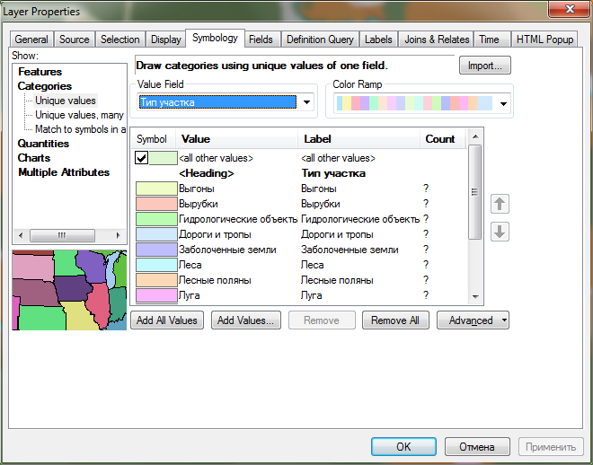
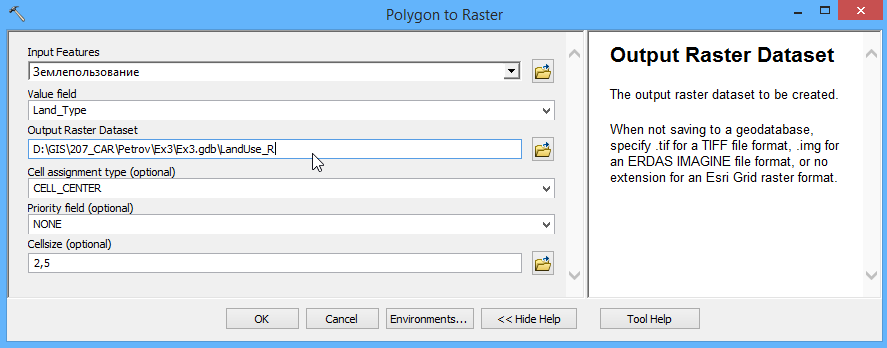
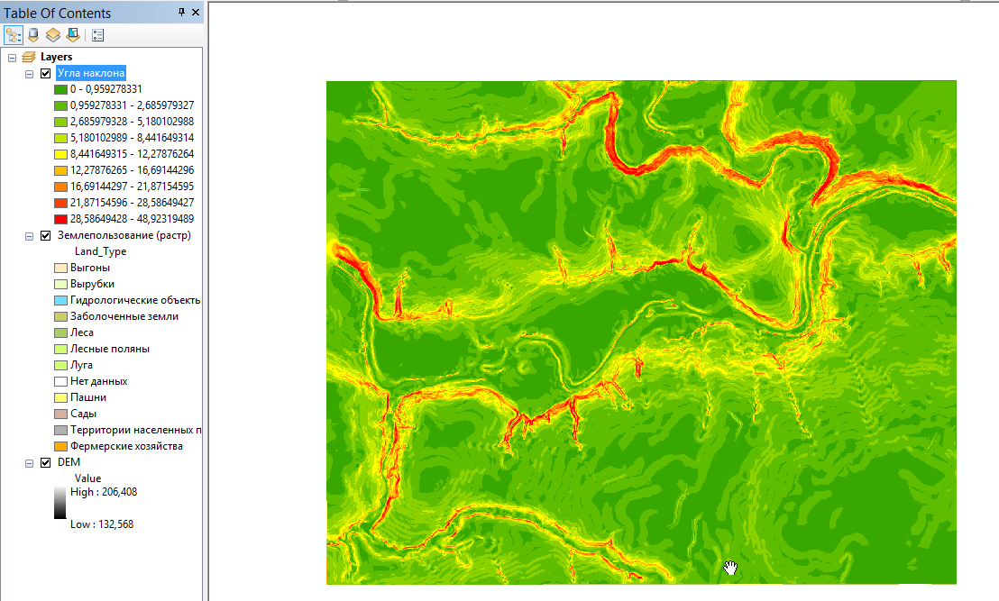
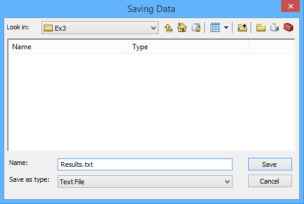
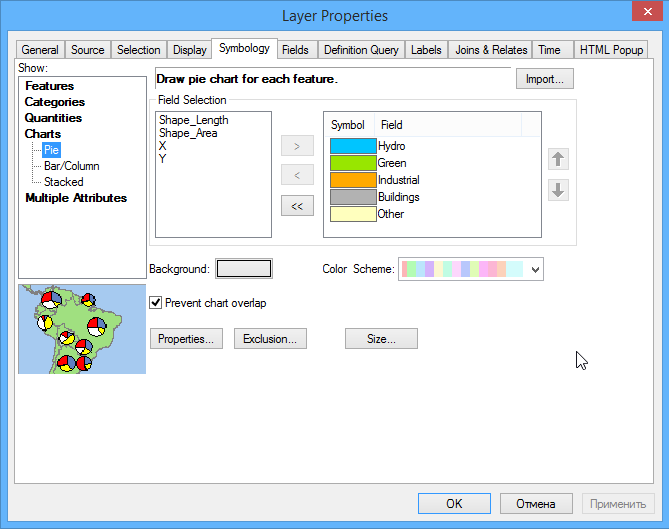
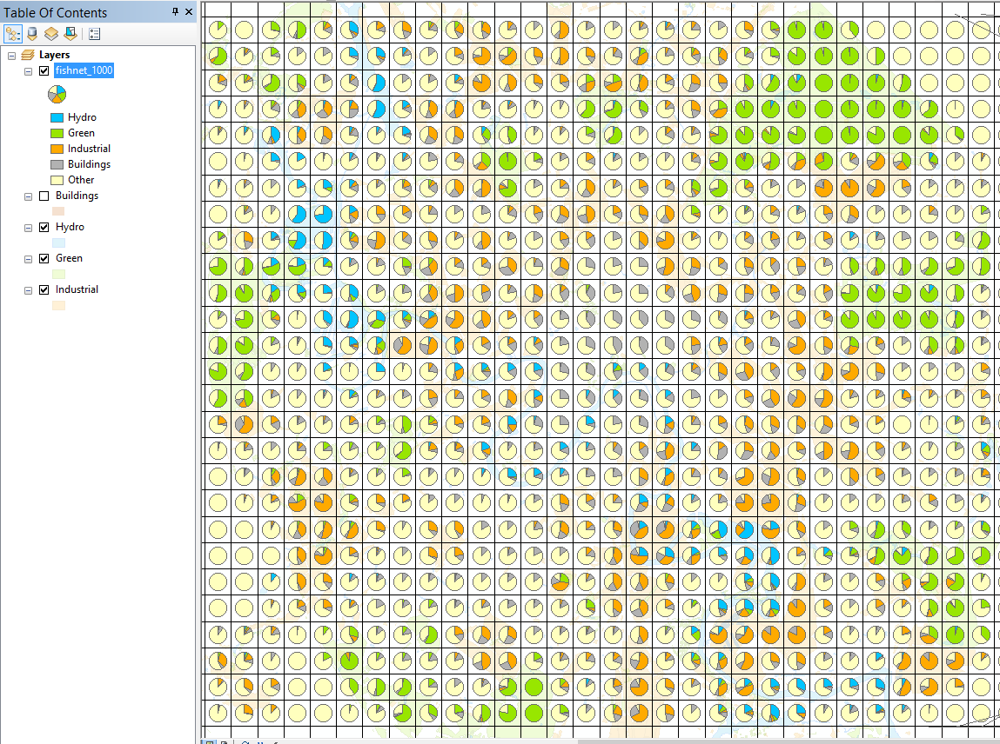
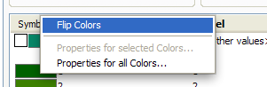
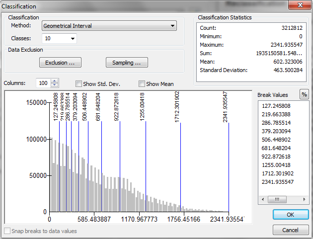
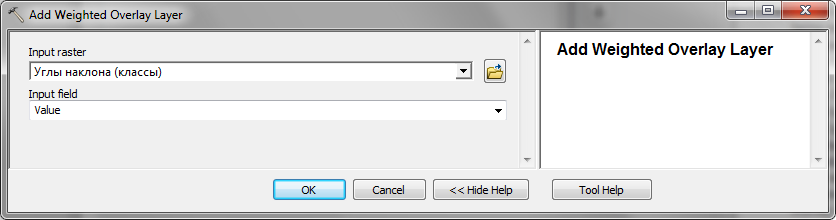

# Выбор оптимального местоположения средствами растрового анализа

## Введение

**Цель** — овладеть основами растрового анализа в ГИС на примере решения задачи поиска оптимального местоположения для размещения объектов.

|   |   |
|---|---|
| **Поток**  | Физический, Экономический  |
| **Теоретическая подготовка** | Растровая модель пространственных данных, вычисление евклидова расстояния на плоскости, методы классификации числовых рядов, оверлей с весовыми коэффициентами (взвешенный оверлей). |
| **Практическая подготовка** | Знание основных компонент интерфейса ArcGIS Desktop (каталог, таблица содержания, карта). Инструменты геообработки. Работы с базой пространственных данных. Настройка символики и подписей объектов. Базовые технологии ГИС (пространственные и атрибутивные запросы, оверлей). |
| **Исходные данные** | База данных ГИС «Сатино». |
| **Результат** | Слой базы пространственных данных, содержащий участок с наиболее оптимальной суммой критериев |
| **Ключевые слова** | Классификация числовых рядов, растровая модель данных, взвешенный оверлей, евклидово расстояние. |  

### Контрольный лист:
* [x] Конвертировать слой землепользования в растровое представление
* [x] Построить и классифицировать растр углов наклона рельефа
* [x] Построить и классифицировать растры расстояний до водотоков и домов
* [x] Осуществить взвешенный оверлей полученных растров
* [x] Конвертировать класс с максимальной суммой баллов в векторное представление и выбрать участок, удовлетворяющий критерию минимальной площади.

### Аннотация

В первых заданиях вы познакомились с редактированием векторных данных. Для ряда практических задач более удобным оказывается растровое представление. Оно хорошо подходит для анализа географического пространства, которое обладает постоянно меняющимися характеристиками среды. Растровая модель топологически неразрывна, что позволяет моделировать различные поля и перенос вещества в пространстве из одной ячейки в другую. В силу своей регулярности растровая модель проста в обработке, поскольку все операции можно унифицировать, ориентируясь на матрицу ячеек. В частности, к растровым слоям удобно применять операции алгебры карт, такие как сложение, вычитание, суммирование --- что и используется данном задании.

Вам предстоит решить задачу выбора оптимального местоположения участка для строительства производственного объекта. Критерии выбора следующие:

* оптимальные зоны для размещения — открытые пространства, такие как выгоны, пустыри, луга, вырубки и т.д;

* предельный угол наклона рельефа — *12,5°*;

* участок должен располагаться в непосредственной близости от автомобильных дорог;

* участок должен располагаться в непосредственной близости от крупных водотоков, поскольку требуется водоснабжение;

* необходимая площадь участка — не менее *30 000 м^2^*.

Таким образом, в анализе участвует 5 факторов: тип землепользования, углы наклона рельефа, расстояние до автодорог, расстояние до водотоков, площадь участка. Поскольку расстояния и углы наклона меняются в пространстве непрерывно, для их анализа удобно использовать растровое представление. К нему же необходимо привести типы землепользования, применив векторно-растровое преобразование. Каждый из полученных слоев далее следует классифицировать по балльной шкале от *1* до *10* и затем получить взвешенную сумму баллов по всей территории. Оптимальное местоположение будет соответствовать участкам с максимальной суммой баллов. Среди них необходимо удовлетворяющие критерию минимальной площади.

Для выполнения анализа и преобразований данных вы будете использовать
инструменты *геообработки*.

> **Геообработка (geoprocessing)** в терминологии ArcGIS — это анализ и преобразование пространственных данных. Инструменты геообработки находятся в ArcToolbox, где они сгруппированы по функциональному назначению.

## Подготовка рабочего пространства
[К содержанию ⇡](#выбор-оптимального-местоположения-средствами-растрового-анализа)

1. Скопируйте папку `Ex3` из каталога упражнений на сервере в свой локальный рабочий каталог на диске `D` с помощью **Проводника**. Раскройте ее после копирования на своем компьютере.

2. Откройте документ под названием *Ex3_Selection.mxd*.

3. Создайте новую базу геоданных. Для этого откройте окно **ArcCatalog**, правой кнопкой мыши щелкните вверху по вашей папке *Ex3* и выберите **New > File Geodatabase**.

4. Назовите ее *Ex3.gdb*.

5. Щелкните по *Ex3.gdb* правой кнопкой мыши и выберите пункт **Make Default Geodatabase**. Эта команда указывает приложению, что все результаты автоматической обработки данных следует помещать в выбранную базу геоданных.

## Преобразование слоя типов землепользования в растровое представление
[К содержанию ⇡](#выбор-оптимального-местоположения)

Поскольку в анализе будут участвовать растровые слои с различными расстояниями и углами наклонов, необходимо и данные по землепользованию привести к растровому виду.

1. Найдите в базе геоданных *Satino.gdb* слой *LandUse* в группе *Thematic* и перенесите его в таблицу содержания карты.

2. Визуализируйте слой *Землепользование* способом категорий, используя поле *Тип участка (Land_Type)*. Выбирать цвета не требуется, т.к. далее вы будете использовать растровый слой.

3. Диалоговое окно примет вид, аналогичный представленному на рисунке.

    

1. Нажмите **ОК**, чтобы завершить настройку способа изображения.

2. Откройте **ArcToolbox** с помощью кнопки  на панели инструментов.

3. Запустите инструмент **Conversion Tools > To Raster > Polygon to Raster**.

4. Заполните его параметры следующим образом:

    | Параметр | Значение |
    |---|---|
    | Input Features | `Землепользование` |
    | Value Field   | `Land_Type` |
    | Output Raster Dataset | `<Фамилия>\Ex3\Ex3.gdb\LandUse_R` |
    | Cellsize | `2,5` |

    В поле **Output point features** вам потребуется заменить только название класса объектов (*LandUse_R*).

    Диалог примет следующий вид:

    

    После завершения работы инструмента конвертации в таблицу содержания добавится новый слой.

1. Выделите его, нажмите <kbd>F2</kbd> и переименуйте в *Землепользование (растр)*.

2. Дважды щелкните по созданному слою и перейдите на вкладку **Symbology**.

3. Смените поле отображения **Value field** на *Land_type*. В легенду автоматически подставятся все найденные значения. Присвойте классам подходящие цвета в соответствии с их типом.

4. Удалите векторный слой *Землепользование* из таблицы содержания. Далее в этом упражнении он не понадобится.

5. Нажмите **ОК**. Переместите растровый слой наверх и нажмите кнопку . Окно карты примет вид, аналогичный представленному на рисунке:


<kbd>**Снимок экрана №1.** Растровый слой типов землепользования</kbd>

> Увеличьте масштаб до величины порядка 1:2 000. Изучите отличия векторного и растрового слоя, поочередно отключая и включая векторный слой. Чем они отличаются?

## Расчет углов наклона
[К содержанию ⇡](#выбор-оптимального-местоположения-средствами-растрового-анализа)

1. Найдите слой *DEM* в базе геоданных *Satino.gdb* и перенесите его в таблицу содержания карты. Поместите его вниз таблицы содержания под слой *Землепользование (растр)*.

2. Запустите инструмент вычисления углов наклона **Spatial Analyst Tools > Surface > Slope** и заполните его параметры следующим образом:

    | Параметр  | Значение |
    |---|---|
    |  Input Raster |  `DEM` |
    |  Output Raster  |  `<Фамилия>\Ex3\Ex3.gdb\Slope` |    

    Остальные параметры в диалоге оставьте по умолчанию. Его окно примет вид, аналогичный представленному на рисунке:

    

1. Нажмите **ОК**, чтобы запустить расчеты.

2. После того как слой углов наклона *Slope* добавится в таблицу содержания, переименуйте его в *Углы наклона*.

Обратите внимание на то, что значения углов были классифицированы на несколько интервалов, которым был присвоен цвет:



Эта классификация является динамической (то есть, применяется при визуализации слоя и никак не отражается на его хранении) и при желании ее можно поменять ее на вкладке **Symbology** в свойствах слоя.

## Расчет расстояний
[К содержанию ⇡](#выбор-оптимального-местоположения-средствами-растрового-анализа)

### Дороги

Чтобы определить участки, наиболее подходящие с точки зрения транспортной доступности, можно построить растр, в каждой ячейке которого будет содержится расстояние (евклидово) до ближайшей дороги.

1. Добавьте на карту слой дорог *General/Roads* из базы геоданных *Satino*.

2. Откройте пункт меню **Selection > Select by attributes**, выберите для выборки слой *Дороги и тропы* и в конструктор запроса введите следующее выражение:
    ```
    "Description" = 'Асфальтированные' OR "Description" = 'Проселочные'
    ```

    Выборка позволит учитывать для при анализе только дороги (в слое также содержатся тропы). Окно запроса примет вид, аналогичный представленному на рисунке. Нажмите **ОК**:

    

1. Постройте растр расстояний для выбранных дорог. Для этого запустите инструмент **Spatial Analyst Tools > Distance > Euclidian Distance**.

2. Выберите в качестве параметра **Input Raster or Feature** слой *Roads*. Остальные параметры оставьте по умолчанию. Диалог примет следующий вид:

    

1. Нажмите **ОК**. Получившийся растр будет добавлен на карту. Переименуйте его в *Расстояния до дорог*.

2. Очистите выборку в слое дорог, нажав кнопку  **Clear Selected Features** на панели инструментов **Tools**. Окно приложения примет следующий вид (обратите внимание на то, что расстояния были вычислены не для всех дорог, а только для выбранных):

    

### Водотоки

Выполните расчет расстояний до водотоков самостоятельно, руководствуясь краткой схемой:

1.  Добавить на карту слой G*eneral/WaterPolygon* (Гидрография (Полигоны))

2.  Выбрать вручную крупные реки (Протва, Исьма) с помощью инструмента  **Select Features By Rectangle** на панели инструментов **Tools**. Чтобы выбрать последовательно несколько объектов, вы можете зажать клавишу <kbd>Shift</kbd>:

    

1. Запустить инструмент **Euclidian Distance** для слоя *Гидрография (полигоны)*. Все параметры оставить по умолчанию.

2. Получившийся после расчетов слой переименовать в *Расстояния до водотоков*. Если все выполнено правильно, то результат должен быть примерно следующим:

    

## Классификация углов наклона
[К содержанию ⇡](#выбор-оптимального-местоположения-средствами-растрового-анализа)

Поскольку в анализе будет участвовать несколько факторов, необходимо привести их значения к общей балльной шкале от *1* до *10*. Для этого используется классификация растра.

1. Запустите инструмент классификации **Spatial Analyst Tools > Reclass > Reclassify**.

2. Выберите в качестве **Input raster** слой *Углы наклона*.

3. Нажмите кнопку **Classify...**, чтобы настроить классы.

4. Раскройте список методов классификации вверху диалогового окна.

    > Какие методы классификации доступны в инструменте Reclass? Какие принципы в них заложены? Попробуйте выбрать разные методы классификации и посмотрите, как меняются границы классов.

1. Выберите режим естественных интервалов *Natural Breaks (Jenks)* и установите количество интервалов равным *10*. Окно диалога примет вид, аналогичный представленному на рисунке.

    

    > Метод естественных интервалов минимизирует дисперсию внутри каждого класса и максимизирует отличия между классами

1. Нажмите **ОК**, чтобы завершить настройку метода классификации.

2. Нажмите кнопку **Reverse new values**, чтобы инвертировать значения классов (меньшие углы наклона должны иметь больший вес).

3. Остальные параметры оставьте по умолчанию. Окно диалога примет вид, аналогичный представленному на рисунке:

    

4. Нажмите **ОК**, чтобы запустить выполнение инструмента.

5. После того как в таблицу содержания будет добавлен слой классифицированных углов наклона, переименуйте его в *Углы наклона (классы).*

1. Через свойства слоя на вкладке **Symbology** присвойте классам шкалу от зеленого к красному, так чтобы класс 1 был красным, а класс 10 был зеленым. Если у вас получилось наоборот, нажмите мышкой на заголовке столбца **Symbol** и выберите в меню **Flip Colors** (сменить порядок цветов на противоположный):

    

1. Нажмите **ОК** в диалоге свойств слоя, чтобы закрыть его. Изображение должно принять следующий вид:

    

    <kbd>**Снимок экрана №2.** Классифицированные углы наклона</kbd>

1. Сохраните документ карты.

## Классификация расстояний
[К содержанию ⇡](#выбор-оптимального-местоположения-средствами-растрового-анализа)

### Дороги

1. Запустите инструмент **Reclassify**. Выберите в качестве **Input raster** слой *Расстояния до дорог*.

2. Нажмите кнопку **Classify...**, чтобы настроить классы.

3. Настройте метод классификации на *Geometric Intervals*, и установите число интервалов равным *10*. Метод геометрических интервалов позволяет сконцентрировать зоны с высокими баллами на небольшом расстоянии от дорог. Диалог настройки классификации примет вид, аналогичный представленному на рисунке. Нажмите **ОК**:

    

1. Нажмите кнопку **Reverse New Values**, чтобы инвертировать номера классов и максимальный балл получили классы с малыми расстояниями.

2. Переименуйте выходной класс в *Reclass\_Euc\_Roads*. Остальные параметры оставьте по умолчанию. Диалог инструмента примет вид, аналогичный представленному на рисунке:

    

1. Запустите вычисления, нажав кнопку **ОК**.

2. После того, как классифицированный растр расстояний до дорог появится на карте, переименуйте его в *Расстояния до дорог (классы)*.

3. Настройте отображение нового слоя на красно-зеленую шкалу, как обычно.

4. Удалите из таблицы содержания оригинальный слой *Расстояния до дорог*.

### Водотоки

Выполните классификацию самостоятельно в соответствии со следующим планом:

1. Запустить инструмент **Reclassify** для слоя *Расстояния до водотоков*.

    * В качестве метода классификации выбрать *Quantile* (квантили), число классов — *10*. Исправьте в столбце справа последнее значение на *2400*, чтобы заведомо включить максимум.

    * Инвертировать номера классов

    * Переименовать выходной слой в *Reclass\_Euc\_Water.*

2. Получившийся слой назвать *Расстояния до водотоков (классы)* и раскрасить в стандартной зелено-красной шкале.

3. Удалить из таблицы содержания оригинальный слой *Расстояния до водотоков*.

4. Снять выборку с объектов гидрографии.

5. Сохранить карту.

<kbd>**Снимок экрана №3.** Классифицированный растр расстояний до водотоков</kbd>

## Нахождение мест с наилучшей комбинацией факторов с помощью взвешенного оверлея
[К содержанию ⇡](#выбор-оптимального-местоположения-средствами-растрового-анализа)

Наилучшие участки соответствуют территориям, где сумма баллов по всем факторам максимальна. Соединение значений (в том числе и сложение) по нескольким слоям, располагающимся друг над другом, осуществляется с помощью растрового оверлея.

1. Запустите инструмент **Spatial Analyst Tools > Overlay > Weighted Overlay**.

2. Исправьте значения полей **From**, **To** и **By** на *1*, *10* и *1*, соответственно. Тем самым вы укажете, что необходимо полученные суммы ранжировать по баллам с *1* до *10* с шагом в *1* балл.

3. Щелкните на кнопке  добавления слоя вверху диалога.

4. В появившемся диалоге выберите *Углы наклона (классы)* в списке **Input Raster**. Поле **Input field** поставьте по умолчанию. Нажмите **ОК**:

    

    Обратите внимание на появившуюся таблицу: она выводит значения классов, взятые из слоя (столбец *Field*), и позволяет сменить их (столбец *Scale Value*) при выполнении оверлея.

    Необходимо запретить строительство на участках с углами наклона более *12,5* градусов. Такие углы наклона возможны в классах *1-5* (в соответствии с проведенной классификацией).

1. Щелкните на ячейке поля *Scale Value* напротив *1* класса и выберите из списка значение *Restricted* (запрещен).

2. Повторите эту операцию для *2*, *3*, *4* и *5* класса. Диалог инструмента примет вид, аналогичный представленному на рисунке:

    

1. Добавьте в таблицу оверлея слои *Расстояния до дорог (классы)* и *Расстояния до водоемов (классы)* с помощью кнопки . Не меняйте значения классов в таблице.

2. Сверните таблицы классов, нажав кнопку  в начале каждой строки. Диалог примет следующий вид:

    

1. Добавьте в таблицу оверлея слой *Землепользование (растр)*. Однако на этот раз выберите для него в качестве поля со значениями классов *Land_Type*:

    

1. Присвойте различным классам земель веса соответственно **Рис. 17**. Обратите внимание на то, что больший вес имеют территории, более доступные для размещения площадки. Заболоченные земли и объекты гидрографии необходимо запретить для выбора, указав им класс *Restricted*. В эту же категорию попадают участки, где нет данных.

    

    Осталось определиться с тем, какие факторы будут иметь максимальный вес. Заказчик решил, что приоритет в наборе факторов следует отдать близости к автодорогам. Среди остальных факторов меньше внимания можно уделить углам наклона рельефа, поскольку они уже были ограничены параметром *Restricted*.

1. Заполните веса в колонке *%Influence* следующим образом:

    * Углы наклона — *15*

    * Расстояния до дорог — *35*

    * Расстояния до водоемов — *20*

    * Землепользование — *30*.

    После заполнения весов диалог примет вид, аналогичный представленному на рисунке:

    

1. Нажмите **ОК**, чтобы запустить вычисления.

2. После того, как результат оверлея будет добавлен в таблицу содержания, переименуйте слой в *Комбинация факторов*.

3. Примените к полученному слою стандартную красно-зеленую шкалу.

> Изучите получившееся изображение. Насколько оно отвечает тем требованиям, которые выдвигались при анализе факторов? Отмечается ли близость темно-зеленых участков в дорогам, водоемам? Каким цветом закрашены участки с крутыми склонами?

## Конвертация результирующих зон в векторный формат
[К содержанию ⇡](#выбор-оптимального-местоположения-средствами-растрового-анализа)

В качестве потенциальных мест на размещение площадки следует выбрать 10-балльные участки. Затем можно конвертировать эти участки в векторный формат, чтобы получить границы.

1. Откройте атрибутивную таблицу слоя комбинаций и выделите строку со значением *10*. Пикселы этого классы подсветятся на карте.

2. Запустите инструмент **Conversion Tools > From Raster > Raster to Polygon**.

3. Выберите в качестве входного слой *Комбинация факторов* и нажмите **ОК**.

4. Переименуйте получившийся слой в *Потенциальные участки*. Обратите внимание, что полигональные объекты были построены только для тех пикселов, которые вы выделили на экране.

5. Смените цвет выделенных полигонов на ярко-желтый и нажмите кнопку  **Full extent**, чтобы вся карта поместилась на экран.

### Выбор участков, имеющих необходимую площадь

Для выбора участков по площади следует использовать атрибутивный запрос

1. Откройте пункт меню **Selection > Select by attributes**, выберите для выборки слой *Потенциальные участки.*

2. В конструктор запроса введите следующее выражение:
    ```
    "Shape_Area" > 30000
    ```

    Нажмите **ОК**. Результат вашей работы должен быть похож на рисунок ниже:

    

    <kbd>**Снимок экрана №4.** Результат анализа: выбранный участок</kbd>

2. Сохраните документ карты.

## Ответы на вопросы
[К содержанию ⇡](#выбор-оптимального-местоположения-средствами-растрового-анализа)

Заполните отчетный файл и положите его в сетевую папку для проверки преподавателем.
