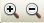
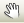
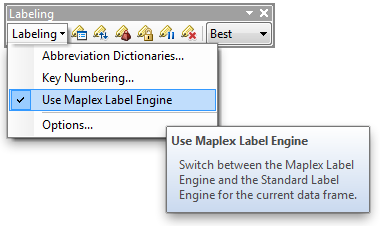
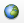
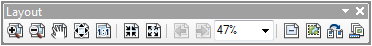
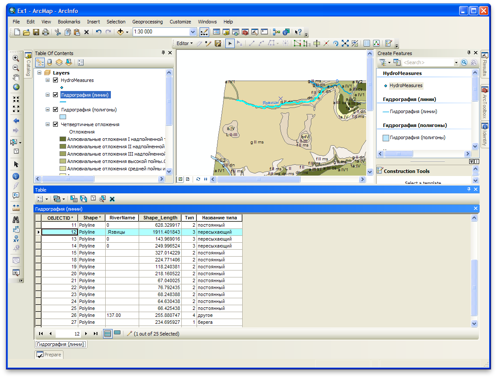
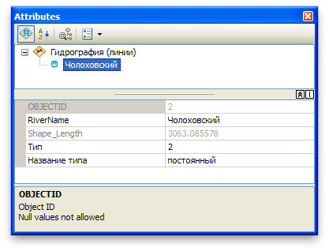

# (PART) Визуализация данных {-}

# Карта четвертичных отложений {#map-design-quaternary}

[Скачать данные и файл отчета](https://github.com/tsamsonov/arcgis-course/raw/refs/heads/master/data/Ex01.zip)

## Введение {#map-design-quaternary-intro}

**Цель задания** --- знакомство с моделями пространственных объектов и базой пространственных данных. Визуализация данных на карте. Оформление легенды и компоновки карты.

Параметр                    Значение
--------------------------  --------
*Теоретическая подготовка*  Модели пространственных данных, модели пространственных объектов, базы пространственных объектов, картографические проекции
*Практическая подготовка*   Не требуется
*Исходные данные*           База данных ГИС “Сатино”.
*Результат*                 Карта четвертичных отложений Сатинского учебного полигона масштаба 1:30 000
*Ключевые слова*            Модели пространственных данных, модели пространственных объектов, базы пространственных данных, классы пространственных объектов, визуализация пространственных данных, геоинформационное картографирование

### Контрольный лист {#map-design-quaternary-control}

- Добавить на карту слои базы пространственных данных и оформить их
- Настроить подписи объектов
- Создать компоновку карты, легенду и координатную сетку
- Экспортировать результат в графический файл

### Аннотация {#map-design-quaternary-annotation}

Задание посвящено знакомству с базами пространственных данных а также созданием тематических карт на их основе. Вы научитесь извлекать из базы данных и визуализировать пространственные данные, оформлять легенду, сетку координат и зарамочные элементы карты.

## Изучение данных в приложении ArcMap {#map-design-quaternary-data}
[В начало упражнения ⇡](#map-design-quaternary)

1. Скопируйте папку *Ex01* с сервера в каталог под своей фамилией.

2. Откройте приложение **ArcMap** (Рис. \@ref(fig:mdq-arcmap))

    > **ArcMap** — это основное приложение ArcGIS, предназначенное для редактирования и анализа данных, создания новых объектов и оформления карт.

1. Откройте окно **Catalog**, нажав кнопку  на панели инструментов.

    > **Catalog (Каталог)** — это файловый менеджер для управления пространственными данными. Его задачи в чем-то аналогичны _Проводнику_ в Windows или _Finder_ в mac OS: создание, копирование, удаление и т.д., но видит он только файлы тех форматов, которые можно использовать в ГИС.
    
    

    
    
(\#fig:mdq-arcmap)Приложение ArcMap

    

1. Раскройте папку *D:/GIS* в дереве каталогов и найдите в ней директорию *Ex01* в вашем каталоге, содержащую исходные данные для выполнения первого задания. Если директории *D:/GIS* нет в списке, подключитесь к ней c помощью кнопки .

2. Внутри директории *Ex01* раскройте содержимое объекта под названием  *Satino.gdb* — это база пространственных данных, созданная в формате *File Geodatabase* (файловая база геоданных).

> **База геоданных** — это структурированное хранилище, внутри которого можно создавать слои данных, группировать их и связывать различными отношениями. В базе геоданных *Satino.gdb* есть две группы:  General (общегеографические данные) и  Thematic (тематические данные).

Внутри базы геоданных есть данные трех типов:

-  --- слои векторных данных (классы пространственных объектов),
-  — слои растровых данных;
-  — обычные таблицы;

> **Класс пространственных объектов (feature class)** --- это набор пространственных объектов одного типа геометрии (точки, линии, полигоны или объемные тела). Для класса могут быть определены атрибуты, а его представлением является таблица, содержащая как обычные столбцы (текстовые, числовые и т.д.) так и специальное поле *Shape*, в котором хранится информация о геометрии. Каждая строчка в таблице — это описание одного объекта.

Представьте, что вы работаете с двумя слоями: один содержит точки наблюдений скорости течения реки Протвы, другой — представление самой реки на меженный уровень в виде площадного объекта. Съемка точек производилась с помощью GPS-приемника, координаты измерены в виде геодезических широт и долгот на эллипсоиде *WGS-1984*. Береговая линия реки получена с топографического плана и сохранена в проекции *UTM*, координаты точек границы представлены семизначными числами в метрах.

*Как совместить эти два слоя, чтобы составить карту фактического материала?* Очевидно, надо преобразовать координаты одного слоя в систему координат другого слоя: либо в метры в проекции UTM, либо в градусы на эллипсоиде *WGS-1984*.

1. Дважды щелкните на слое *WaterPolygon* в группе *General* и перейдите на вкладку **XY Coordinate System**.

2. Найдите строку **Projection**.

    > В какой проекции хранятся координаты?

    Как вы помните, проекции обладают разными искажениями. В частности, проекция *Меркатора* вытягивает все приполярные объекты вдоль меридианов, следовательно, величины плоских прямоугольных координат зависят о того, какая проекция используется.

1. Найдите строку **Linear Unit**.

    > В каких единицах измерения записаны координаты в проекции слоя WaterPolygon? Это могут быть градусы, метры, футы (в США) и т.д.

1. Откройте свойства слоя *HydroMeasures*, лежащего к корне базы геоданных. Этот слой хранится в *Географической системе координат (ГСК)* — широтах и долготах, отнесенных к эллипсоиду *WGS-1984*. Т.е. у него **нет проекции**.

2. Закройте свойства слоя *HydroMeasures*.

3. Перенесите в таблицу содержания (окно __Table of Contents__ на Рис. \@ref(fig:mdq-arcmap)) слой *WaterPolygon* из группы *General*.

    Обратите внимание на то, что слой добавился под названием Гидрография (полигоны). У него был русскоязычный псевдоним (*alias*). Его можно задать в свойствах слоя в **Каталоге**.

    > **Объекты базы геоданных**, такие как слои, наборы данных, атрибутивные поля, обычно называют латинскими буквами, однако вы можете дать им русскоязычные псевдонимы, которые будут отображаться вместо названий в **ArcMap**.

1. Добавьте в таблицу содержания слой *HydroMeasures*. Обратите внимание на то, что слои совместились, несмотря на то, что у них различные системы координат!

2. Откройте панель инструментов **Tools** (инструменты), щелкнув правой кнопкой мыши вверху окна и выбрав ее из списка.

3. Попробуйте инструменты навигации с панели **Tools**: увеличить/уменьшить  и переместить . Обратите внимание на то, как будет меняться масштаб вверху окна.

    > Для быстрого доступа к инструментам **увеличить, уменьшить и переместить** используйте клавиши <kbd>Z</kbd>, <kbd>X</kbd> и <kbd>C</kbd> соответственно.

1. Выберите инструмент  **Identify** и щелкните мышью на любом объекте, либо растяните прямоугольник вокруг объектов.

    > Какую информацию позволяет узнать инструмент идентификации?

1. Откройте атрибутивную таблицу слоя *Гидрография (полигоны)*, щелкнув на нем правой кнопкой мыши и выбрав команду **Open Attribute Table**.

2. Найдите поля *Shape* и *ObjectID*.

    > **Звездочка** (\*) рядом с названием поля означает, что для него внутри базы геоданных построен *индекс* — невидимая вспомогательная таблица, позволяющая быстро находить объекты по их атрибутам или местоположению. Соответственно, различают атрибутивный и пространственный индекс.

    > В поле *ObjectID* хранится уникальный идентификатор каждого объекта. Он нужен системе для того, чтобы каждый объект можно было гарантированно найти по некому однозначному критерию.

    > В поле *Shape* (вспомните, что слой полигональный) хранится список координат вершин полигона. Геометрия объектов редактируется специальными инструментами, поэтому содержимое поля *Shape* скрыто от пользователя.

1. Закройте атрибутивную таблицу.

## Оформление слоя четвертичных отложений {#map-design-quaternary-representations}
[В начало упражнения ⇡](#map-design-quaternary)

1. Удалите из таблицы содержания слой *HydroMeasures* и добавьте слой *QDeposit* (четвертичные отложения). Перетащите его вниз списка и дважды щелкните на нем.

2. Перейдите на вкладку **Symbology** (Рис. \@ref(fig:mdq-symb)). Здесь вы встретите многие знакомые вам способы изображения.

    > Просмотрите список в левой части диалога и попробуйте назвать способы изображения, основываясь на вспомогательных иллюстрациях.

    Четвертичные отложения показываются качественным фоном. В ArcGIS этот способ изображения называется **Categories** (категории).

1. Выберите пункт **Categories** в списке слева, и в нем же выберите режим *Unique values* (уникальные значения).

    Вверху вы должны увидеть два списка: поле, из которого необходимо взять уникальные значения, и цветовая шкала.

1. Выберите поле *Отложения* в списке **Value Field**, и нажмите внизу диалога кнопку **Add All Values**. Программа просканирует все строчки таблицы, найдет уникальные значения, которые там есть, и подставит их в список. В крайнем правом поле отображается количество объектов каждого уникального значения (Рис. \@ref(fig:mdq-symb)).
    
    

    
    
(\#fig:mdq-symb)Диалог настройки символов для отображения слоя

    

    Обратите внимание на то, что типам объектов были автоматически присвоены символы из той цветовой шкалы, которая выбрана справа вверху.

1. Снимите галочку **All other values**, расположенную вверху списка.

2. Разверните список цветовых шкал **Color Ramp** и выберите любую другую на свой вкус. Цвета объектов в легенде автоматически поменяются.

    Существуют официальные и негласные договоренности относительно цветов, используемых на геологических, геоморфологических, почвенных, геоботанических картах. Вы можете задать каждому типу индивидуально тот цвет, который требуется. Более того, вы можете сохранить набор цветов как шкалу.

1. Щелкните дважды на любом символе в легенде. Перед вами появится диалог настройки символа, в котором вы можете поэкспериментировать.

2. Закройте диалог настройки символа и нажмите **ОК** в диалоге свойств слоя.

Теперь слой *Четвертичные отложения* показан способом качественного фона с использованием тех цветов, которые были назначены каждому типу.

## Подписи {#map-design-quaternary-labels}
[В начало упражнения ⇡](#map-design-quaternary)

В предыдущем разделе вы изучили возможные способы изображения и показали типы четвертичных отложений способом качественного фона. Однако карты без подписей встречаются крайне редко. Если в атрибутивной таблице набора данных есть поле с теми значениями, которые надо вынести в качестве подписей, это делается автоматически.

1. Убедитесь, что включен механизм расстановки подписей **Maplex**. Для этого откройте панель инструментов **Labeling** и поставьте соответствующую галочку (Рис. \@ref(fig:mdq-maplex)).
    
    

    
    
(\#fig:mdq-maplex)Включение механизма расстановки подписей Maplex

    

1. Откройте снова свойства слоя Четвертичные отложения и перейдите на вкладку **Labels**.

2. Отметьте галочкой опцию **Label features in this layer**. Эта опция включает подписи для слоя.

3. В поле **Label Field** выберите значение *Индекс* Подписи будут браться из этого поля. Рядом расположены элементы настройки шрифта, с которыми вы можете поэкспериментировать (Рис. \@ref(fig:mdq-labels)).
    
    

    
    
(\#fig:mdq-labels)Диалог настройки подписей объектов слоя

    

1. Нажмите кнопку **Placement Properties**. Появившийся диалог позволяет вам настроить, как именно будут размещены подписи относительно самих объектов. Это очень мощный инструмент, который управляет множеством нюансов расстановки подписей.

2. В диалоге **Placement Properties** нажмите кнопку **Position** и изучите возможные варианты размещения подписей.

3. Закройте все диалоговые окна, последовательно нажимая кнопку **OK** в каждом из них.

4. Нажмите кнопку  на панели **Tools**, чтобы вся карта уместилась в окне просмотра. Окно приложения примет вид, примерно соответствующий тому, что показано на Рис. \@ref(fig:mdq-fullview).
    
    

    
    
(\#fig:mdq-fullview)Карта четвертичных отложений с индексами в произвольной цветовой шкале

    

> Обратите внимание, что на вашей карте все объекты подписаны одинаково. Если требуется, чтобы подписи объектов были разными в зависимости от типа объекта, на вкладке **Labels** свойств слоя необходимо сменить режим *Label all the features the same way* на режим *Define classes…* и произвести настройку.

<kbd>**Снимок экрана №1.** Окно карты с подписями объектов</kbd>

## Компоновка карты {#map-design-quaternary-layout}
[В начало упражнения ⇡](#map-design-quaternary)

Если карту необходимо подготовить к печати, снабдить заголовком, масштабом, легендой и градусной сеткой, используется режим компоновки.

1. Выберите пункт меню **View > Layout View**. Приложение перейдет в режим компоновки.

2. Откройте панель инструментов **Layout**. С ее помощью вы можете осуществлять навигацию в режиме компоновки (Рис. \@ref(fig:mdq-layout)).
    
    

    
    
(\#fig:mdq-layout)Панель инструментов Layout

    

1. Откройте меню **Insert** и изучите его содержание.

    > Какие элементы компоновки можно создать, используя меню **Insert**?

1. Вставьте название карты (**Insert > Title**). В появившемся диалоге введите текст «Карта четвертичных отложений». Сдвиньте название в угол листа.

2. Вставьте легенду (**Insert > Legend**). Добавьте туда только слой четвертичных отложений. Разберитесь самостоятельно с мастером создания легенды.

    > Настройка легенды разнесена на несколько диалоговых окон. Изучите назначение каждого из них.

    Сетка прямоугольных координат строго привязана к местоположению самой карты, поэтому она является ее свойством. Для того, чтобы вставить ее, выполните следующие шаги:

1. Дважды щелкните на заголовке фрейма данных **Layers** и перейдите на вкладку **Grid**.

2. Нажмите кнопку **New Grid**.

    > Перед вами окажется диалог с тремя типами возможных сеток. Чем они отличаются?

1. Выберите режим *Measured Grid*, который создает сетку в плоских прямоугольных координатах. Изучите модерждание каждого последующего диалога, параметры оставьте по умолчанию

2. Нажмите **ОК** в свойствах фрейма данных. Теперь поверх вашей карты должна отображаться сетка прямоугольных координат.

3. Разместите на карте линейный масштаб в метрах.

<kbd>**Снимок экрана №2.** Компоновка карты с легендой и масштабом</kbd>

__Сохраните документ карты__ через команду меню **File > Save as** в свой каталог _Ex01_ под названием *Ex01_<Фамилия>.mxd*.

> Файл с расширением `.mxd` является файлом документа карты __ArcMap__. Он содержит перечень слоев и их настроек, созданные компоновки и ряд дополнительных параметров. Документ карты, как и входящие в него слои, не хранит сами данные, а лишь _ссылается_ на них. Поэтому, перемещая проект на другой компьютер, вы должны также переместить и данные, чтобы он открылся (в вашем случае — базу геоданных, из которой вы добавляли классы объектов на карту).

## Редактирование атрибутов {#map-design-quaternary-attributes}
[В начало упражнения ⇡](#map-design-quaternary)

Атрибуты играют важную роль в геоинформационных системах. На их основе происходит визуализация данных, также они участвуют в большинстве операций пространственного анализа. Необходимо овладеть техникой их создания, редактирования и использования.

Редактирование атрибутов может понадобиться при заполнении полей для новых объектов, исправлении ошибок и заполнении пустых значений.

1. Переключитесь обратно в режим **View > Data View**.

2. Добавьте на карту слой  *WaterLine* (линейные объекты гидрографии).

3. Исправьте его символ на голубую линию толщиной 1.5 пиксела, чтобы он лучше читался на карте.

4. Включите подписи по полю *RiverName* на вкладке **Labels**, задайте им синий цвет, криволинейное размещение и нажмите **OK** в диалоге свойств слоя.

    > Появились ли подписи ручьев?

    По всей видимости, с атрибутом *RiverName* что-то не в порядке, необходимо проверить его содержимое.

1. Зажмите клавишу <kbd>Ctrl</kbd> и дважды кликните на названии слоя *Гидрография (линии)*. Откроется его атрибутивная таблица.

    > Таблицу также можно открыть через контекстное меню слоя, выбрав пункт **Open Attribute Table**. Свойства слоя также доступны из пункта **Properties** в контекстном меню. Однако вариант с двойным нажатием более быстрый и, скорее всего, более удобный.

    Похоже, что создатель слоя забыл внести в него названия водотоков. Следует исправить этот недочет.

1. Пристыкуйте таблицу в нижнюю часть окна, чтобы она не загораживала карту.

2. Выделите в таблице содержания слой Гидрография (линии) и в его контекстном меню выберите пункт **Edit Features > Start Editing**. Включится режим редактирования, который позволяет вручную править атрибуты и геометрию объектов. Должна появиться панель редактора (Рис. \@ref(fig:mdq-editor)).
    
    

    
    
(\#fig:mdq-editor)Панель редактирования Editor

    

1. Чтобы не выделять лишних объектов, в контекстном меню слоя *Гидрография (линии)* выберите пункт **Selection > Make this the only selectable layer**

1. Возьмите с панели редактора инструмент выбора (отмечен на рисунке) и выделите с его помощью ручей *Язвицы* (на севере полигона). Он автоматически подсветится в таблице. Введите название в ячейку поля *RiverName* (Рис. \@ref(fig:mdq-edlyr)).
    
    

    
    
(\#fig:mdq-edlyr)Редактирование таблицы атрибутов слоя

    

2. Найдите на карте Чолоховский ручей (на юге полигона), выделите его и в контекстном меню выберите пункт **Attributes**. Перед вами откроется окно формы редактирования атрибутов --- еще один способ редактирования таблицы, ориентированный на индивидуальную работу с каждым объектом (Рис. \@ref(fig:mdq-edwin)).

    

    
    
(\#fig:mdq-edwin)Форма редактирования атрибутов отдельного объекта

    

3. Найдите поле *RiverName* и введите название ручья.

4. Завершите редактирование, выбрав на панели редактора пункт меню **Editor > Stop Editing**. В появившемся диалоге нажмите Да.

<kbd>**Снимок экрана №3.** Окно карты с подписями ручьев</kbd>

Сохраните документ карты еще раз. Сохраните ваш отчетный файл и положите его в сетевую папку преподавателя.

## Создание и вычисление атрибутов (дополнительно)  {#map-design-quaternary-calculation}
[В начало упражнения ⇡](#map-design-quaternary)

Поля можно не заполнять не только вручную, но и автоматизированно. В частности, их можно вычислять и копировать значения из других полей. Но для начала необходимо научиться их создавать.

Предположим, что бригада топографов произвела съемку границы леса в целях ее сравнения с данными 10-летней давности. Чтобы построить карту границы леса и совместить ее с другими данными, необходимо знать координаты опорных геодезических пунктов, которые участвовали в планово-высотном обосновании. Эти пункты есть в базе геоданных *Satino.gdb*.

1. Добавьте на карту слой  *GeoPoints* (геодезические пункты).

2. Смените через свойства слоя значок на белый треугольник с точкой посередине (он есть в библиотеке).

3. Откройте атрибутивную таблицу слоя.

    > Есть ли координаты точек в таблице слоя Геодезические пункты? В каком поле они должны храниться?

    Координаты объектов точечного слоя можно вывести в числовое поле. Для этого создадим два поля *X* и *Y*.

1. Выберите в окне таблицы пункт меню  **Table Options — Add Field...**.

2. В диалоге введите *X* (латиницей) в название поля **Name**.

3. Теперь необходимо задать тип поля. Раскройте ниспадающий список **Type**.

    > Какой тип должно иметь поле для хранения координат геодезических пунктов и почему?

1. Установите тип поля *Float*. Остальные параметры оставьте по умолчанию. Нажмите **OK**.

2. Повторите операцию, создав поле *Y*.

3. Нажмите правой кнопкой на заголовке поля *X* и выберите в контекстном меню **Calculate Geometry...**.

4. В появившемся диалоге из ниспадающего списка выберите величину *X Coordinate of Point* и единицы измерения *Meters*.

    Обратите внимание, что инструмент **Calculate Geometry** позволяет вам вычислять координаты не только в проекции данных (*data source*), но и в проекции карты (*data frame*).

1. Нажмите **OK**.

2. Повторите вычисление координаты для поля **Y**

    > Какого порядка величины получились в полях **X** и **Y**? Вспомните, куда направлена ось *X* в проеции *UTM/Гаусса-Крюгера*. Нет ли здесь противоречия?

    > В ArcGIS используется стандартная система плоских прямоугольных координат, в которой ось *X* направлена на восток, а ось *Y* — на север. То же самое касается и проекций Гаусса-Крюгера и UTM

## Контрольные вопросы {#map-design-quaternary-questions}
[В начало упражнения ⇡](#map-design-quaternary)

1.	Какие типы геометрии допустимы для слоев в базе геоданных?

2.	Что хранят системные поля Shape и ObjectID?

3.	Если у слоя нет проекции, то в какой системе координат он хранится и в каких единицах измерения выражены координаты?

4.	Как добавить слой базы данных на карту в ArcMap? Опишите последовательность действий.

5.	Как получить доступ к настройкам отображения слоя? Опишите последовательность действий.

6.	Чем отличается вид компоновки от вида данных?

7.	Какая команда меню позволяет создать легенду?

8.	Если открыта таблица слоя, что нужно включить, чтобы отредактировать значение в ячейке?

----
_Самсонов Т.Е._ **Основы геоинформатики: практикум**. М.: Географический факультет МГУ, 2025. DOI: 10.5281/zenodo.1167857
----
