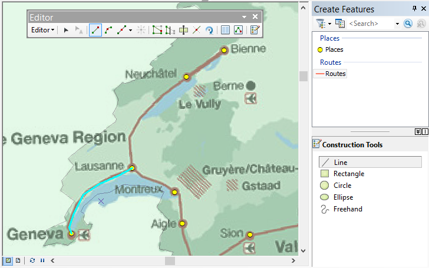
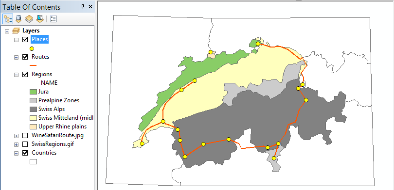
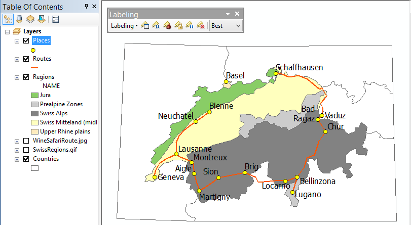

# (PART) Базовые технологии ГИС {-}

# Привязка и векторизация (туристская карта) {#map-ref-general}

[Скачать данные и файл отчета](https://carto.geogr.msu.ru/gis/data/Ex05.zip)

## Введение {#map-ref-general-intro}

**Цель задания** --- знакомство с привязкой, трансформированием и векторизацией растровых геоизображений.

Параметр                    Значение
--------------------------  --------
*Теоретическая подготовка*  Системы координат и проекции на картах, привязка геоизображений, трансформирование геоизображений, цифрование геоизображений. Методы трансформации: аффинное, проективное, полиномиальное, метод резинового листа (сплайны).
*Практическая подготовка*   Знание основных компонент интерфейса ArcGIS Desktop (каталог, таблица содержания, карта). Работа с базой геоданных. Настройка символики и подписей объектов.
*Исходные данные*           Растровые карты для привязки, база пространственных данных на территорию Швейцарии.
*Результат*                 База данных со следующими слоями: границы природных зон; линии туристического маршрута; остановки вдоль маршрута; проект карты карта с компоновкой
*Ключевые слова*            Системы координат, проекции, трансформирование координат, пространственная привязка, цифрование, векторизация, классы пространственных объектов, база пространственных данных,

### Контрольный лист {#map-ref-general-control}

* Привязать растровые карты к опорным данным
* Создать базу геоданных и классы пространственных объектов
* Наполнить классы пространственных объектов путем векторизации привязанных карт
* Наполнить атрибуты объектов значениями
* Разработать символику и подписи для слоев карты
* Подготовить компоновку карты
* Экспортировать карту в графический файл

### Аннотация {#map-ref-general-anno}

Задание посвящено знакомству с привязкой растровых карт, созданием и наполнением баз пространственных данных путем их векторизации, оформлением карт на их основе.

В задании предлагается привязать в координатную систему карту природных зон и карту туристического маршрута по территории Швейцарии. По результатам векторизации этих карт вы составите туристскую карту, показывающую прохождение маршрута по разным природным зонам.

## Привязка карт {#map-ref-general-referencing}
[В начало упражнения ⇡](#map-ref-general)

### Карта физико-географических регионов {#map-ref-general-referencing-phys}

1. Внимательно прочтите раздел [**Привязка растровых данных (Georeferencing)**](#manual-georef) в разделе **Описание функций**.

1. Добавьте на карту слой *Countries* из базы данных упражнения 3.

1. Добавьте на карту растр *SwissRegions.gif*. Появится диалог, предупреждающий вас, что добавляемый файл не имеет пространственной привязки. Нажмите **ОК** (Рис. \@ref(fig:mrg-noref)):
    
    

    
    
(\#fig:mrg-noref)Предупреждение о неизвестной пространственной привязке

    

1. Убедитесь, что контур страны отображается примерно посередине экрана.

1. Откройте панель инструментов **Georeferencing**. Выберите в меню команду **Fit to Display**, чтобы переместить непривязанный растр на середину области отображения (Рис. \@ref(fig:mrg-fit)):
    
    

    
    
(\#fig:mrg-fit)Вписывание изображения в экран с помощью панели Georeferencing

    

1. Сделайте растровый слой прозрачным на *50%*.

1. Используя **инструмент расстановки контрольных точек**, укажите *3-6* соответствующих точек по границе страны на характерных выступах контура (Рис. \@ref(fig:mrg-ctr)):
    
    

    
    
(\#fig:mrg-ctr)Инструмент расстановки контрольных точек

    

    
1. Выберите команду меню **Georeferencing > Update Georeferencing**, чтобы завершить привязку растра. При этом по умолчанию будет применено аффинное преобразование с минимизацией среднеквадратической ошибки отклонения исходных и целевых координат (Рис. \@ref(fig:mrg-upd)):
    
    

    
    
(\#fig:mrg-upd)Привязанная карта физико-географических регионов

    

<kbd>**Снимок экрана №1**. Привязанная карта физико-географических регионов</kbd>

### Карта туристического маршрута {#map-ref-general-referencing-tourist}

1. Добавьте на карту слой *WineSafariRoute.jpg*.

1. Выберите его в списке на панели **Georeferencing** (Рис. \@ref(fig:mrg-lyr)):

    

    
    
(\#fig:mrg-lyr)Выбор слоя для привязки

    

1. Отключите слой *SwissRegions.gif* в таблице содержания.

1. Привяжите растр *WineSafariRoute* аналогично предыдущему растру, используя контрольные точки (Рис. \@ref(fig:mrg-rou)):

    

    
    
(\#fig:mrg-rou)Привязка карты маршрута по контрольным точкам

    

1. Выберите команду **Georeferencing > Update georeferencing**, чтобы завершить привязку второго растра.

<kbd>**Снимок экрана №2**. Привязанная карта маршрута</kbd>

## Создание базы данных и классов пространственных объектов {#map-ref-general-geodatabase}
[В начало упражнения ⇡](#map-ref-general)

1. Прочитайте параграф [**База геоданных**](#manual-gdb) в разделе **Описание функций**.

1. Создайте в папке *Ex05* базу геоданных под названием *RouteMap.gdb*.

1. Создайте в базе данных *классы пространственных объектов* со следующими параметрами:

Название  Модель пространственных объектов  Атрибутивные поля Проекция
--------  --------------------------------- ----------------- --------  
*Regions* Полигональная (polygon features)  NAME (text)       `WGS_1984_UTM_Zone_32N` (импортируйте у слоя карты)
*Routes*  Линейная (line features)          -                 `WGS_1984_UTM_Zone_32N` (импортируйте у слоя карты)
*Places*  Точечная (point features)         NAME (text)       `WGS_1984_UTM_Zone_32N` (импортируйте у слоя карты)

По завершению создания слоёв они автоматически будут добавлены в таблицу содержания карты (Рис. \@ref(fig:mrg-lyrs)):

(\#fig:mrg-lyrs)Созданные слои в таблице содержания карты

## Векторизация регионов {#map-ref-general-digitizing}
[В начало упражнения ⇡](#map-ref-general)

1. Прочитайте параграф [**Редактирование**](#manual-edit) в разделе **Описание функций**.

1. Оставьте включенными только слои *Regions*, *SwissRegions* и *Countries*.

1. Уберите *прозрачность* у слоя *SwissRegions*.

1. Откройте сеанс редактирования для слоя *Regions*. Появится панель редактирования **Editor**, а также окно шаблонов объектов **Create Features** (Рис. \@ref(fig:mrg-cre)):

    

    
    
(\#fig:mrg-cre)Панель Editor и окно Create Features

    

1. Щелкните на шаблоне объекта *Regions* в окне **Create Features** и выберите режим создания объектов **Polygon** (Рис. \@ref(fig:mrg-pol)):

    

    
    
(\#fig:mrg-pol)Выбор режима создания объектов

    

1. Последовательно щелкая мышкой на точках вдоль границы, обведите регион *Prealpine Zones* (Предальпийские зоны) в центре карты. По завершению дважды щелкните мышкой (Рис. \@ref(fig:mrg-alp)):

    

    
    
(\#fig:mrg-alp)Ручная векторизация границы Предальпийской зоны

    

1. Чтобы появилась возможность пристыковать остальные регионы к границам стран, **выделите** в слое *Countries* все страны, кроме Швейцарии, **скопируйте** их в буфер обмена и **вставьте** в слой *Regions* (Рис. \@ref(fig:mrg-bnd)):
    
    

    
    
(\#fig:mrg-bnd)Вставка границ стран в слой с границами физико-географических зон

    

1. Выделите опять шаблон *Regions* в окне **Create Features**.

1. Используя режим **Auto-Complete Polygon**, оцифруйте границы оставшихся регионов в следующем порядке:

    - Сначала небольшие регионы, примыкающие к границам (Рис. \@ref(fig:mrg-breg)):

    

    
    
(\#fig:mrg-breg)Регионы, примыкающие к границе

    

    - Затем область второго порядка дальности от границы (горы *Юра*, Рис. \@ref(fig:mrg-jura)):

    

    
    
(\#fig:mrg-jura)Векторизация региона гор Юра

    

    - Наконец, границу между центральными регионами (Рис. \@ref(fig:mrg-cnt)):

    

    
    
(\#fig:mrg-cnt)Граница между центральными регионами

    

1. Выделите в слое *Regions* границы стран и удалите их.

1. Выберите команду **Editor > Save Edits**, чтобы сохранить результаты редактирования (Рис. \@ref(fig:mrg-cntr)).

(\#fig:mrg-cntr)Результат векторизации границ физико-географических регионов

<kbd>**Снимок экрана №3**. Векторный слой физико-географических регионов</kbd>

## Атрибутирование регионов {#map-ref-general-attributes}
[В начало упражнения ⇡](#map-ref-general)

1. Уберите заливку регионов, линии сделайте толщиной 1.5-2 пиксела (Рис. \@ref(fig:mrg-out)):

    

    
    
(\#fig:mrg-out)Оформление границ регионов

    

1. Откройте атрибутивную таблицу слоя *Regions*.

1. Поочередно выделяя каждый объект в таблице или на карте, заполните его атрибуты в соответствии с легендой (Рис. \@ref(fig:mrg-att)):

    

    
    
(\#fig:mrg-att)Заполнение атрибутов объектов

    

1. Сохраните изменения и завершите сеанс редактирования.

<kbd>**Снимок экрана №4**. Атрибутированные регионы</kbd>

## Цифрование маршрутов и точек интереса {#map-ref-general-routes-poi}
[В начало упражнения ⇡](#map-ref-general)

1. Выключите слои *Regions* и *SwissRegions.gif*.

1. Включите слои *WinSafariRoute*, *Routes* и *Places*.

1. Оцифруйте объекты слоев *Places* и *Routes*, используя инструменты панели **Сreate Features**:

    - Начните с расстановки точек населённых пунктов (Рис. \@ref(fig:mrg-pop)):

    

    
    
(\#fig:mrg-pop)Расстановка точек населенных пунктов

    

    - Увеличьте масштаб, чтобы были хорошо видны изгибы линий (Рис. \@ref(fig:mrg-bds)):

    

    
    
(\#fig:mrg-bds)Линии маршрутов при увеличенном масштабе

    

    - Проведите линии через получившиеся точки, повторяя контур исходной линии на растровой подложке. Каждую линию начинайте в точке и завершайте двойным щелчком в перекрестке (Рис. \@ref(fig:mrg-rts)):

    

    
    
(\#fig:mrg-rts)Векторизация линий маршрутов

    

    После выполнения ручной векторизации всех маршрутов изображение должно принять примерно следующий вид (Рис. \@ref(fig:mrg-vrts)):
    
    

    
    
(\#fig:mrg-vrts)Векторизованные линии маршрутов

    

1. Заполните названия городов в слое *Places* (Рис. \@ref(fig:mrg-popn)).

    

    
    
(\#fig:mrg-popn)Заполнение названий городов в атрибутах точек

    

1. Сохраните изменения и завершите сеанс редактирования.

<kbd>**Снимок экрана №5**. Слои маршрута и пунктов назначения</kbd>

## Оформление карты {#map-ref-general-design}
[В начало упражнения ⇡](#map-ref-general)

1. Оставьте включенными слои *Regions*, *Routes*, *Places* и *Countries*. Остальные слои выключите.

1. Уберите заливку у слоя *Countries*.

1. Оформите слой *Regions* методом категорий по полю *NAME* (Рис. \@ref(fig:mrg-symreg)):

    

    
    
(\#fig:mrg-symreg)Настройка визуализации слоя Regions

    

    
1. Оформите слои *Routes* и *Places* по аналогии с нижеприведенным фрагментом (Рис. \@ref(fig:mrg-sympop)):

    

    
    
(\#fig:mrg-sympop)Образец оформления слоёв Routes и Places

    

1. Откройте панель **Labeling** и включите **Maplex** для размещения подписей.

1. Включите подписи для слоя *Places* со следующими настройками:

    Параметр                Значение
    ----------------------- ---------
    *Поле для подписей*     NAME
    *Шрифт*                 Tahoma
    *Кегль (размер)*        12
    *Цвет*                  Черный
    *Начертание*            Обычное

    После настройки подписей картографическое изображение должно принять приблизительно следующий вид (Рис. \@ref(fig:mrg-labpop)):
    
    

    
    
(\#fig:mrg-labpop)Подписи населенных пунктов

    

Некоторые подписи могут быть размещены не очень удачно. Чтобы они не перекрывали линии маршрута и значки выполните следующие действия:

1. Откройте *настройки весов подписей* **Label Weight Ranking** на панели **Labeling**

1. Установите вес равным *1000* слоям *Places* и *Routes* (Рис. \@ref(fig:mrg-labwgt)):

    

    
    
(\#fig:mrg-labwgt)Редактирование весов для слоёв карты

    

    После настройки весов слоев количество графических конфликтов должно существенно уменьшиться (Рис. \@ref(fig:mrg-labres)):
    

    
    
(\#fig:mrg-labres)Отображение подписей после настройки весов слоёв

    

1. Добавьте на карту слой аналитической отмывки рельефа *Hillshade* из базы данных упражнения 3, разместите его над слоем Regions и установите прозрачность _80%_ (Рис. \@ref(fig:mrg-hill)):

    

    
    
(\#fig:mrg-hill)Карта со слоем аналитической отмывки

    

1. Добавьте на карту слой *Lakes* и присвойте ему символ полигона с голубой заливкой без обводки (Рис. \@ref(fig:mrg-lakes)).

    

    
    
(\#fig:mrg-lakes)Карта со слоем озёр

    

<kbd>**Снимок экрана №6**. Оформление карты</kbd>

## Компоновка карты {#map-ref-general-layout}
[В начало упражнения ⇡](#map-ref-general)

1. Переключитесь в **режим компоновки**.

1. Установите альбомную ориентировку листа.

1. Оформите компоновку в соответствии с нижеприведенным образцом (Рис. \@ref(fig:mrg-lay)):

    

    
    
(\#fig:mrg-lay)Образец компоновки карты

    

    <kbd>**Снимок экрана №7**. Компоновка карты</kbd>
    
1. Экспортируйте карту в формат <kbd>PNG</kbd> с разрешением *300 dpi*.

1. Сохраните документ карты.

## Контрольные вопросы {#map-ref-general-questions}
[В начало упражнения ⇡](#map-ref-general)

1. Какова последовательность действий при создании каждой контрольной точки? Каково оптимальное расположение контрольных точек?

1. Какой метод трансформирования изображения вы использовали в работе?

1. Как пристыковать один полигон к другому, не оцифровывая их общую границу? Опишите последовательность действий.
