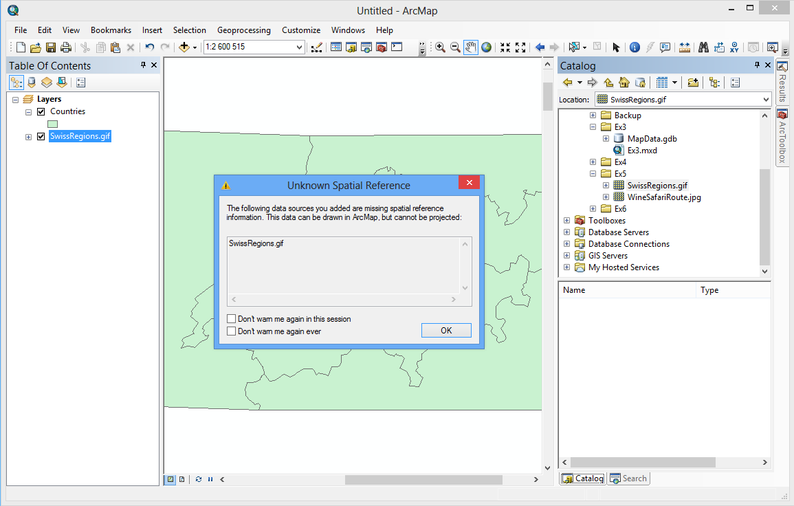
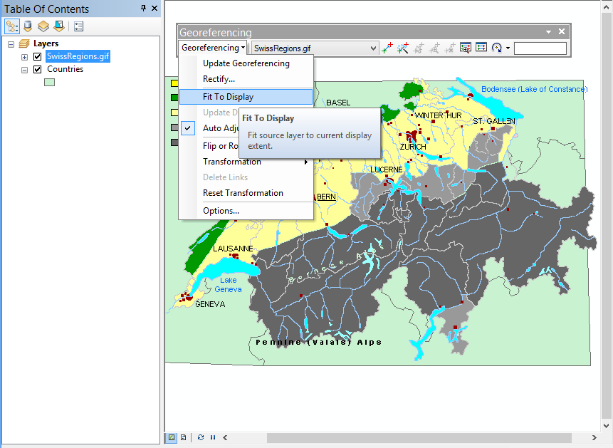
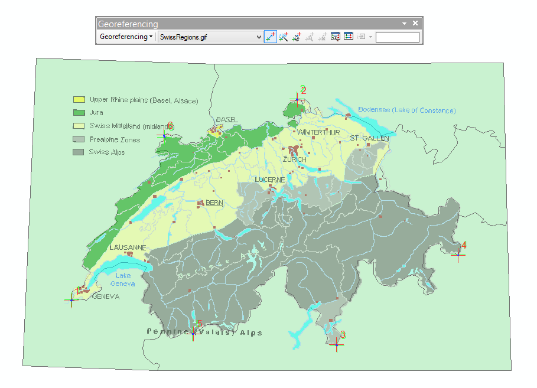
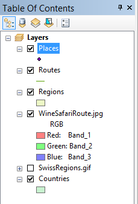
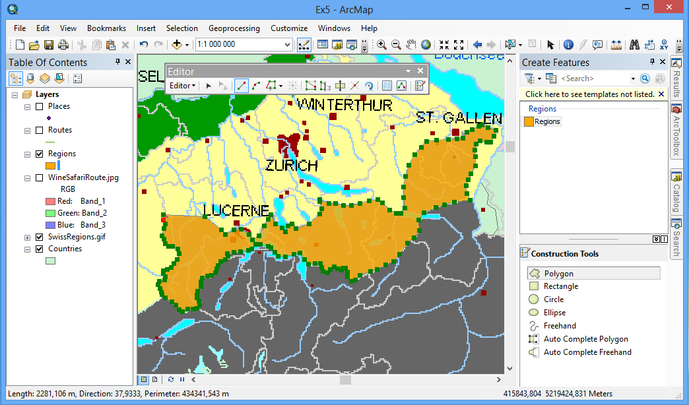
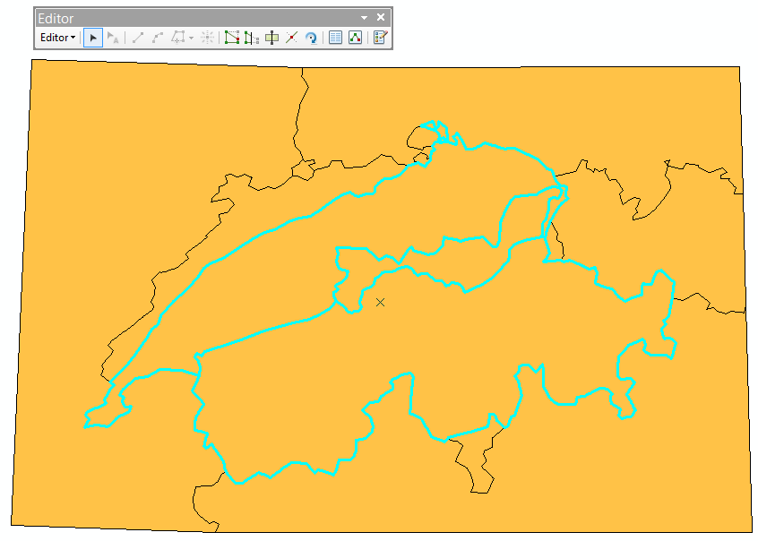
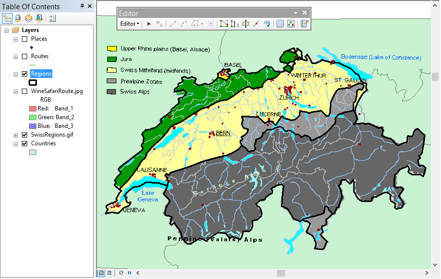

# Привязка и цифрование гидрогеологической карты {#map-ref-hydrogeologic}

## Введение

**Цель задания** — знакомство с привязкой, трансформированием и цифрованием геоизображений, элементами базовых технологий ГИС (оверлей, пространственные запросы).

Параметр                    Значение
--------------------------  --------
*Поток*                     Гидрометпоток, Физпоток  
*Теоретическая подготовка*  Системы координат и проекции на картах, привязка геоизображений, трансформирование геоизображений, цифрование геоизображений. Методы трансформации: аффинное, проективное, полиномиальное, метод резинового листа (сплайны). Пространственные запросы, атрибутивные запросы, оверлей.
*Практическая подготовка*   Знание основных компонент интерфейса ArcGIS Desktop (каталог, таблица содержания, карта). Работа с базой геоданных. Настройка символики и подписей объектов.
*Исходные данные*           Слои картографической основы (карт масштаба 1:2 500 000), растровая карта гидрогеологического районирования на район среднего течения Дона.
*Результат*                 Слой гидрогеологического районирования в базе данных. Слой рек, обогащенный данными о принадлежности участков рек к артезианским бассейнам. Проект карты с оформленной компоновкой
*Ключевые слова*            Системы координат, проекции, трансформирование координат, пространственная привязка, цифрование, оверлей, пространственные запросы, атрибутивные запросы

### Контрольный лист

* Привязать растровую карту к опорным данным
* Создать в базе геоданных класс пространственных объектов для районов
* Наполнить класс районов путем цифрования растровой карты
* Заполнить названия районов
* Осуществить оверлей для обогащения слоя рек данными о принадлежности к бассейнам, выполнить пространственный и атрибутивный запрос
* Подготовить проект гидрогеологической карты с компоновкой

### Аннотация

Задание посвящено знакомству с привязкой растровых карт, созданием и наполнением баз пространственных данных путем цифрования, использовании оверлея, пространственных и атрибутивных запросов. Эти методы входят в число базовых технологий геоинформатики. С их помощью в дальнейшем вы сможете решать множество задач. Одним из источников питания рек являются артезианские воды. К артезианским водам относятся подземные воды, находящиеся в водоносных горизонтах, перекрытых и подстилаемых водоупорными (или относительно водоупорными) слоями горных пород, и обладающие гидростатическим напором. В задании предлагается перевести в векторный вид карту гидрогеологического районирования среднего течения Дона и далее наполнить этой информацией участки рек, чтобы в дальнейшем определять источник питания каждой реки.

## Оформление базовых слоев
[В начало упражнения ⇡](#map-ref-hydrogeologic)

1. Скопируйте каталог *Ex02* в свою папку.

1. Откройте приложение **ArcMap**, создайте новый документ карты и сохраните его в свою папку *Ex02*.

2. Подключитесь в окне каталога к папке *Ex02*. Убедитесь, что в ней находится база геоданных *Don.gdb* и растровый файл *DonArtesian.png*.

3. Раскройте базу геоданных и перенесите на карту классы *Lakes* и *Rivers*

4. Присвойте слою *Lakes* символ с голубой заливкой и синей обводкой.

5. Настройте оформление слоя *Rivers* следующим образом:

    * Выберите способ изображения по категориям (уникальные значения).

    * В качестве поля для отображения используйте атрибут *Тип*. Нажмите *Add All Values*.

    * Покрасьте все реки в синий цвет. Для этого щелкните на заголовке первого столбца *Symbol* и вызовите команду *Properties for all symbols*. Выберите *точно такой же цвет*, что вы использовали для обводки озер.

    * Установите следующие параметры толщины линий:

        Слой                      Толщина линии
        ------------------------- ---------
        *Реки постоянные крупные* 2 пункта
        *Реки постоянные средние* 1,5 пункта
        *Остальные классы*        1 пункт

    Диалог примет следующий вид:

    

1. Включите опцию подписи рек. Перейдите на вкладу **Labels** и отметьте флажок **Label features in this layer**. Выберите поле *Название* в качестве поля для подписей, смените их цвет на темно-синий и установите криволинейное размещение вдоль линии. Нажмите ОК. В результате операции все реки будут подписаны.

2. Чтобы были подписаны только крупнейшие реки, необходимо использовать определяющий запрос на языке SQL. Для этого откройте снова свойства слоя и на вкладке **Labels** выберите метод «*Define classes of features and label each class separately*». Нажмите кнопку **SQL query…** и введите в поле следующий текст запроса:

    `"CLASS" = 2 OR "CLASS" = 3`

    Чтобы избежать ошибок ввода, вы можете дважды щелкнуть на поле `CLASS` в списке слева — оно подставится в запрос. Добавьте знак `=`. Далее нажмите кнопку **Get unique values** и найдите 2-й класс. Щелкните на нем дважды — после этого название поля подставится в текст запроса. После этого введите оператор `OR` и повторите ввод для 3-го класса. Диалог примет следующий вид:

    

1. Нажмите ОК в диалоге свойств слоя. Карта примет следующий вид:

    

1. Сохраните документ карты в _свою_ папку *Ex02* под именем *Don.mxd*.

<kbd>**Снимок экрана №1** — *Реки*</kbd>

## Привязка карты
[В начало упражнения ⇡](#map-ref-hydrogeologic)

1. Внимательно прочтите раздел *Привязка растровых данных (Georeferencing)* в файле *Описание функций*.

2. Добавьте на карту из базы данных слой *DonArtesian.png.* и поместите его непосредственно под слоем Rivers. При добавлении слоя появится диалоговое окно, предупреждающее о том, что файл не имеет привязки. Закройте его.

3. Поместите карту в центр окна ArcMap.

4. Откройте панель инструментов **Georeferencing**. Убедитесь, что в ее списке выбран файл *DonArtesian*. Выберите в ее меню команду **Fit to Display**, чтобы переместить непривязанный растр на середину области отображения.

4. Поместите растр непосредственно под слоем *Rivers*.

5. Используя инструмент расстановки контрольных точек, укажите пять контрольных точек в разных частях карты. Желательно, чтобы точки были равномерно распределены по полю карты (по краям и в центре) и *не располагались на одной линии* — это обеспечит хорошие коэффициенты трансформации. В качестве точек используйте места впадения притоков и впадения рек в водохранилища. Например, можно использовать точку впадения реки Хопёр в реку Дон:

    

    

1. Ознакомьтесь с доступными методами трансформирования по контрольным точкам. Для этого в меню **Georeferencing** выберите команду **Transformation**. По умолчанию выбрано аффинное преобразование.

    > Какие еще виды трансформирования доступны? Чем проективное преобразование отличается от аффинного?

    Оставьте выбранным аффинное преобразование.

2. Осуществите трансформирование растра. На панели инструментов **Georeferencing** выберите команду меню **Georeferencing > Update Georeferencing**. Контрольные точки удалятся.

    Картографическое изображение примет следующий вид:

    

    <kbd>**Снимок экрана №2** — *Привязанная растровая карта*</kbd>

3. Сохраните документ карты в формате mxd в папке отчета.

## Создание слоя гидрогеологического районирования
[В начало упражнения ⇡](#map-ref-hydrogeologic)

1. Прочтите раздел *Создание классов пространственных объектов* в файле *Описание функций*.

2. Создайте новый класс пространственных объектов в базе геоданных *Don.gdb*. Для этого:

    * На первом шаге назовите слой *Artesian*, выберите площадную модель пространственных объектов (*Polygon features*).

    * На втором шаге выберите систему координат. Оптимально использовать ту же систему, что используется в базовых данных. Для этого ее можно импортировать у существующего слоя. Нажмите **Add Coordinate Systems > Import**, найдите и укажите любой слой в базе данных *Don.gdb*.

    * На 3-м и 4-м шагах оставьте все параметры по умолчанию.

    * На 5-м шаге добавьте в первую пустую строку новое поле *Basin*. Тип поля — *Text*. В этом поле вы будете хранить название гидрогеологического бассейна.

    * Нажмите **Finish**.

3. Добавьте получившийся слой на карту и разместите его вверху таблицы содержания.

4. Отключите слои рек и озер.

5. Прочтите раздел *Редактирование* в файле *Описание функций*, особенно уделив внимание разделам *Создание объектов* и *Цифрование в режиме автозавершения (auto-complete)*.

6. Включите режим редактирования слоя. Для этого в его контекстном меню выберите команду **Edit Features > Start Editing**.

7. Откройте список шаблонов слоя и посмотрите доступные опции редактирования в нижней части окна.

8. Оцифруйте все бассейны. Выполняйте работу в следующей последовательности.

    * Сначала оцифруйте Донецко-Донской бассейн (IV) с помощью обычного инструмента **Polygon**.

    * Далее последовательно пристыкуйте к нему оставшиеся бассейны с помощью инструмента **Auto Complete Polygon**. Замкните их по границе листа.

9. После того как редактирование районов завершено, сохраните изменения, выбрав команду **Editor — Save Edits**.

10. Откройте таблицу атрибутов слоя районов. Поочередно выделяя каждый из них (для этого щелкните в самом начале строки), введите в поле *Basin* его название, ориентируясь по карте. Слово «бассейн» не вводите:

    

1.  После ввода названий снова сохраните изменения.

2.  Завершите редактирование, выбрав команду **Editor > Stop Editing**.

3.  Измените оформление слоя в соответствии с цветами на
    исходном растре.

4.  Включите подписи районов по полю *Basin*.

5.  Отключите слой растровой карты. Включите снова слои рек и озер и
    переместите их вверх таблицы содержания. Картографическое
    изображение примет следующий вид:

    

1.  Сохраните документ карты в папке отчета.

<kbd>**Снимок экрана №3** — *Слой артезианских бассейнов*</kbd>

## Пространственный запрос
[В начало упражнения ⇡](#map-ref-hydrogeologic)

Для получения информации о взаимном положении объектов или поиске объектов, основанном на их местоположении, вы можете использовать три метода:

* Вычисление расстояний
* Пространственный запрос
* Оверлей

Вычисление расстояний позволяет оценить попарные расстояния между объектами, найти для каждого объекта ближайший к нему. Пространственный запрос осуществляет выборку объектов, находящихся в указанных топологических отношениях с другими объектами. Например, вы можете сказать «*выбрать реки, находящиеся целиком внутри (completely within) Московского артезианского бассейна*» или смягчить запрос, указав «*выбрать реки, пересекающие (intersect) Московский артезианский бассейн*». Частным случаем пространственного запроса также является поиск объектов по координатам, диапазону координат или произвольно заданной области. В этом случае пользователь чаще всего обводит на карте прямоугольником интересующую его зону, при этом выбираются объекты, пересекающие или находящиеся целиком внутри выделенной зоны.

Рассмотрим, как можно выберать реки, принадлежащие Приволжско-Хоперскому бассейну.

1. Выделите на карте Приволжско-Хоперский бассейн, используя инструмент  на панели **Tools**.

2. Откройте диалог пространственной выборки (меню **Selection > Select by Location**)

3. Выберите в диалоге пространственной выборки слой *Rivers* в качестве выбираемого (**target**) и слой *Artesian* в качестве выбирающего (**source**). Отметьте галочкой пункт **Use Selected Features** — это позволит выбирать с использованием уже выбранных объектов.

4. Выберите метод выборки «*intersect the source layer feature*» —пересечение.

5. Нажмите **Apply**. Будут выбраны реки, пересекающие выбранный артезианский бассейн:

    

    <kbd>**Снимок экрана №4** — *Пространственный запрос методом пересечения*</kbd>

1. Выберите метод выборки «*are completely within the source layer feature*» (полностью внутри).

2. Нажмите **Apply**. Будут выбраны реки, находящиеся полностью внутри выбранного бассейна:

    

    <kbd>**Снимок экрана №5** — *Пространственный запрос методом «внутри»*</kbd>

1. Очистите выборку с помощью инструмента **Clear Selected Features**:

## Оверлей
[В начало упражнения ⇡](#map-ref-hydrogeologic)

**Оверлей** (от англ. *overlay* — наложение), в отличие от пространственного запроса, создает новые данные путем геометрической композиции входных слоев. Полученные участки наследуют атрибуты от каждого слоя. Эта операция базируется на стандартных отношениях множеств, таких как пересечение, объединение и симметрическая разность. Оверлей позволяет понять, какие комбинации объектов встречаются в пространстве. Так, если в качестве аргументов служат реки и бассейны, то в результате выполнения оверлея реки будут разрезаны на участки в соответствии с границами бассейнов.

Для выполнения оверлея вы будете использовать инструменты **геообработки**.

> **Геообработка (geoprocessing)** в терминологии ArcGIS — это анализ и преобразование пространственных данных. Инструменты геообработки находятся в Арктулбоксе (ArcToolbox), где они сгруппированы по назначению. Некоторые наборы инструментов, такие как Spatial Analyst и 3D Analyst, с которыми вы познакомитесь на следующих занятиях, являются дополнительными модулями ArcGIS.

С помощью оверлея можно разбить речную сеть на сегменты, принадлежащие разным бассейнам, а полученным сегментам автоматически присвоить название бассейна.

1. Щелкните по базе данных *Don.gdb* правой кнопкой мыши и выберите пункт **Make Default Geodatabase**. Эта команда указывает системе, что все результаты обработки данных (новые слои) следует помещать в выбранную базу геоданных.

2. Откройте **ArcToolbox** с помощью кнопки  на главной панели инструментов.

3. Раскройте группу инструментов **Analysis Tools > Overlay**. Здесь можно найти различные режимы оверлея.

4. Запустите инструмент **Identity**, который находит геометрическое пересечение двух слоев и присваивает атрибуты второго слоя участкам первого слоя.

5. Заполните его параметры следующим образом:

    Параметр                Значение
    ----------------------- --------
    *Input features*        Rivers
    *Identity Features*     Artesian
    *Output Feature Class*  `<Ваша папка>\Ex02\Don.gdb\Rivers_Identity`
    *JoinAttributes*        ALL

    Диалог инструмента примет следующий вид:

    

После выполнения инструмента слой будет добавлен на карту. Раскройте его таблицу атрибутов, чтобы убедиться, что каждому участку реки присвоена принадлежность к артезианскому бассейну (часть строк будет пустой, так как созданный вами слой артезианских бассейнов покрывает не всю территорию):

## Атрибутивный запрос
[В начало упражнения ⇡](#map-ref-hydrogeologic)

Атрибутивный запрос позволяет искать объекты по значениям их атрибутов. В результате выполнения оверлея вы можете найти участки рек, принадлежащие артезианским бассейнам, по информации, содержащейся в поле *Basin*.

1. Откройте диалог атрибутивной выборки (меню **Selection > Select by Attributes**).

2. Выберите в качестве выбираемого слой *Rivers\_Identity*.

3. Введите следующий текст запроса:

    `"Basin" = 'Приволжско-Хоперский'`

1. На карте будут выделены водотоки, принадлежащие данному артезианскому бассейну. Обратите внимание на то, что выборка теперь полностью совпадает с границами бассейна.

2. Откройте таблицу атрибутов слоя *Rivers\_Identity* и укажите опцию **Show Selected records**, чтобы показывать только выбранные объекты:

    

1. Скомпонуйте окна приложения таким образом, чтобы было видно одновременно окно атрибутивного запроса, таблицу атрибутов слоя со столбцом *Basin*, а также картографическое изображение с выделенными реками. Окно приложения примет следующий вид:

    

1. Сохраните документ карты.

<kbd>**Снимок экрана №6** — *Атрибутивный запрос*</kbd>

## Оформление карты
[В начало упражнения ⇡](#map-ref-hydrogeologic)

1. Отключите слой *Rivers\_Identity* и завершите оформление карты, добавив на нее слои *Boundaries* (границы) и *Cities* (города). Используйте для их отображения способ **Категорий** и настройте отображение разными символами классов границ, а также городов в соответствии с численностью населения. При оформлении подписей городов используйте метод *Классифицированных подписей* (прочтите соответствующий раздел в файле *Описание функций*). Пример результирующего изображения:

    

    <kbd>**Снимок экрана №7** — Карта</kbd>

1. Переключитесь в режим компоновки и оформите легенду карты. Добавьте название «*Гидрогеологическое районирование среднего течения Дона*», а также масштаб и свои ФИО.

2. Экспортируйте результирующую карту в файл с расширением `png` и вставьте его в отчет.

## Ответы на вопросы
[В начало упражнения ⇡](#map-ref-hydrogeologic)

Заполните отчетный файл и положите его в сетевую папку для проверки преподавателем.
