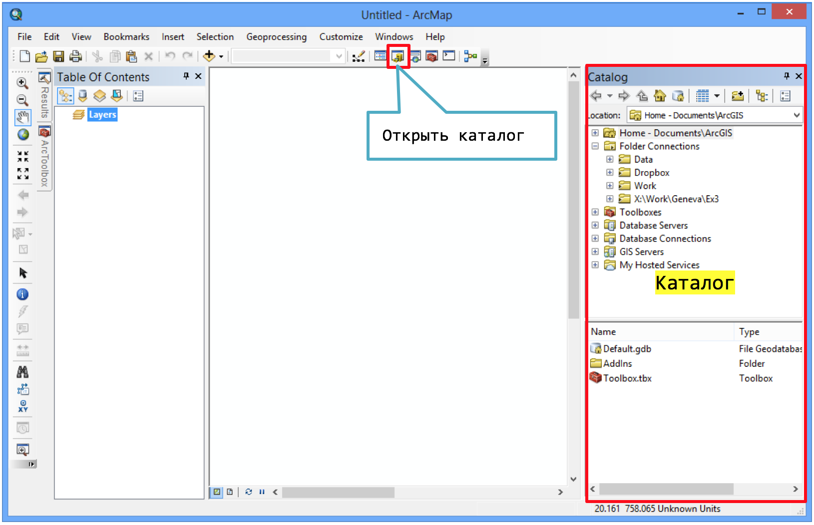
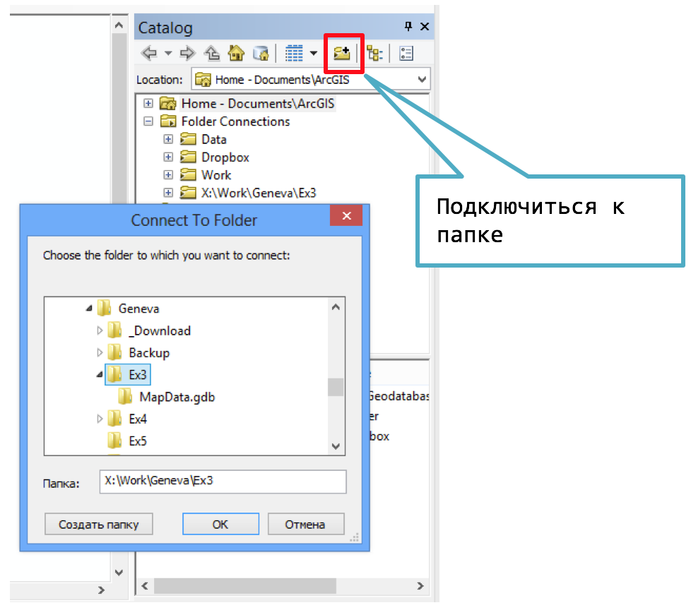

# (APPENDIX) Описание функций {-}

# Работа с окном каталога {#manual-catalog}

## Открытие каталога

Окно каталога используется для работы с файлами и базами пространственных данных. Оно обычно расположено в правой части приложения и вызывается путем нажатия кнопки на панели инструментов:

## Подключение к каталогу

Для подключения к папке используйте кнопку на панели инструментов:

