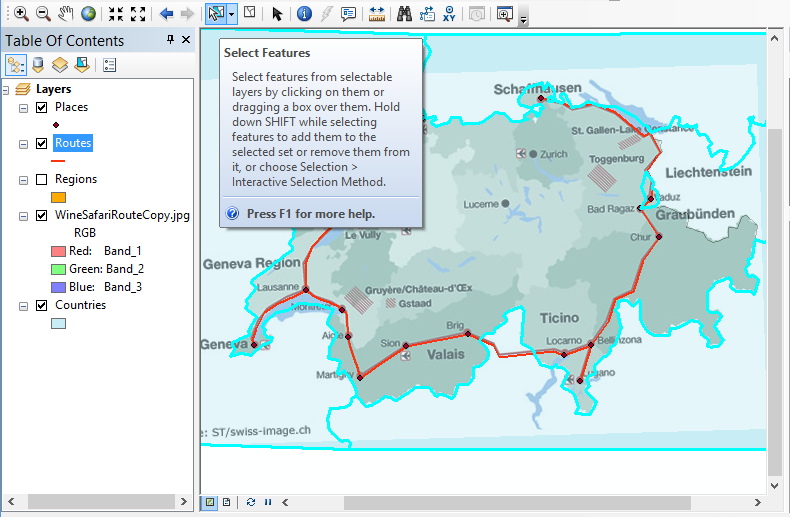
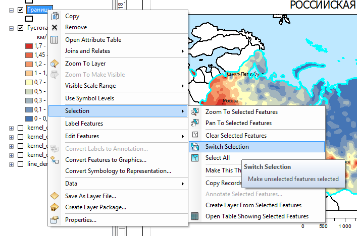
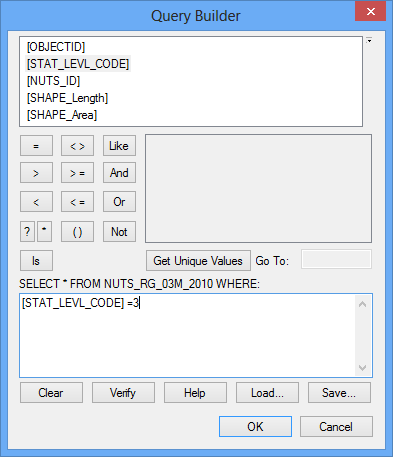

# Выборка объектов {#manual-select}

## Выборка вручную

Для выделения объектов используйте кнопку Select Features на панели Tools. Чтобы выделить несколько объектов, зажмите клавишу Shift:

## Инвертирование выборки

В контекстном меню слоя выберите команду Selection---Switch Selection:

## Определяющий запрос

1. Дважды щелкните на слое и перейдите на вкладку Definition query

2. Нажмите кнопку Query Builder

3. В появившемся диалоге дважды щелкните на названии поля, которое используется для запроса. Оно автоматически подставится в строку запроса

4. Допишите запрос вручную (например, = 3).

Пример запроса для выбора единиц по значению поля:

## Пространственный запрос

1. Выберите команду меню Selection --- Select by Location

2. В появившемся диалоге укажите слой искомых объектов, слой-источник и тип пространственного запроса

    
