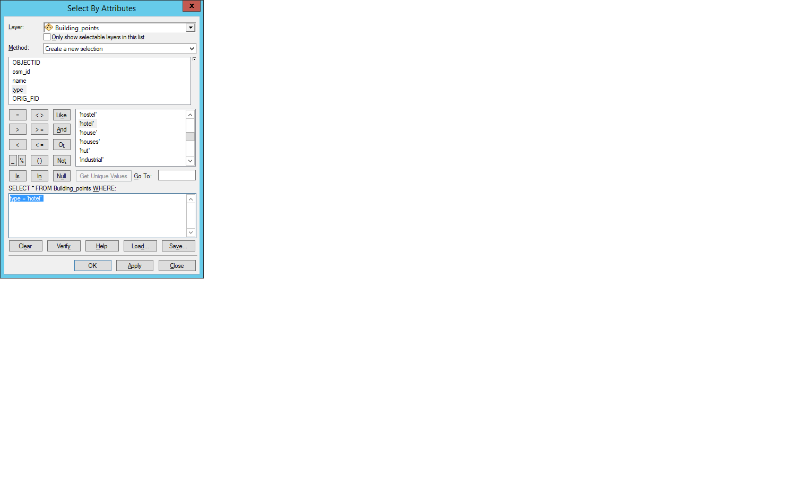

# Выборка объектов {#manual-select}

## Выборка вручную {#manual-select-manual}

Для выделения объектов используйте кнопку **Select Features** на панели **Tools**. Чтобы выделить несколько объектов, зажмите клавишу <kbd>Shift</kbd>:

## Инвертирование выборки {#manual-select-invert}

В контекстном меню слоя выберите команду **Selection > Switch Selection**:

## Атрибутивный запрос {#manual-select-attribute}

1. Выберите команду меню **Selection > Select by Attributes**

2. В появившемся диалоге введите текста запроса для выборки объектов по атрибутам. Обратите внимание на то, что при выполнении выборки по атрибуту название поля не заключается в дополнительные символы (кавычки и т.п.):

    

    > Если вы выберете название поля в списке слева и нажмете кнопку Get Unique Values, то вы сможете увидеть полный список уникальных значений, хранящихся в данном поле, что поможет правильно сконструировать запрос.

3. Нажмите **Apply** (Применить) либо **OK** (в этом случае диалог закроется).

## Пространственный запрос {#manual-select-location}

1. Выберите команду меню **Selection > Select by Location**

2. В появившемся диалоге укажите слой искомых объектов, слой-источник и тип пространственного запроса:

    

## Определяющий запрос {#manual-select-definition}

1. Дважды щелкните на слое и перейдите на вкладку **Definition query**

2. Нажмите кнопку **Query Builder**

3. В появившемся диалоге дважды щелкните на названии поля, которое используется для запроса. Оно автоматически подставится в строку запроса

4. Допишите запрос вручную (например, `= 3`).

Пример запроса для выбора единиц по значению поля:

